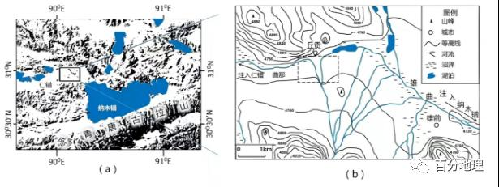

# 微专题之083暖湿化

```
本专题摘自“百分地理”公众号，如有侵权请告之删除，谢谢。联系hhwxyhh@163.com
```

------
（2021·广东高考真题）岸线发育系数（简称SDI）是反映湖泊几何形态的指标，其值越大表示湖岸线越曲折。我国某内陆咸水湖，拥有丰富的湖岸线资源，部分湖岸区域沙漠化现象较为明显。下图示意该湖1973—2017年水位和SDI值变化。据此完成下列小题。   

   

1．导致1973—2004年SDI值变化的主要原因是（  ）   
①水下地貌体出露   
②湖岸土地沙化加剧   
③湖盆区构造沉降   
④人类活动强度减弱   
A．①②   
B．①③   
C．②④   
D．③④   
2．2010—2017年SDI值的变化指示了该湖（  ）   
A．湖岸线长度变短   
B．沿岸区域土地沙漠化加剧   
C．湖泊的面积稳定   
D．沿岸区域生物多样性增加   
<span style="color: rgb(255, 0, 0);">1．A读图分析，1973-2004年SD值呈上升趋势，说明湖岸线变曲折。水下地貌体出露会导致湖岸线更加曲折，SDI值会变大。①符合；湖岸土地沙化会导致湖岸线越来越曲折，②符合；湖盆区构造沉降会导致湖岸线缓和，SDI值变小，③不符合；人类活动强度减弱会导致湖岸线缓和，SDI值变小，④不符合；综上，A正确，BCD错误；故选A。</span>   
<span style="color: rgb(255, 0, 0);">2．D读图分析，2010-2017年SD值总体呈现上升趋势。读图分析，2010-2017年该湖泊水位上升，造成水域面积扩大，更多原来单一陆境生物环境区域变为水域和陆域交替环境，生境多样性增加。D正确；SD值上升说明湖岸线曲折，湖岸线长度变长，A错误；该湖泊水位上升，土地沙漠化减弱，B错误；该湖泊水位上升，湖泊面积扩大，C错误；故选D。</span>   
（2021·福建高考真题）下图示意黄土高原某地区考古挖掘出的古聚落遗址，遗址中有许多黄土烧制的陶器。仰韶文化晚期，我国亚热带-暖温带界线南移。在人类活动和环境变化的双重影响下，该地区聚落向高处迁移。为避免坍塌，窑洞宽度须小于窑顶黄土厚度。据此完成下面小题。   

   

3．仰韶文化晚期，该地区气候趋向（  ）   
A．冷湿   
B．冷干   
C．暖湿   
D．暖干   
4．仰韶文化晚期，该地区聚落向高处迁移是由于（  ）   
A．水土流失加剧，河床抬升   
B．人口增长迅速，耕地不足   
C．蓄水技术提高，供水充足   
D．土壤肥力下降，作物减产   
5．龙山文化时期，该地区坡地的窑洞平面形态最可能是上图中的（  ）   
A．   

   

B．   
   

C．   
   

D．   
   

<span style="color: rgb(255, 0, 0);">3．B温度带是根据活动积温划分，即作物某时段或某生长季节内逐日活动温度的总和。根据材料“仰韶文化晚期，我国亚热带-暖温带界线南移”，说明当地气候趋向寒冷，冬季风势力更加强大，降水少趋于干燥，故选B。</span>   
<span style="color: rgb(255, 0, 0);">4．A仰韶文化早中期聚落遗址中有大型木骨泥墙建筑，消耗了大量的木材，说明森林砍伐量大；遗址中有许多黄土烧制的陶器，黄土的土质疏松，烧制陶器也需要砍伐森林，获取燃料。在人类活动和环境变化的双重影响下，人类过度砍伐，植被遭到破坏，环境发生变化，导致水土流失严重，河流淤积，河床抬升，该地区聚落向高处迁移，A正确；在生产力水平低下的原始社会时期，社会经济发展水平低，技术水平低，人类受自然条件的影响大，人口增长缓慢，BC错误；黄土高原地区，黄土的土质疏松，土壤肥力较低，土壤肥力下降，作物减产不是其向高处迁移的最主要原因，D错误，故选A。</span>   
<span style="color: rgb(255, 0, 0);">5．A由图可知，该窑洞位于坡面位置，门上洞顶的土层厚度较小，越往里，窑顶的土层越厚，而挖掘窑洞为了避免坍塌，宽度应窄于洞顶覆盖土层，窑洞的宽度应随着窑顶的黄土厚度增加而增加，C错误，A正确；B迅速拓宽不符合坡面黄土厚度变化趋势，B错误；窑洞门口到窑洞里应是从窄到宽，D项与A项对比，D门口处宽度较宽，更易坍塌，D错误，故选A。</span>   
（2022·山西运城模拟预测）感热是指地面与大气之间单位时间单位面积流过的垂直热量，主要受地表的粗糙度、地气温差以及风速等直接影响。青藏高原感热变化将会影响青藏高原与周边区域的大气环流和对周边大洋水汽的抽吸作用，高原感热越强，对水汽的抽吸作用越强，进而对周边区城气候和天气影响较大。据研究，自1981年以来青藏高原气候有暖湿化的趋势，并对我国区域气候产生影响。据此完成下面小题。   
6．青藏高原夏季感热减弱对周边区域天气和气候的影响是（  ）   
A．我国南方地区多洪涝灾害   
B．我国西南地区多阴雨天气   
C．我国北方地区多寒潮灾害   
D．我国西北地区多暴雪天气   
7．近年来青藏高原气候暖湿化对高原感热的影响是（  ）   
A．高原植被覆盖率提高，高原感热强度下降   
B．高原植被覆盖率提高，高原感热强度升高   
C．高原植被覆盖率下降，高原感热强度下降   
D．高原植被覆盖率下降，高原感热强度升高   
<span style="color: rgb(255, 0, 0);">6．A根据材料“高原感热越强，对水汽的抽吸作用越强，进而对周边区城气候和天气影响较大”可知：青藏高原夏季感热减弱，对水汽的抽吸作用减弱，使得我国夏季风势力减弱，推移速度减慢，长期滞留在我国南方地区，使得我国南方地区降水增多，多引发洪涝灾害，我国北方地区降水少，多引发旱灾，A符合题意、C不符合题意；青藏高原夏季感热减弱，对水汽的抽吸作用减弱，使得西南季风势力也减弱，我国西南地区阴雨天气减少，B不符合题意；暴雪天气夏季出现较少，D不符合题意。故选A。</span>   
<span style="color: rgb(255, 0, 0);">7．A据材料，青藏高原目前气候出现暖湿化特征，利于高原地表植被恢复，地气温差减小，高原感热强度下降，A符合题意，B、C、D不符合题意，故选A。</span>   
（2022·福建漳州一模）巴尔喀什湖是哈萨克斯坦境内最大的湖泊，是发源于我国西北境内伊犁河的尾问湖泊（图）。研究发现，1930一2014年，巴尔喀什湖流域主要河流的入湖水量均显减少趋势，但中因伊犁河流入哈萨克斯坦境内的水量呈显著增加趋势。据此完成下面小题。   

   

8．巴尔喀什湖湖水东咸西淡，其主要影响因素是（  ）   
A．降水   
B．径流   
C．蒸发   
D．下渗   
9．中国伊犁河流入哈萨克斯坦境内的水量呈显著增加趋势，反映出伊犁河源头区域气候（  ）   
A．暖湿化   
B．暖干化   
C．冷湿化   
D．冷干化   
10．巴尔喀什湖流域主要河流的入湖水量均呈减少趋势，可能导致流域内（  ）   
A．农业用地增加   
B．湖泊水位上升   
C．荒漠化加剧   
D．富营养化减轻   
<span style="color: rgb(255, 0, 0);">8．B巴尔喀什湖湖水东咸西淡主要是西部有较多河流汇入，有丰富的淡水稀释，盐度较低，东侧汇入河流较少，淡水补充较少，故影响的主要因素是径流，B正确，降水、蒸发和下渗差异不大，ACD错误；故选B。</span>   
<span style="color: rgb(255, 0, 0);">9．A 伊犁河位于新疆，河流的补给主要是高山冰雪融水和大气降水，随着全球气候变暖，冰川消融增加，河水增多，蒸发加大，水汽增多，降水增多，反映出伊犁河源头区域气候暖湿化；A正确，BCD错误。故选A。</span>   
<span style="color: rgb(255, 0, 0);">10．C巴尔喀什湖流域主要河流的人湖水量均呈减少趋势，主要是由于河流上游地区工农业用水量增加，导致中下游水量减少，可能导致中下游地区沙漠化加剧，C正确；水源减少，农业用地减少，A错误；湖泊水位下降，B错误；富营养化加重，D错误，故选C。</span>   
（2022·宁夏石嘴山市第三中学三模）和田河是塔里木河四大源流之一，也是唯一一条穿越塔克拉玛干沙漠绿色生态走廊的河流，流域上游由玉龙喀什河（简称玉河，发源于昆仑山）与喀拉喀什河（简称喀河，发源于喀喇昆仑山）两支流组成。近30年来，该流域生态环境变得异常脆弱。下图示意和田河流域玉河和喀河的降水、冰川径流、气温年代际变化趋势。据此完成下面小题。   

   

11．和田河流域的冰川径流呈现增加趋势，说明该区域（  ）   
A．气候冷干化   
B．气候冷湿化   
C．气候暖干化   
D．气候暖湿化   
12．对冰川消融产生抑制作用的有（  ）   
①全球变暖②降水增加③保护森林和人工造林④大规模开发利用新能源   
A．①②④   
B．①③④   
C．②③④   
D．①②③   
13．玉河与喀河对气候变化的响应程度存在差异的原因是（  ）   
A．人类活动强度不同   
B．发源山系不同   
C．地表径流速度不同   
D．植被分布不同   
<span style="color: rgb(255, 0, 0);">11．D 读图可知，该流域近30年来，气温明显升高，降水量也明显增加，冰川径流呈现增加趋势，说明该区域气候暖湿化，D正确，ABC错误。故选D。</span>   
<span style="color: rgb(255, 0, 0);">12．C由图中可知，冰川径流量与气温变化和降水变化趋势相关，全球变暖有利于冰川融化，加速冰川消融，①错误；降水增加，冰川补给量增加，能抑制冰川消融，②正确；保护森林和人工造林，增加植被对二氧化碳的消耗，缓解全球变暖，抑制冰川消融，③正确；大规模开发利用新能源，减少化石能源的使用，减少二氧化碳的排放，能减缓全球变暖，抑制冰川消融，④正确。综上所述，C正确，ABD错误。故选C。</span>   
<span style="color: rgb(255, 0, 0);">13．B读图可知，玉河与喀河对气候变化的响应程度存在差异主要表现在降水差异上，都位于高山区，人类活动都较小，A错误；都是河流的源头，山区河流落差大，地表径流速度差别不大，C错误；都位于高山上的积雪冰川带，都没有植被分布，D错误；但两河发源的山系不同，地形对山地降水的影响下，降水量的变化差异较大，B正确。故选B。</span>   
（2022·福建模拟预测）湿地的形成和发育反映大量古气候信息。东北地区是我国最大的沼泽湿地集中分布区。研究发现该地区的沼泽湿地从全新世（12000年前至今）开始发育。下图示意全新世以来三江平原沼泽湿地随时间的发育变化情况。据此完成下列各题。   

   

14．距今10000年至5000年期间，三江平原的气候演变过程主要表现为（  ）   
A．暖湿→冷湿   
B．暖湿→冷干   
C．暖干→冷湿   
D．冷干→冷湿   
15．在过去的几百年期间，三江平原沼泽湿地发育速率显著降低，主要原因可能是（  ）   
A．森林覆盖率提高   
B．大量农田垦殖   
C．湿地蒸发量剧增   
D．风沙灾害加剧   
<span style="color: rgb(255, 0, 0);">14．A根据材料信息可知，距今10000年至5000年期间，三江平原湿地逐渐由发育期向发育最适宜期演化，表明气候有利于湿地的形成。在发育期，气候温暖湿润，而随着气候从暖湿向冷湿演变，降水依然保持相对较多的优势，而气温降低，蒸发减少，有利于地表积水，进而有利于湿地的形成，A正确。气候向冷干演变，不利于湿地的形成，B错。在距今大致5500万年以前，三江平原为湿地的发育期，此时气候偏湿润，而非偏干旱，CD错。故选A。</span>   
<span style="color: rgb(255, 0, 0);">15．B根据材料信息可知，在过去的几百年间，三江平原湿地进入减速期，主要受人类活动影响，随着三江平原商品粮基地的建设，人类活动大量农田垦殖，导致湿地面积萎缩。B正确。森林覆盖率提高，表明区域水分条件变好，则三江平原地区地势平坦低洼地区湿地面积不会减小，A错。随着全球气候变暖，湿地蒸发可能加大，但相比于人类活动而言，不是主要原因。C错。同理，相比于人类农田垦殖而言，风沙灾害加剧也不是导致三江平原湿地发育速度显著降低的原因，排除D。故选B。</span>   
（2022·福建师大附中模拟预测）研究表明，泥炭是一种记录过去气候变化的可靠地质载体。一般认为当沼泽表面气候温暖、湿润时，泥炭的腐殖化度较低。科研中使用分光光度计测量泥炭样品的吸光度，泥炭腐殖化程度与其碱提取液的吸光度值成正相关。下图示意我国东北长白山区锦北泥炭距今6000年以来剖面样本的吸光度变化。据此完成下面小题。   

   

16．锦北泥炭剖面样本距今约1600年左右吸光度较低，且剖面中木本植物残体含量大，当时的气候特征与下列气候事件体现一致的是（  ）   
A．黄河中下游平原的严重干旱事件   
B．北大西洋大规模冰川漂移事件   
C．青藏高原末次冰期暖湿气候事件   
D．中国明清时期小冰期气候事件   
17．锦北泥炭样本吸光度反映该地区距今6000-3500年以来的环境变化，最可能的是（  ）   
A．沼泽中水生植物增多   
B．沼泽地表水盐度降低   
C．沼泽地面积显著增大   
D．沼泽边缘演化为草原   
<span style="color: rgb(255, 0, 0);">16．C 据图文材料可知，一般认为当沼泽表面气候温暖、湿润时，泥炭的腐殖化度较低。泥炭腐殖化程度与其碱提取液的吸光度值成正相关。锦北泥炭剖面样本距今约1600年左右吸光度较低，且剖面中木本植物残体含量大，则其泥炭的腐殖化度较低，说明当时沼泽表面气候温暖、湿润，生长的木本植物多。我国的气候当时应处于温暖湿润期，和青藏高原末次冰期暖湿气候事件体现一致，C正确；黄河中下游平原严重干旱事件中的“干”，与当时的温暖、湿润，气候特征不一致，A错误；北大西洋大规模冰川漂移事件、中国明清时期小冰期气候事件两次气候事件体现是“冷”，与当时的温暖、湿润，气候特征不一致，BD错误。故选C。</span>   
<span style="color: rgb(255, 0, 0);">17．D据图文材料可知，一般认为当沼泽表面气候温暖、湿润时，泥炭的腐殖化度较低。泥炭腐殖化程度与其碱提取液的吸光度值成正相关。读图距今6000-3500年以来锦北泥炭样本吸光度是波状上升的，说明当时沼泽表面气候变干、变冷，沼泽中水生植物会减少，A错误；由于变干水分蒸发，沼泽地表水盐度会升高，B错误；由于变干水分蒸发，沼泽地面积显著减小，C错误；由于变干水分蒸发，沼泽地面积显著减小， 沼泽边缘演化为草原，D正确。故选D。</span>   
（2022·江西赣州市赣县第三中学模拟预测）冰川稳定时期，前端的堆积物会不断垒高，形成弧形垄岗。冰川后退时，前端的垄岗会阻挡冰川融水。形成冰碛阻寒湖。清决风险较高。M、W两湖是冰渍阻寒湖其中W湖有一个稳定出水口。图示意M、W两湖1987~2018年的面积变化情况。据此完成问题。   

   

   

18．M、W两湖最可能位于山脉（  ）   
A．东坡   
B．南坡   
C．西坡   
D．北坡   
19．据图可知（  ）   
A．M湖冰川后退面积比W湖小   
B．M湖为咸水湖，W湖为淡水湖   
C．M湖溃决的风险比W湖高   
D．气候冷湿化导致湖泊面积变化   
<span style="color: rgb(255, 0, 0);">18．D根据图中信息，可以判断出M、W两湖位于北半球低纬度地区，由于两湖均属于冰碛湖，所以是冰川融水形成的，由于在冰川稳定时期前端的堆积物会不断的垒高，形成弧形垄岗，所以在图中可以判断出形成M、W两湖的冰川的前端应该向北，说明M、W两湖可能位于山脉的北坡，而且由于M、W两湖地处北半球，北坡是阴坡，更容易出现冰川与冰碛湖。所以D正确，ABC错误。故选D。</span>   
<span style="color: rgb(255, 0, 0);">19．C在图中可以判断出，从1987年到2018年M湖面积增大的更多，说明M湖冰川后退面积比W湖要大，A错误。由于W湖有一个稳定的出水口，所以W湖可能为淡水湖，但无法判断出M湖是淡水湖还是咸水湖，B错误。M湖由于没有一个稳定的出水口，所以比W湖更容易溃决，C正确。冰碛湖面积变大是冰川后退的结果，所以是气候温暖导致的湖泊面积变大，D错误。故选C。</span>   
（2022·福建厦门一中模拟预测）大兴安岭北段冻土广布，积雪期长逾8个月。该区域生长的兴安落叶松对水分要求高，生长季为6月至9月初。厦门中学生助手地理研究小组经研究表明，该区域气候趋向暖干；3月气温异常偏高，西坡兴安落叶松的生长受到明显抑制，但对东坡的兴安落叶松影响较小。据此完成下面小题。   
20．与南段相比，大兴安岭北段积雪期较长的原因有（  ）   
①针叶林面积广②位于迎风坡③受冬季风影响大④纬度较高   
A．①②   
B．③④   
C．①④   
D．②③   
21．该区域西坡兴安落叶松的生长受到抑制的主要原因是3月气温异常偏高导致（  ）   
A．3月土壤蒸发加剧   
B．3月土壤温度降低   
C．5月积雪融水减少   
D．7月冻土厚度变薄   
22．下列气象要素中，与该区域西坡兴安落叶松生长具有显著正相关关系的是（  ）   
A．1—2月降雪量   
B．11—12月降雪量   
C．上一年的生长季均温   
D．生长季均温   
<span style="color: rgb(255, 0, 0);">20．B①针叶林面积广与积雪时长无关，故①错误；②南段位于夏季风迎风坡，故②错误；③北部较南部受冬季风的影响大，气温低，故积雪期长，故③正确；④北部比南部纬度高，气温低，故积雪期长，故④正确；故B③④正确，ACD 错误，本题选B。</span>   
<span style="color: rgb(255, 0, 0);">21．C 据材料可知，大兴安岭北段冻土广布，积雪期长逾8个月，西坡3月份气温异常偏高，虽然蒸发加剧，但积雪融水量大，土壤并不缺水，故A错；3月气温升高，土壤温度升高，故B错；3月气温升高，积雪大量融化，使5月积雪融水减少，兴安落叶松对水分要求高，影响其生长，故C正确，7月冻土厚度变薄不会使兴安落叶松的生长受到抑制，故D错。故选C。</span>   
<span style="color: rgb(255, 0, 0);">22．A据上题分析可知，该区域西坡兴安落叶松生长受抑制与水分不足有关，1-2月降雪量越大，3月到5月，融雪量越大，水分越足，兴安落叶松长势越好，故A正确；11~12月距离来年春天积雪融化的时间较长，11-12月降雪量较少，但1-2月降雪多，则11-12月的降雪量会与落叶松生长具有负相关的关系，B错；兴安落叶松主要受水分影响，受温度影响较小，故CD错。故选A。</span>   
（2022·湖南·新田县第一中学一模）灌丛沙堆是风沙流运移过程中，受到植被拦截形成的风积地貌，其发育状况与风沙活动、植被变化、人类活动及环境变化等因素密切相关。我国东南某地灌丛沙堆是典型的第四纪季风运移聚沙形成，下表是该灌丛沙堆第四纪岩层的剖面概况。据此完成下面小题。   
<table cellspacing="0" cellpadding="0" width="577"><tbody><tr style="break-inside: avoid;"><td width="86" valign="middle" style="padding: 3.75pt 6pt;border-width: 1pt;border-color: rgb(0, 0, 0);"><section style="margin-top: 0pt;margin-bottom: 0pt;margin-left: 0pt;text-indent: 0pt;font-size: 10.5pt;font-family: &quot;Times New Roman&quot;;text-align: left;line-height: 2em;"><span style="font-family: 宋体;">岩层性质</span></section></td><td width="59" valign="middle" style="padding: 3.75pt 6pt;border-width: 1pt;border-color: rgb(0, 0, 0);"><section style="margin-top: 0pt;margin-bottom: 0pt;margin-left: 0pt;text-indent: 0pt;font-size: 10.5pt;font-family: &quot;Times New Roman&quot;;text-align: center;line-height: 2em;"><span style="font-family: 宋体;">埋深/m</span></section></td><td width="104" valign="middle" style="padding: 3.75pt 6pt;border-width: 1pt;border-color: rgb(0, 0, 0);"><section style="margin-top: 0pt;margin-bottom: 0pt;margin-left: 0pt;text-indent: 0pt;font-size: 10.5pt;font-family: &quot;Times New Roman&quot;;text-align: center;line-height: 2em;"><span style="font-family: 宋体;">年龄/距今万年</span></section></td><td width="98" valign="middle" style="padding: 3.75pt 6pt;border-width: 1pt;border-color: rgb(0, 0, 0);"><section style="margin-top: 0pt;margin-bottom: 0pt;margin-left: 0pt;text-indent: 0pt;font-size: 10.5pt;font-family: &quot;Times New Roman&quot;;text-align: center;line-height: 2em;"><span style="font-family: 宋体;">平均粒径/mm</span></section></td><td width="74" valign="middle" style="padding: 3.75pt 6pt;border-width: 1pt;border-color: rgb(0, 0, 0);"><section style="margin-top: 0pt;margin-bottom: 0pt;margin-left: 0pt;text-indent: 0pt;font-size: 10.5pt;font-family: &quot;Times New Roman&quot;;text-align: center;line-height: 2em;"><span style="font-family: 宋体;">含水量/%</span></section></td></tr><tr style="break-inside: avoid;"><td width="86" valign="middle" style="padding: 3.75pt 6pt;border-width: 1pt;border-color: rgb(0, 0, 0);"><section style="margin-top: 0pt;margin-bottom: 0pt;margin-left: 0pt;text-indent: 0pt;font-size: 10.5pt;font-family: &quot;Times New Roman&quot;;text-align: left;line-height: 2em;"><span style="font-family: 宋体;">沙丘砂</span></section></td><td width="59" valign="middle" style="padding: 3.75pt 6pt;border-width: 1pt;border-color: rgb(0, 0, 0);"><section style="margin-top: 0pt;margin-bottom: 0pt;margin-left: 0pt;text-indent: 0pt;font-size: 10.5pt;font-family: &quot;Times New Roman&quot;;text-align: center;line-height: 2em;">-</section></td><td width="104" valign="middle" style="padding: 3.75pt 6pt;border-width: 1pt;border-color: rgb(0, 0, 0);"><section style="margin-top: 0pt;margin-bottom: 0pt;margin-left: 0pt;text-indent: 0pt;font-size: 10.5pt;font-family: &quot;Times New Roman&quot;;text-align: center;line-height: 2em;">1.5</section></td><td width="98" valign="middle" style="padding: 3.75pt 6pt;border-width: 1pt;border-color: rgb(0, 0, 0);"><section style="margin-top: 0pt;margin-bottom: 0pt;margin-left: 0pt;text-indent: 0pt;font-size: 10.5pt;font-family: &quot;Times New Roman&quot;;text-align: center;line-height: 2em;">2.8</section></td><td width="74" valign="middle" style="padding: 3.75pt 6pt;border-width: 1pt;border-color: rgb(0, 0, 0);"><section style="margin-top: 0pt;margin-bottom: 0pt;margin-left: 0pt;text-indent: 0pt;font-size: 10.5pt;font-family: &quot;Times New Roman&quot;;text-align: center;line-height: 2em;">5.9</section></td></tr><tr style="break-inside: avoid;"><td width="86" valign="middle" style="padding: 3.75pt 6pt;border-width: 1pt;border-color: rgb(0, 0, 0);"><section style="margin-top: 0pt;margin-bottom: 0pt;margin-left: 0pt;text-indent: 0pt;font-size: 10.5pt;font-family: &quot;Times New Roman&quot;;text-align: left;line-height: 2em;"><span style="font-family: 宋体;">砂质古土壤</span></section></td><td width="59" valign="middle" style="padding: 3.75pt 6pt;border-width: 1pt;border-color: rgb(0, 0, 0);"><section style="margin-top: 0pt;margin-bottom: 0pt;margin-left: 0pt;text-indent: 0pt;font-size: 10.5pt;font-family: &quot;Times New Roman&quot;;text-align: center;line-height: 2em;">1.7</section></td><td width="104" valign="middle" style="padding: 3.75pt 6pt;border-width: 1pt;border-color: rgb(0, 0, 0);"><section style="margin-top: 0pt;margin-bottom: 0pt;margin-left: 0pt;text-indent: 0pt;font-size: 10.5pt;font-family: &quot;Times New Roman&quot;;text-align: center;line-height: 2em;">3.0</section></td><td width="98" valign="middle" style="padding: 3.75pt 6pt;border-width: 1pt;border-color: rgb(0, 0, 0);"><section style="margin-top: 0pt;margin-bottom: 0pt;margin-left: 0pt;text-indent: 0pt;font-size: 10.5pt;font-family: &quot;Times New Roman&quot;;text-align: center;line-height: 2em;">3.6</section></td><td width="74" valign="middle" style="padding: 3.75pt 6pt;border-width: 1pt;border-color: rgb(0, 0, 0);"><section style="margin-top: 0pt;margin-bottom: 0pt;margin-left: 0pt;text-indent: 0pt;font-size: 10.5pt;font-family: &quot;Times New Roman&quot;;text-align: center;line-height: 2em;">7.4</section></td></tr><tr style="break-inside: avoid;"><td width="86" valign="middle" style="padding: 3.75pt 6pt;border-width: 1pt;border-color: rgb(0, 0, 0);"><section style="margin-top: 0pt;margin-bottom: 0pt;margin-left: 0pt;text-indent: 0pt;font-size: 10.5pt;font-family: &quot;Times New Roman&quot;;text-align: left;line-height: 2em;"><span style="font-family: 宋体;">砂质古土壤</span></section></td><td width="59" valign="middle" style="padding: 3.75pt 6pt;border-width: 1pt;border-color: rgb(0, 0, 0);"><section style="margin-top: 0pt;margin-bottom: 0pt;margin-left: 0pt;text-indent: 0pt;font-size: 10.5pt;font-family: &quot;Times New Roman&quot;;text-align: center;line-height: 2em;">2.6</section></td><td width="104" valign="middle" style="padding: 3.75pt 6pt;border-width: 1pt;border-color: rgb(0, 0, 0);"><section style="margin-top: 0pt;margin-bottom: 0pt;margin-left: 0pt;text-indent: 0pt;font-size: 10.5pt;font-family: &quot;Times New Roman&quot;;text-align: center;line-height: 2em;">3.7</section></td><td width="98" valign="middle" style="padding: 3.75pt 6pt;border-width: 1pt;border-color: rgb(0, 0, 0);"><section style="margin-top: 0pt;margin-bottom: 0pt;margin-left: 0pt;text-indent: 0pt;font-size: 10.5pt;font-family: &quot;Times New Roman&quot;;text-align: center;line-height: 2em;">3.3</section></td><td width="74" valign="middle" style="padding: 3.75pt 6pt;border-width: 1pt;border-color: rgb(0, 0, 0);"><section style="margin-top: 0pt;margin-bottom: 0pt;margin-left: 0pt;text-indent: 0pt;font-size: 10.5pt;font-family: &quot;Times New Roman&quot;;text-align: center;line-height: 2em;">3.4</section></td></tr><tr style="break-inside: avoid;"><td width="86" valign="middle" style="padding: 3.75pt 6pt;border-width: 1pt;border-color: rgb(0, 0, 0);"><section style="margin-top: 0pt;margin-bottom: 0pt;margin-left: 0pt;text-indent: 0pt;font-size: 10.5pt;font-family: &quot;Times New Roman&quot;;text-align: left;line-height: 2em;"><span style="font-family: 宋体;">沙丘砂</span></section></td><td width="59" valign="middle" style="padding: 3.75pt 6pt;border-width: 1pt;border-color: rgb(0, 0, 0);"><section style="margin-top: 0pt;margin-bottom: 0pt;margin-left: 0pt;text-indent: 0pt;font-size: 10.5pt;font-family: &quot;Times New Roman&quot;;text-align: center;line-height: 2em;">3.4</section></td><td width="104" valign="middle" style="padding: 3.75pt 6pt;border-width: 1pt;border-color: rgb(0, 0, 0);"><section style="margin-top: 0pt;margin-bottom: 0pt;margin-left: 0pt;text-indent: 0pt;font-size: 10.5pt;font-family: &quot;Times New Roman&quot;;text-align: center;line-height: 2em;">5.0</section></td><td width="98" valign="middle" style="padding: 3.75pt 6pt;border-width: 1pt;border-color: rgb(0, 0, 0);"><section style="margin-top: 0pt;margin-bottom: 0pt;margin-left: 0pt;text-indent: 0pt;font-size: 10.5pt;font-family: &quot;Times New Roman&quot;;text-align: center;line-height: 2em;">2.4</section></td><td width="74" valign="middle" style="padding: 3.75pt 6pt;border-width: 1pt;border-color: rgb(0, 0, 0);"><section style="margin-top: 0pt;margin-bottom: 0pt;margin-left: 0pt;text-indent: 0pt;font-size: 10.5pt;font-family: &quot;Times New Roman&quot;;text-align: center;line-height: 2em;">3.7</section></td></tr><tr style="break-inside: avoid;"><td width="86" valign="middle" style="padding: 3.75pt 6pt;border-width: 1pt;border-color: rgb(0, 0, 0);"><section style="margin-top: 0pt;margin-bottom: 0pt;margin-left: 0pt;text-indent: 0pt;font-size: 10.5pt;font-family: &quot;Times New Roman&quot;;text-align: left;line-height: 2em;"><span style="font-family: 宋体;">砂质古土壤</span></section></td><td width="59" valign="middle" style="padding: 3.75pt 6pt;border-width: 1pt;border-color: rgb(0, 0, 0);"><section style="margin-top: 0pt;margin-bottom: 0pt;margin-left: 0pt;text-indent: 0pt;font-size: 10.5pt;font-family: &quot;Times New Roman&quot;;text-align: center;line-height: 2em;">4.2</section></td><td width="104" valign="middle" style="padding: 3.75pt 6pt;border-width: 1pt;border-color: rgb(0, 0, 0);"><section style="margin-top: 0pt;margin-bottom: 0pt;margin-left: 0pt;text-indent: 0pt;font-size: 10.5pt;font-family: &quot;Times New Roman&quot;;text-align: center;line-height: 2em;">5.7</section></td><td width="98" valign="middle" style="padding: 3.75pt 6pt;border-width: 1pt;border-color: rgb(0, 0, 0);"><section style="margin-top: 0pt;margin-bottom: 0pt;margin-left: 0pt;text-indent: 0pt;font-size: 10.5pt;font-family: &quot;Times New Roman&quot;;text-align: center;line-height: 2em;">2.8</section></td><td width="74" valign="middle" style="padding: 3.75pt 6pt;border-width: 1pt;border-color: rgb(0, 0, 0);"><section style="margin-top: 0pt;margin-bottom: 0pt;margin-left: 0pt;text-indent: 0pt;font-size: 10.5pt;font-family: &quot;Times New Roman&quot;;text-align: center;line-height: 2em;">6.2</section></td></tr><tr style="break-inside: avoid;"><td width="86" valign="middle" style="padding: 3.75pt 6pt;border-width: 1pt;border-color: rgb(0, 0, 0);"><section style="margin-top: 0pt;margin-bottom: 0pt;margin-left: 0pt;text-indent: 0pt;font-size: 10.5pt;font-family: &quot;Times New Roman&quot;;text-align: left;line-height: 2em;"><span style="font-family: 宋体;">沙丘砂</span></section></td><td width="59" valign="middle" style="padding: 3.75pt 6pt;border-width: 1pt;border-color: rgb(0, 0, 0);"><section style="margin-top: 0pt;margin-bottom: 0pt;margin-left: 0pt;text-indent: 0pt;font-size: 10.5pt;font-family: &quot;Times New Roman&quot;;text-align: center;line-height: 2em;">5.7</section></td><td width="104" valign="middle" style="padding: 3.75pt 6pt;border-width: 1pt;border-color: rgb(0, 0, 0);"><section style="margin-top: 0pt;margin-bottom: 0pt;margin-left: 0pt;text-indent: 0pt;font-size: 10.5pt;font-family: &quot;Times New Roman&quot;;text-align: center;line-height: 2em;">7.7</section></td><td width="98" valign="middle" style="padding: 3.75pt 6pt;border-width: 1pt;border-color: rgb(0, 0, 0);"><section style="margin-top: 0pt;margin-bottom: 0pt;margin-left: 0pt;text-indent: 0pt;font-size: 10.5pt;font-family: &quot;Times New Roman&quot;;text-align: center;line-height: 2em;">1.7</section></td><td width="74" valign="middle" style="padding: 3.75pt 6pt;border-width: 1pt;border-color: rgb(0, 0, 0);"><section style="margin-top: 0pt;margin-bottom: 0pt;margin-left: 0pt;text-indent: 0pt;font-size: 10.5pt;font-family: &quot;Times New Roman&quot;;text-align: center;line-height: 2em;">8.6</section></td></tr></tbody></table>


23．推测第四纪季风风力较小的时段距今（  ）   
A．1．4万年   
B．3万年   
C．5.7万年   
D．7.7万年   
24．从距今5万年至距今3万年，该地的古地理环境特征是（  ）   
A．河川径流量减少   
B．生物多样性减少   
C．气候趋于暧湿   
D．土壤趋于黏重   
25．灌丛沙堆发育过程中（  ）   
A．背风坡灌丛越高，沙堆坡高越小   
B．迎风坡沙粒粒径小千背风坡   
C．迎风坡灌丛越密，沙堆坡长越长   
D．风力越大，沙堆发育越好   
<span style="color: rgb(255, 0, 0);">23．D风力越大，搬运能力越强，剩余的土壤平均粒径越大。据此推测，平均粒径最小的沙丘砂的形成时期，风力最小，据表可知，沙丘砂的年龄为距今7.7万年，D正确，ABC错误。故选D。</span>   
<span style="color: rgb(255, 0, 0);">24．C 据表可知，从距今5万年至距今3万年，含水量由3.7%上升到7.4%，表明降水增多，气候趋于湿润；砂质古土壤的发育反映当时气候相对温暖湿润，适宜植被生长；沙丘砂发育反映当时气候相对干旱，因此可知距今5万年至距今3万年，气候趋于暖湿，C正确。降水增加，河川径流量增多，生物多样性增加，AB错误。从距今5万年至距今3万年，粒径从2.4到3.3，再到3.6，粒径不断增大，土壤通气透水性好，土壤不会趋于黏重，D错误。故选C。</span>   
<span style="color: rgb(255, 0, 0);">25．C灌丛沙堆是在植被影响下发育的一种风力沉积地貌，它是由于风力搬运作用，风中挟带的沙物质受到植物阻挡，沙在植物下风向沉积下来，因此，迎风坡灌丛越密，沙堆坡长和坡高发育越大，C正确。背风坡风力作用较小，沙堆不易发育，A错误。迎风坡风力大，沙粒粒径大于背风坡，B错误。灌丛沙堆其发育状况与风沙活动、植被变化、人类活动及环境变化等因素密切相关，但风力过大，搬运能力过强，不利于沙堆的形成，D错误。故选C。</span>   
二、综合题   
（2022·新高考广东卷）26．阅读图文资料，完成下列要求。   
纳木错位于念青唐古拉山北侧，湖泊面积2015km2,湖面海拔4718m。在其沿岸，曾发现高于现代湖面30m的古湖岸线。仁错位于纳木错西侧，湖面海拔4648m。雄曲和那曲两河分别汇入纳木错和仁错。纳木错地处夏季风影响边缘区，冬半年盛行西风，在10-11月期间，湖泊东侧区域降水相对较多。图（a）示意纳木错和仁错所在区域自然地理环境;图（b）示意两湖分水岭区域水系与地形特征。   

   

（1）分析10-11月期间纳木错东侧区域降水相对较多的原因。   
（2）结合河流侵蚀的知识，分析图（b）中虚线框所示区域水系演化过程与趋势。   
（3）从全球变暖的角度考虑，说明未来纳木错能够与仁错贯通的理由。   
<span style="color: rgb(255, 0, 0);">【答案】（1）此期间纳木错东侧区域位于西风下风向，西风影响加强；西风经过湖区时，湖泊为西风提供热量和水汽；湖泊东侧区域地形较高，易产生地形雨。</span>   
<span style="color: rgb(255, 0, 0);">（2）那曲凹岸处向东侵蚀，雄曲凹岸处向西侵蚀；侵蚀持续进行，分水岭将被切开；发生河流袭夺，两河流连通。</span>   
<span style="color: rgb(255, 0, 0);">（3）两湖分水岭海拔低于4740m；纳木错湖面海拔曾达到4748m，高于分水岭和仁错湖面海拔，说明两湖曾经贯通；随着全球变暖，注入两湖的冰雪融水和降水增加，湖面上涨；如果湖面上涨超过分水岭海拔，两湖将再次贯通。</span>   
<span style="color: rgb(255, 0, 0);">【解析】（1）纳木错地处夏季风影响边缘区，冬半年盛行西风，而纳木错东侧区域位于西风的下风向，湖面没有结冰时，西风带来纳木错湖面的水汽，吹向纳木错东岸，再加上纳木错东侧区域的地形较高，从而容易形成地形雨，在10-11月期间，降水充足。</span>   
<span style="color: rgb(255, 0, 0);">（2）河流从南部山区流出，在遇到地形阻挡后分流，但两条河流凹岸处均受到侵蚀，随着时间推移，两条河流凹岸处距离不断侵蚀而接近，直到两河切穿分水岭，河流连通。</span>   
<span style="color: rgb(255, 0, 0);">（3）在全球变暖的影响下，注入两湖内的冰雪融水和降水逐渐增加，从而导致湖面上涨，当湖面的上涨超过两湖之间分水岭的海拔时，两湖将连通。</span>   
（2022·辽宁大连二十四中模拟预测）27.阅读图文材料，回答下列问题。   
新疆赛里木湖（下图）海拔约2073米，全年盛行偏西风，流域内年降水量约257毫米，湖面年蒸发量约550毫米（比我国西北内陆其他湖泊蒸发量小很多），结冰期长达6个月。近60年来，赛里木湖流域气候暖湿化，湖水盐度随之变化。组成湖岸的多为粘性差、易透水的粉砂岩，近年来湖岸整体上出现坍塌趋势，尤其以东岸坍塌最为严重。   

   

(1)结合图文材料，分析赛里木湖年内蒸发量小的原因。   
(2)指出近60年来赛里木湖盐度的变化趋势，并从气候角度说明原因。   
(3)赛里木湖湖岸易坍塌且东岸最为严重，对上述现象做出合理解释。   
<span style="color: rgb(255, 0, 0);">【答案】(1)湖面海拔较高，气温较低；受冰川融水补给影响，湖水水温较低；湖面结冰期长，蒸发历时较短。</span>   
<span style="color: rgb(255, 0, 0);">(2)变化趋势：盐度降低。原因：气候变暖，冰雪融水增多，气候变湿，降水量增加，汇入的淡水量增加，对湖水起到稀释作用。</span>   
<span style="color: rgb(255, 0, 0);">(3)汇入湖泊的水量增加，湖泊水位上涨；湖岸岩性抗侵蚀能力弱；东岸是迎风岸，易受风浪、湖冰的冲击；东岸湖岸相对陡峭。</span>   
<span style="color: rgb(255, 0, 0);">【解析】（1）影响水分蒸发的因素主要有温度、湿度、风力、光照、蒸发时间、蒸发面积等。本题要求“结合图文材料”作答。由材料可知：赛里木湖所处地区纬度较高，海拔约2073米，因而气温较低，蒸发较弱；读图可知，赛里木湖周围高山环绕，地处内陆盆地，地形封闭，赛里木湖湖面面积在整个流域内占比大，受其影响，空气湿度较大，湖水不易蒸发；读图可知，赛里木湖受西侧的冰川融水补给影响，水温较低，蒸发弱；该湖结冰期长达6个月，结冰期长，蒸发时间较短。（2）湖水盐度的变化主要取决于湖水的收入和支出情况。气候因素主要包括气温、降水等。赛里木湖为内流湖，湖中盐分无法排出，为咸水湖。由材料可知，近60年来，赛里木湖流域气候呈暖湿化趋势，气温升高，冰雪融水增多；气候变湿，降水增多，补给赛里木湖的淡水量增加，入湖的淡水对湖水起到稀释作用，盐度降低。（3）由材料可知：赛里木湖流域气候暖湿化，气温升高，冰雪融水增多，降水增多，补给赛里木湖的淡水量增加，湖泊水位上涨；湖岸岩性较为单一，多为粘性差、易透水的粉砂层，抗侵蚀能力弱，易被侵蚀。因而湖岸易坍塌。由材料可知，赛里木湖流域全年盛行偏西风，东岸为迎风岸，受风浪和湖冰的冲击侵蚀程度大；西侧湖岸河流携带泥沙的沉积，湖岸较缓，从湖岸线到山地距离来看，东侧湖岸较近，坡度较西侧陡，更容易出现侵蚀坍塌。</span>   
（2022·福建师大附中模拟预测）28.阅读图文材料，回答下列问题。   
NDVI为归一化植被指数，该指数广泛用于定性和定量反映植被覆盖度及其生长活力，指数越高，反映植被长势越好。随着全球气候变化以及人类活动的影响，全球植被自20世纪80年代以来发生明显变化。在过去的二十年当中，全球的绿化面积增加了将近745万平方公里，我国增加的绿化面积大约是全球增加面积的25%。随着全球植被覆盖率的改变，也对全球气候带来了深刻的影响。2021年植物生长季（5-9月）我国植被长势总体偏好，全国年平均NDVI为0.469，创2000年以来历史新高。2021年7月河南省出现较长时间的连续性降水，9月江西省以晴热为主。图为我国5-9月平均归一化植被指数变化图。   

   

中国5月-9月平均NDVI变化图   
(1)基于全国植被归一化指数，推测2021年生长季河南省和江西省植被归一化指数的变化特征，并说明原因。   
(2)对比分析2000-2021年生长季我国青藏高原高寒区与北温带半湿润—半干旱地区植被归一化指数提高的主要驱动力。   
(3)分析全球植被归一化指数提升对全球气候变化速度放缓的反馈机制。   
<span style="color: rgb(255, 0, 0);">【答案】(1)全国植被归一化指数呈增长趋势，说明水热条件好转。</span>   
<span style="color: rgb(255, 0, 0);">河南省指数下降，原因：7月出现连续性降水，降雨量大，降雨强度大，且河南省地形以平原为主，排水不畅，造成农作物大量被淹，受灾严重。</span>   
<span style="color: rgb(255, 0, 0);">江西省指数下降，原因：9月平均气温高，天气晴朗，全省以晴天为主，降水少，旱情严重，不利于植被生长和农作物生长。</span>   
<span style="color: rgb(255, 0, 0);">(2)青藏高原：海拔高，气温低，随着全球气候变暖，热量条件改善，植被生长更加旺盛；北温带半湿润—半干旱地区：地处中纬，降水较少，植被增加主要是人类活动，以植树种草以及集约农业发展带来的植被增加。</span>   
<span style="color: rgb(255, 0, 0);">(3)全球植被归一化指数提升，全球植被增加，吸收二氧化碳增加，减少温室气体，减缓增温幅度；植被茂盛吸收太阳辐射增强，地面吸收太阳辐射减少，地面长波辐射减少，大气吸收地面长波增温减弱；植被茂盛蒸腾作用加强，蒸腾吸热，减缓全球增温速度。</span>   
<span style="color: rgb(255, 0, 0);">【解析】（1）全国归一化植被指数越高，反映植被长势越好。2021年植物生长季（5-9月）我国全国年平均NDVI创2000年以来历史新高，说明水热条件向好发展。河南省7月出现较长时间的连续性降水，加上河南省地形以平原为主，排水不畅，不利于植物生长，植被归一化指数下降。江西省以晴热为主，加上江西省9月气温较高，气候以热</span>   
<span style="color: rgb(255, 0, 0);">干为主，干旱导致植物生长不良，植被归一化指数下降。（2）青藏高原高寒区植物的主要限制性条件是热量不足，北温带半湿润—半干旱地区植物的主要限制性条件是水分不足，两地归一化植被指数提高，说明青藏高原随着全球气候变暖，热量条件改善，植被生长更加旺盛；北温带半湿润—半干旱地区降水没有明显增加，植被增加主要影响因素是人类活动，人类为改善环境植树种草以及集约农业发展带来的植被增加。（3）全球植被归一化指数提升意味着植被长势良好，全球植被面积增加，吸收二氧化碳增加，减少温室气体，减缓增温幅度；植被茂盛改变了下垫面性质，比热容增加，吸收太阳辐射增多，升温变缓，地面释放长波辐射减少，大气温度上升减缓；植被茂盛蒸腾作用加强，空气湿度增大，水汽和蒸腾作用吸热，减缓全球增温速度。</span>   

   

   

   