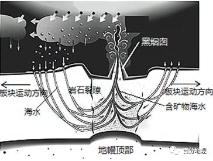
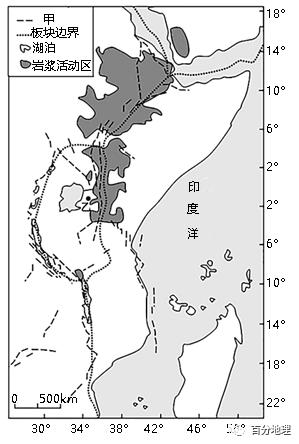
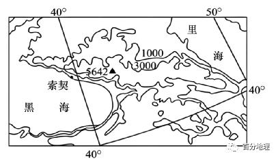
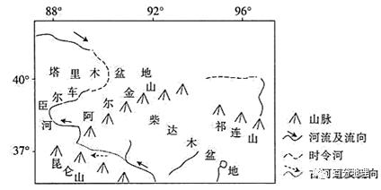

# 微专题之084板块构造学说

```
本专题摘自“百分地理”公众号，如有侵权请告之删除，谢谢。联系hhwxyhh@163.com
```

------
（2022·河北·高三阶段练习）苏门答腊岛东北隔马六甲海峡与马来半岛相望，西濒印度洋，东临南海。岛上河流众多，有90余座火山，其中最高峰海拔达3800米。下图示意苏门答腊岛山脉、河流、沼泽分布。据此完成1题。   
   
   
1．巴里桑山脉呈西北一东南走向，主要是因为（  ）   
A．亚欧板块向东南俯冲   
B．印度洋板块向东北挤压   
C．地壳活跃程度的差异   
D．岛屿呈西北一东南走向   
<span style="color: rgb(255, 0, 0);">1．B因苏门答腊拉岛西南部边缘为印度洋板块与亚欧板块的碰撞挤压边界，印度洋板块向东北挤压，地壳抬升，形成西北一东南走向的山脉，B正确；亚欧板块海拔较高，印度洋板块海拔较低，是印度洋板块俯冲到亚欧板块下面，A错误；地壳活跃程度的差异与之无关，C错误；岛屿呈西北一东南走向，不是原因，是结果，D错误。故选B。</span>   
（2022·河南·濮阳一高高三阶段练习）2022年1月15日南太平洋岛国汤加海域海底火山发生剧烈喷发，大量火山灰、气体与水蒸气形成巨大云团冲至近20千米高空。完成2-3题。   
   
   
2．汤加附近海域常有火山喷发活动，是因为地处（  ）   
A．南极洲板块和太平洋板块的消亡边界   
B．印度洋板块和太平洋板块的消亡边界   
C．印度洋板块和太平洋板块的生长边界   
D．太平洋板块和南极洲板块的生长边界   
3．关于此次火山喷发所产生的火山灰可能造成的影响，说法正确的有（  ）   
①土壤中肥力降低②当地昼夜温差变小③影响交通通行安全④引发山洪、泥石流   
A．①②   
B．③④   
C．①③   
D．②③   
<span style="color: rgb(255, 0, 0);">2．B由图和板块构造知识可知，汤加位于太平洋板块与印度洋板块的交界的消亡边界，地壳活跃，多火山，B正确，ACD错误。故选B。</span>   
<span style="color: rgb(255, 0, 0);">3．D火山灰有丰富的矿物质和无机盐，有机质少，肥沃，①错误；火山灰削弱白天的太阳辐射，白天气温低，晚上产生强的保温作用，夜晚气温不会太低，昼夜温差变小，②正确；火山灰使能见度下降，影响交通安全，③正确；火山不会引发山洪、泥石流，④错误，故选D。</span>   
（2022·江西·高三阶段练习）秘鲁钦查群岛主要由三个干旱的花岗岩岛屿组成，岛上寸草不生，唯一“居民”是海鸟，海鸟在群岛上定居了数百万年，留下厚达50米的粪便层。下面为钦查群岛位置示意图。据此完成下面小题。   
   
   
4．钦察群岛以东附近海域所处板块边界及其对应的地貌单元分别是（  ）   
A．生长边界海岭   
B．生长边界海沟   
C．消亡边界海沟   
D．消亡边界海岭   
<span style="color: rgb(255, 0, 0);">4．C钦差群岛以东的海城分布着幽深的海沟，为南极洲板块与美洲板块的挤压消亡边界。C正确.故选C。</span>   
（2022·湖北·高三阶段练习）迪纳拉山脉是巴尔干半岛的主要山脉，西起阿尔卑斯山，沿亚得里亚海海岸向东南延伸，长达645千米。该山脉广泛发育有石林、漏斗、小盆地、溶洞等地貌。下图示意迪纳拉山脉位置。据此完成下面小题。   
   
   
5．迪纳拉山脉形成得益于（  ）   
A．亚欧板块与太平洋板块的挤压碰撞   
B．非洲板块与亚欧板块的挤压碰撞   
C．亚欧板块与印度洋板块的挤压碰撞   
D．非洲板块与印度洋板块的挤压碰撞   
<span style="color: rgb(255, 0, 0);">5．B根据材料可知，迪纳拉山脉西起阿尔卑斯山，沿亚得里亚海海岸向东南延伸，可判断出该山是非洲板块与亚欧板块挤压碰撞形成的，B正确、ACD错。故选B。</span>   
6．（2022·浙江·高三开学考试）死海位于以色列、巴勒斯坦、约旦交界，是世界上最低的湖泊，湖面海拔-430.5米。完成图中①边界东侧区域所属的板块名称及其边界类型为（  ）   
   
   
A．印度洋板块生长边界   
B．亚欧板块消亡边界   
C．印度洋板块消亡边界   
D．亚欧板块生长边界   
<span style="color: rgb(255, 0, 0);">6．A本题主要考查板块构造学说的基本观点。由图中信息可知，①为非洲板块和印度洋板块的生长边界，BC错误；①西侧为非洲板块，东侧为印度洋板块，亚欧板块为图中上方板块，A正确，D错误。故选A。</span>   
（2022·广东·大埔县虎山中学高三阶段练习）帕米尔高原位于天山、昆仑山、喀喇昆仑山、喜马拉雅山、兴都库什山交会处，地质结构复杂，但在波斯语中意为“平顶屋”。下图示意帕米尔高原地质构造。据此完成7题。   
   
   
7．慕士塔格山的形成过程是（  ）   
A．地层断裂—垂直抬升—水平褶皱—板块挤压   
B．地壳下沉—形成断层—板块碰撞—地壳抬升   
C．地壳抬升—形成断层—板块碰撞—水平收缩   
D．板块挤压—水平褶皱—地层断裂—垂直抬升   
<span style="color: rgb(255, 0, 0);">7．D从图中可以看出该区域位于印度洋板块与亚欧板块的交界处，有板块挤压，板块挤压会造成岩层出现水平褶皱，岩层隆起，图中还可以看出慕士塔格山深处的岩层有明显的断裂，因此又经过了地壳断裂，而后垂直上升之后形成慕士塔格山，故慕士塔格山的形成过程是板块挤压一水平褶皱一地层断裂一垂直抬升，D正确；一般而言，板块碰撞挤压是造成岩层褶皱或是断裂的原因，即板块碰撞挤压在前，断裂或褶皱在后，ABC均不符合此逻辑顺序，故ABC错误。故选D。</span>   
（2022·全国·高三专题练习）地球物理学家实验证明：翡翠是在低温、极高压下变质形成的一种玉石。目前市场上商业品级的翡翠玉石95%以上来自缅甸。   
   
8．缅甸翡翠原石丰富的主要原因是（  ）   
A．板块生长边界，地壳活动剧烈   
B．板块生长边界，岩浆活动频繁   
C．板块消亡边界，地壳挤压强烈   
D．板块消亡边界，岩浆活动频繁   
<span style="color: rgb(255, 0, 0);">8．C根据材料可知，翡翠是在低温、极高压下变质形成的一种玉石，可判断出翡翠原石为变质岩；缅甸位于亚欧板块和印度洋板块的消亡边界，地壳挤压产生的极高压易形成翡翠原石，AB错，C正确；岩浆为高温熔融状态，不符合翡翠形成时的低温条件，D错。故选C。</span>   
（2022·湖南·高三阶段练习）板块构造的聚散经历了从板块离散—大洋形成—洋、陆俯冲到陆、陆汇聚和碰撞造山的过程。位于亚洲大陆内部的青藏高原经历了大洋地壳向北俯冲以及印度洋板块与亚欧板块碰撞的过程，下图为其形成过程各阶段示意图。据此完成9-11题。   
   
   
9．图示阶段按照时间顺序排序正确的是（  ）   
A．甲、乙、丙、丁   
B．乙、甲、丁、丙   
C．乙、丁、甲、丙   
D．丁、乙、丙、甲   
10．丁阶段地势起伏较为和缓主要是由于（  ）   
A．岩浆活动   
B．地壳抬升   
C．外力侵蚀   
D．外力沉积   
11．现已广泛认为蛇绿岩层是贴附于大陆边缘或岛弧上的洋壳碎片，其岩层性质自下而上的顺序一般为（  ）   
A．变质岩—岩浆岩—沉积岩   
B．沉积岩—变质岩—岩浆岩   
C．变质岩—沉积岩—岩浆岩   
D．沉积岩—岩浆岩—变质岩   
<span style="color: rgb(255, 0, 0);">9．C由材料可知，亚洲大陆内部的青藏高原经历了大洋地壳向北俯冲以及印度洋板块与亚欧板块碰撞的过程，故其阶段应该为乙阶段，洋壳向陆壳俯冲为丁阶段，洋壳与陆壳强烈挤压，陆壳隆起，并受外力侵蚀和削平；甲阶段由洋壳向北俯冲，转化为印度板块和亚欧板块碰撞；丙阶段陆陆进一步碰撞，青藏高原和喜马拉雅山逐步抬升。综上所述，图示阶段按照时间顺序排序是乙、丁、甲、丙，C正确，A、B、D错误。故选C。</span>   
<span style="color: rgb(255, 0, 0);">10．C由上题分析可知，丁阶段洋壳和陆壳强烈挤压隆起，并受外力侵蚀和削平，地势起伏较为和缓，C正确、D错误；岩浆活动、地壳抬升是内力作用，会使地表变得高低不平，A、B错误。故选C。</span>   
<span style="color: rgb(255, 0, 0);">11．A由题意可知，蛇绿岩层是洋壳碎片，所以其下部应为变质岩和岩浆岩，上部应为沉积岩，A正确，B、C、D错误。故选A。</span>   
（2022·浙江省温州翔宇中学高三开学考试）读下图，完成12-13题。   
   
   
12．图中区域所示的板块个数为（  ）   
A．3   
B．4   
C．5   
D．6   
13．以下对图中事物描述正确的是（  ）   
A．①②之间地震发生概率高于②④之间   
B．板块挤压处⑤的地层年龄较轻   
C．板块消亡边界附近②地多石灰岩矿   
D．③附近的海域有岛弧链   
<span style="color: rgb(255, 0, 0);">12．B本题的关键在于空间定位，结合经纬度和大陆轮廓等信息可以推断出，图中纬线30°为南纬，在图示范围内包括①印度洋板块、②太平洋板块、③美洲板块和④南极洲板块四个，排除ACD；B符合题意，故选B。</span>   
<span style="color: rgb(255, 0, 0);">13．A图中所示为太平洋板块，①②之间为海沟,属于板块消亡边界，地壳运动活跃多地震，A对。在高温高压下容易形成变质岩，C错。海岭属于板块的生长边界，B错，③地区属于大西洋，岛弧链主要分布在亚洲东部，D错。故选A。</span>   
（2022·重庆·高三阶段练习）巴布亚新几内亚是中国在太平洋岛国地区的重要合作伙伴。2022年6月20日，中国援助巴布亚新几内亚的恩加省医院项目竣工交付，体现了“中国建造”的实力。该医院将成为该国最现代化的综合性医院之一。下图为巴布亚新几内亚的示意图。据此完成14题。   
   
   
14．该国地震多发，与此相关的板块是（  ）   
A．北部—亚欧板块南部—印度洋板块   
B．北部—亚欧板块南部—太平洋板块   
C．北部—太平洋板块南部—印度洋板块   
D．北部—印度洋板块南部—太平洋板块   
<span style="color: rgb(255, 0, 0);">14．C巴布亚新几内亚处于亚欧板块、太平洋板块和印度洋板块交界处的东部，西部为亚欧板块，北部是太平洋板块，南部是印度洋板块，故C正确。</span>   
（2022·黑龙江·哈尔滨三中高三阶段练习）彩虹山（5200米）位于秘鲁南部安第斯山脉中，在阳光的照耀下，它呈现出红橙黄绿青蓝紫七种童话般的鲜艳色彩。彩虹山山麓遍布疏林草原景观。读图完成15题。   
   
   
15．彩虹山所在地区多火山活动，原因是处于（  ）   
A．南美大陆板块内部   
B．大陆板块之间相互挤压地带   
C．大洋板块向大陆板块俯冲地带   
D．大洋板块和大陆板块张裂地带   
<span style="color: rgb(255, 0, 0);">15．C彩虹山位于秘鲁南部安第斯山脉中，位于南极洲板块和美洲板块挤压碰撞处，属于大洋板块向大陆板块俯冲地带，地壳活跃，因此多火山活动，C正确，ABD错误。故选C。</span>   
（2023·全国·高三专题练习）南岭由五条山岭组成，故又称“五岭”，经过多次的造山运动，显得支离破碎，总体呈东西走向。下图示意南岭的地理位置。据此回答16题。   
   
   
16．南岭的形成主要是因为（  ）   
A．南北板块挤压，地壳隆起成山   
B．东西板块碰撞，地壳褶皱成山   
C．地壳岩层断裂，岩块相对上升   
D．地壳水平位移，岩浆上涌成山   
<span style="color: rgb(255, 0, 0);">16．A南岭是东西走向的山脉，是受到南北方向板块碰撞挤压，岩层隆起形成的，A正确，B错、不是断块山和火山，故C、D错误，本题选A。</span>   
（2022·河北·曹妃甸一中高三阶段练习）2020年11月10日8时12分，由我国自主研制的“大国重器”——“奋斗者”号全海深载人潜水器成功坐底马里亚纳海沟，坐底深度为10909m。马里亚纳群岛由十几个岛屿组成，从最南端的关岛向北延伸约900km，其形成与火山密切相关，塞班岛是马里亚纳群岛中面积仅次于关岛的第二大岛屿。读马里亚纳海沟及其附近示意图，完成17-18题。   
   
   
17．从板块位置看，下图能正确表示“奋斗者”号坐底位置的是（  ）   
   
   
A．AB．BC．CD．D18．下列板块边界，最符合图意的是（  ）   
A．亚欧板块和美洲板块   
B．亚欧板块和太平洋板块   
C．非洲板块和印度洋板块   
D．南极洲板块和美洲板块   
<span style="color: rgb(255, 0, 0);">17．C根据所学知识马里亚纳海沟位于太平洋板块和亚欧板块的消亡边界，太平洋板块俯冲到亚欧板块下面而形成的，A选项消亡边界，板块应相向运动，A错误；B为生长边界，B错误；C为消亡边界，板块运动方向正确，C正确；D为生长边界，板块应背向运动，D错误，该题选C。</span>   
<span style="color: rgb(255, 0, 0);">18．B根据马里亚纳海沟的位置，西部滨临亚欧大陆，东临太平洋，所以位于亚欧板块和太平洋板块的消亡边界，B正确，ACD错误。故选B。</span>   
（2023·全国·高三专题练习）地处板块交界处的堪察加半岛，是环太平洋“火链”的重要组成部分，包含200多座第四纪火山。位于堪察加半岛中北部的克柳切夫火山，是全球岩浆产率最大的火山之一（55百万吨/年）。下图为堪察加半岛及其周边地区示意图。据此完成19-20题。   
   
   
19．堪察加半岛活火山发育的主要原因是（  ）   
A．位于板块生长边界，火山喷发频繁   
B．海洋地壳薄，岩浆易喷出   
C．位于板块碰撞边界，地壳运动活跃   
D．岛弧发生断裂，裂隙发育   
20．组成堪察加半岛的主要岩石（  ）   
A．表面多有纹理   
B．存在气孔构造   
C．可以找到化石   
D．片理结构明显   
<span style="color: rgb(255, 0, 0);">19．C依据图中信息，堪察加半岛位于太平洋板块和亚欧板块的碰撞边界（消亡边界），地壳运动活跃，岩浆沿地壳裂隙喷出形成火山，C正确，ABD错误。故选C。</span>   
<span style="color: rgb(255, 0, 0);">20．B堪察加半岛多火山喷发形成的喷出岩，在岩浆喷出到地面时，温度和压力骤减，所含挥发性成分以气体的形式逸出，使孔洞保留在岩石中，形成气孔构造，因此，存在气孔构造是喷出岩的主要特征之一，B正确；表面多有纹理的是大理岩，A与题意不符；可以找到化石的是沉积岩，C与题意不符；片理结构明显的是变质岩，D与题意不符。故选B。</span>   
（2023·全国·高三专题练习）2021年12月4日爪哇岛的塞梅鲁火山持续喷发，形成大量的火山喷出物。下图示意2020年东南亚（局部）人口分布图。据此完成21-22题。   
   
   
21．爪哇岛多火山的原因是位于（  ）   
A．印度洋板块与亚欧板块消亡边界   
B．亚欧板块与太平洋板块消亡边界   
C．南极洲板块与亚欧板块生长边界   
D．印度洋板块与太平洋板块生长边界   
22．塞梅鲁火山喷发后，火山喷出物的主要扩散方向是（  ）   
A．东北   
B．西北   
C．东南   
D．西南   
<span style="color: rgb(255, 0, 0);">21．A爪哇岛位于亚欧板块南缘，与印度洋板块交界，亚欧板块与印度洋板块碰撞挤压，地壳运动活跃，多火山地震，属于板块消亡边界，因此爪哇岛多火山的原因是位于印度洋板块与亚欧板块消亡边界，故BCD项错误，故选A。</span>   
<span style="color: rgb(255, 0, 0);">22．C赛梅鲁位于赤道以南，12月4日太阳直射南半球，北半球的东北信风南移越过赤道偏移形成西北风，赛梅鲁火山喷发后，火山喷出物的主要扩散方向是东南方，故ABD项错误，选C。</span>   
（2022·全国·高三专题练习）地质历史时期，巴塔哥尼亚地区火山活动频繁。下图左为巴塔哥尼亚位置图，下图右为该山区某堆积地貌中颗粒物分布示意围，该颗粒物大小不均，杂乱无章地堆积。据材料完成23题。   
   
   
23．巴塔哥尼亚地区在地质历史时期火山活动频繁的主要原因是其位于（  ）   
A．太平洋板块与美洲板块的消亡边界   
B．太平洋板块与美洲板块的生长边界   
C．南极洲板块与美洲板块的消亡边界   
D．南极洲板块与美洲板块的生长边界   
<span style="color: rgb(255, 0, 0);">23．C巴塔哥尼亚地区位于南美大陆西部，太平洋东岸。位于南极洲板块和美洲板块的消亡边界，南极洲板块和美洲板块碰撞挤压，南极洲板块俯冲到美洲板块下方，地壳活跃，多火山、地震，C正确，ABD错误。故答案选C。</span>   
（2023·全国·高三专题练习）海底黑烟囱是指海水从地壳裂缝渗入地下，遇到熔岩被加热，挟带了周围岩层中的金属后又从地下喷出，这些金属经过化学反应形成硫化物沉积在附近的海底，像“烟囱”形状一样堆积而成的构造。下图为海底黑烟囱形成过程示意图。据此完成24-25题。   
   
   
   
24．形成海底黑烟囱的主要地质作用有（  ）   
A．岩浆活动和地壳运动   
B．变质作用和外力作用   
C．岩浆活动和变质作用   
D．地壳运动和外力作用   
25．根据海底黑烟囱的形成原理，可推测海底黑烟囱主要分布在（  ）   
①大洋内部②板块内部③板块生长边界附近④板块消亡边界附近   
A．①③   
B．②③   
C．①④   
D．②④   
<span style="color: rgb(255, 0, 0);">24．A根据图中的信息，结合材料内容可知，此过程没有变质作用，BC错误。地壳运动使得岩石圈中的岩石出现裂隙，根据图中的地幔顶部可知，该地是岩浆的发源地软流层，岩浆沿着地壳的裂隙上升，产生岩浆活动，所以形成图中海底黑烟囱的主要地质作用有岩浆活动、地壳运动，A正确。根据图中的位置，分析此过程没有外力作用的参与，主要是内力作用形成海底黑烟囱，D错误。故选A。</span>   
<span style="color: rgb(255, 0, 0);">25．A结合图可以看出板块在向两边张裂，海底黑烟囱应处于板块的生长边界附近，③正确，②④错误；由材料“海底黑烟是指海水从地壳裂缝渗入地下”可知其位于大洋内部，①正确。所以A正确，BCD错误。故选A。</span>   
（2023·全国·高三专题练习）新西兰位于板块的交界处，其南岛西部沿海有一处著名地质景观“薄饼岩”，是由硬石灰岩和软砂岩堆积形成数以百计的多层区域，沿着悬崖沟壑垂直形成，形似层层薄饼，故而得名。下左图为“薄饼岩”景观图，下右图为新西兰等高线地形图。完成26-27题。   
   
   
26．推测新西兰所处的板块边界类型及两侧板块的移动方向（  ）   
A．生长边界   
东北、西南   
B．生长边界   
西北、东南   
C．消亡边界   
东北、西南   
D．消亡边界   
西北、东南   
27．“薄饼岩”形成的地质过程是（  ）   
A．沉积作用―地壳抬升―外力侵蚀   
B．岩浆活动―地壳抬升―沉积作用   
C．岩浆活动―沉积作用―外力侵蚀   
D．内力抬升―外力侵蚀―沉积作用   
<span style="color: rgb(255, 0, 0);">26．D根据所学，新西兰处于印度洋板块与太平洋板块碰撞地带，属于消亡边界，再由图中新西兰南岛上山脉走向，可以判断板块碰撞挤压方向是西北、东南方向。D正确，排除ABC。故选D。</span>   
<span style="color: rgb(255, 0, 0);">27．A根据材料，“薄饼岩”，是由硬石灰岩和软砂岩堆积形成的。其形成的地质过程是先经历沉积作用形成硬石灰岩和软砂岩，之后由于受到板块挤压，地壳产生抬升作用，沉积岩层出露地表，受到地表外力的侵蚀，才形成图示景观。综上所述A正确，排除BCD。故选A。</span>   
（2022·四川·成都七中二模）火山锋是指板块交界处火山活动频繁的线状前沿地带。马提尼克岛位于加勒比海，该岛火山锋的移动、停滞在岛上塑造出三道壮观的火山带（如下图，箭头为板块运动方向），据此完成28-29题。   
   
   
28．造成马提尼克岛火山锋分布的主导板块及运动形式是（  ）   
A．加勒比板块间歇性俯冲   
B．大西洋板块间歇性俯冲   
C．加勒比板块间歇性张裂   
D．大西沙板块间歇性张裂   
29．火山锋的存在，导致马提尼克岛（  ）   
①面积缩小②平均高度增加③面积扩大④平均高度降低   
A．①②   
B．①④   
C．②③   
D．③④   
<span style="color: rgb(255, 0, 0);">28．B根据图片中的箭头，板块移动的方向是从大西洋板块移动向加勒比板块，是大西洋板块主动俯冲到加勒比板块的下方，因此导致该地火山锋分布的主导板块是大西洋板块且板块的边界类型是消亡边界；根据材料，该岛火山锋的移动、停滞形成了岛上的三道火山带，因此该处板块运动的形式是间歇性的，ACD错误，B正确。故选B。</span>   
<span style="color: rgb(255, 0, 0);">29．C根据材料，火山锋是火山活动频繁的线状前沿地带，该地区火山喷发频率高，地下物质喷出较多且堆积在岛屿及其周边地区，导致该岛屿面积逐渐扩大、平均高度逐渐增加，②③正确，①④错误，ABD错误，C正确。故选C。</span>   
（2022·山东·禹城市华奥私立学校高三阶段练习）江南造山带是指出露于扬子板块与华夏板块之间，主要由一套浅变质、强变形的新元古代巨厚沉积--火山岩系及时代相当的侵入体所构成的带状地质构造单元，呈弧形跨越了桂北、黔东、湘西、湘北、赣北、皖南、浙北和苏中的广大区域。江南造山带中的金及金多金属矿产成矿作用特殊，是我国一个典型的金多金属矿床成矿带。按照矿床地质特征、结合区域构造演化，有专家学者提出了江南造山带矿床成矿模式，如下图所示（a、b、c表示不同阶段）。据此完成30-31题。   
   
   
30．江南造山带矿床成矿模式的先后顺序是（  ）   
A．a、c、BB．a、b、CC．c、a、BD．c、b、A31．与b时期长沙--平江深大断裂带的形成关系最密切的是（  ）   
A．变质作用   
B．岩浆活动   
C．地壳运动   
D．火山地震   
<span style="color: rgb(255, 0, 0);">30．C根据材料，江南造山带是指出露于扬子板块与华夏板块之间，主要由一套浅变质、强变形的新元古代巨厚沉积--火山岩系及时代相当的侵入体所构成的带状地质构造单元，根据c图信息，扬子板块内发生岩浆活动，在九岭弧后盆地发生沉积，之后扬子板块与华夏板块发生挤压，岩层发生弯曲变形，形成江面造山带，b时期两板块继续挤压，在板块交界处岩浆活动频繁，岩浆侵入，提供主要矿质来源，所以江南造山带矿床成矿模式的先后顺序是c、a、b ，C正确，ABD错误，所以选C。</span>   
<span style="color: rgb(255, 0, 0);">31．C岩层受到地壳运动产生强大的挤压或张力作用，超过了岩层所能承受的范围，岩层发生断裂，并沿断裂面发生明显位移，称为断层构造，所以与b时期长沙--平江深大断裂带的形成关系最密切的是地壳运动，C正确；变质作用发生在地壳深处，对地表形成基本不产生影响，A错误，岩浆活动是沿着地壳的薄弱地带侵入地壳的上部或喷出地表，不会形成断裂带，B错误，断裂带处多火山地震活动，不是火山地震形成断裂带，D错误，所以选C。</span>   
（2022·四川泸州·高三期末）科隆群岛(下图)隶属厄瓜多尔，位于东太平洋，横跨赤道两侧，群岛地貌独特，由海底火山喷发的熔岩凝固而成。群岛气候凉爽，降水较少，某些季节时常会有“浓湿雾”从东南方向的海上袭来。岛上不同习性的动植物种类众多，耐寒和喜暖动物共存。群岛上现存有其他地区罕见的多种古老且奇特的动物。经测算，群岛每年以数厘米速度向东南方移动。据此完成32题。   
   
   
<span style="color: rgb(255, 0, 0);">32．A科隆群岛位于太平洋板块与南极洲板块的生长边界附近，由于板块运动的影响，科隆群岛向东南的南极洲板块方向移动，A正确。信风、洋流、海浪不会导致群岛的移动，BCD错误。所以选A。</span>   
（2023·浙江·高三专题练习）2019年8月，水手在汤加群岛附近先是发现海上上升蒸汽柱，然后看到海面覆盖了大片“浮石筏”（如下图所示）。据此完成33-34题。   
   
   
33．推断组成“浮石筏”的物质是（  ）   
A．海洋污染物组成的陆地   
B．鱼类、水藻组成的群落   
C．海底岩浆喷出快速冷却   
D．海水上升导致岩石上浮   
34．此处两侧板块运动方向和地形是（  ）   
A．相向运动   
海岭   
B．相向运动   
海沟   
C．彼此分离   
裂谷   
D．彼此分离   
岛弧   
<span style="color: rgb(255, 0, 0);">33．C根据图示信息可知，浮石多气孔构造，为喷出型岩浆岩，当岩浆喷出地表之后，其中的气体就顺着岩浆未凝固的缝隙释放出来，形成了气孔，故组成“浮石筏”的物质是由海底岩浆喷出快速冷却形成，C正确；海洋污染物种类主要有石油及其产品，金属和酸、碱，农药、放射性物质、有机废液和生活污水，热污染和固体废物，由其组成的陆地不会出现大量的浮石，A错误；鱼类、水藻组成的群落应以鱼类、水藻为主体，而不是以浮石为主体，B错误；地壳抬升会导致岩石上浮，海水上升不会引起岩石上浮，D错误。故选C。</span>   
<span style="color: rgb(255, 0, 0);">34．B由图可以看出，汤加群岛位于印度洋板块和太平洋板块的交界处，板块发生相向运动，大洋板块与大陆板块碰撞挤压，大洋板块俯冲到大陆板块之下形成海沟，大陆板块受挤上升形成岛弧和海岸山脉 。此处位于汤加群岛东侧，应该是板块相向运动形成的海沟，B正确，A、C、D错误。故选B。</span>   
（2021·甘肃·兰州市第二十七中学高三阶段练习）下图为世界局部区域图。阿留申群岛属于形成年代较晚的火山群岛,长1900千米,由300多个细小的火山岛（当中有57座火山）组成。群岛四季温差小,多雨雾和强风。据此35题。   
   
   
35．阿留申群岛多火山的原因是（  ）   
A．海底板块发生升降运动   
B．阿留申群岛的隆起抬升   
C．位于生长边界板块张裂   
D．位于消亡边界板块碰撞   
<span style="color: rgb(255, 0, 0);">35．D本题主要考查火山的形成原因。阿留申群岛位于美洲板块与太平洋板块的消亡边界，位于环太平洋火山地带，D对；ABC排除。故选D。</span>   
（2022·全国·高三专题练习）下图示意东非大裂谷地质构造，早些年根据地质学家的勘测以及GPS的测量，该裂谷以每年6～7mm的速度分裂。2018年3月底，肯尼亚西南部附近突然出现了一条长几千米、宽约15米大致呈南北走向的大裂缝（图中乙处），地质学家认定该裂缝直接反映了东非大裂谷分裂正在加剧。据此完成36-37题。   
   
   
36．图中甲最可能是（  ）   
A．国界线   
B．断层线   
C．火山通道   
D．褶皱山脉   
37．地质学家认定图中乙处裂缝能反映东非大裂谷分裂的直接依据可能是（  ）   
A．裂缝附近是岩浆活动区   
B．裂缝的形成具有突然性   
C．该裂缝距离板块边界较近   
D．裂缝与裂谷走向大体一致   
<span style="color: rgb(255, 0, 0);">25．B图中甲多沿东非大裂谷及周边分布，属于板块运动形成的断层线，B正确；根据所学知识可知，甲不是国界线，A错误；甲所在位置主要为裂谷、断层不是火山通道、褶皱山脉，CD错误。所以本题选B。</span>   
<span style="color: rgb(255, 0, 0);">26．D肯尼亚西南部附近突然出现的一条长几千米、宽约15米大致呈南北走向的大裂缝与东非大裂谷的走向基本一致，这也是地质学家认定该裂缝直接反映了东非大裂谷分裂加剧的直接依据，D正确。而靠近岩浆活动区，距离板块边界较近，发生的突然性均属于间接性证据，ABC错误。所以本题选D。</span>   
（2022·贵州·贵阳清镇北大培文学校高三阶段练习）热点是岩石圈板块之下提供炽热岩浆的固定源地，火山喷发是热点在地表的重要表现。美国西部的黄石国家公园位于北美大陆下面的热点上方，在过去的200万年间,黄石公园发生了由同一热点引发的三次大型火山喷发,如下面左图所示。下面右图示意在肖松尼湖和刘易斯湖位置发生的一次火山喷发,在这里只喷发了火山灰和火山碎屑，并未形成火山体，在那之后,经过地质变迁，最终形成两个火山湖。据此完成下面小题。   
   
   
38．推测过去的200万年间美洲板块的移动方向是（  ）   
A．自西北向东南   
B．自西南向东北   
C．自东南向西北   
D．自东北向西南   
39．正确表示右图所示湖泊形成过程的是（  ）   
A．内力作用—地面隆起—火山碎屑喷出—地面下陷—积水成湖   
B．内力作用—火山碎屑喷出—地面隆起—外力沉积—积水成湖   
C．内力作用—地面隆起—外力沉积—地面下陷—积水成湖   
D．外力作用—火山碎屑喷出—外力沉积—地面下陷—积水成湖   
<span style="color: rgb(255, 0, 0);">38．D据图可知，三处火山大致呈现西南东北方向分布，且形成时间上，西南方向的形成时间更早，东北方向的形成时间更晚，根据热点的定义：热点是岩石圈板块之下提供炽热岩浆的固定源地，热点是固定的，那么形成的火山位置发生改变只有可能是板块的移动导致火山的位置不同，据此可知，板块的移动方向为自东北向西南方向移动，D正确，ABC错误；故选D。</span>   
<span style="color: rgb(255, 0, 0);">39．A湖泊是洼地积水而成，洼地不可能是外力沉积而来，B错误；据材料在肖松尼湖和刘易斯湖位置发生的一次火山喷发，在这里只喷发了火山灰和火山碎屑，并未形成火山体，在那之后，经过地质变迁，最终形成两个火山湖分析，由于内力作用，大量岩浆上升，导致地面隆起，火山灰、火山碎屑沿着两个湖泊所在的位置的地下裂隙喷出喷出，火山喷发结束后，经过地质变迁（地面下陷），形成洼地，最终积水成湖。A正确；CD错误；故选A。</span>   
（2022·黑龙江·牡丹江市第三高级中学高三阶段练习）下列左图示意海底平顶山的形成过程，其中箭头表示板块的移动方向，右图示意太平海火山群岛分布。它们是在太平洋板块漂移时，由一个静止不动的岩浆喷发点依次形成的，其岛屿边缘的数字表示其形成的距今时间（百万年）。据此完成40-41题。   
   
   
40．影响图左中火山顶部平坦最主要的地质作用是（  ）   
A．风化   
B．侵蚀   
C．沉积   
D．岩浆活动   
41．根据图右信息判断，图中的太平洋板块（  ）   
A．向东南移动   
B．向西北移动   
C．移动速度逐渐加快   
D．移动速度逐渐减慢   
<span style="color: rgb(255, 0, 0);">40．B海底岩浆喷出形成火山锥，新形成的火山顶部坡度较大，不易接受沉积，CD错误；火山形成后，受长期受海水的侵蚀，顶部变得平坦，B正确；海底的火山各部位均会发生风化，风化不能仅造成火山顶部平坦，A错误。故选B。</span>   
<span style="color: rgb(255, 0, 0);">41．B由图中形成的距今时间可推测，西北方向的岛屿形成最早，故板块向西北移动，A错误、B正确；根据各岛屿的时间间隔和相距远近，可推测板块移动速度在波动变化，CD错误。故选B。</span>   
42．（2022·黑龙江·鹤岗一中高三阶段练习）阅读图文材料，完成下列要求。   
肯尼亚奥卡瑞地热田位于东非裂谷带中央，这是非洲首个利用地热资源进行发电的地热田，断裂破碎带构成了深层流体（主要是地下天然蒸汽和热水）上涌的主要通道，地热井的生产能力受热源、断裂和裂缝分布、地层岩性影响。地热电站每天需消耗大量的水对设备进行冷却，地热电站水源取自附近纳瓦沙湖。这里年降水量为714mm，雨季主要在3-5月和10-11月。随着地下蒸汽的大规模开采需要地面进行人工回灌。下图示意奥卡瑞地区东部和西部典型地温曲线。   
   
   
根据板块构造学说解释奥卡瑞地热田的形成原因。   
<span style="color: rgb(255, 0, 0);">【答案】位于东非大裂谷地带，地壳运动活跃，板块张裂超过岩石承受能力，断裂发育，裂缝众多。雨季降水较丰富，雨水下渗后，被来自地球内部的热能加热后，以水蒸汽和热水的形式，沿断裂带裂隙溢出地表。</span>   
<span style="color: rgb(255, 0, 0);">【解析】根据材料“奥卡瑞地热田位于东非裂谷带中央”可知这里位于板块张裂带，“断裂破碎带构成了深层流体(主要是地下天然蒸汽和热水）上涌的主要通道”可知，地热能与地下水结合生成的天然蒸汽和热水是地热电站的发电原料，所以答案可以从断裂带的发育原因和地热资源的溢出形式两方面分析。如位于东非大裂谷地带，地壳运动活跃，板块张裂超过岩石承受能力，断裂发育，裂缝众多。雨季降水较丰富，雨水下渗后，被来自地球内部的热能加热后，以水蒸汽和热水的形式，沿断裂带裂隙溢出地表。</span>   
43．（2021·四川宜宾·高三阶段练习）阅读图文材料，完成下列要求。   
晚白垩纪开始，印度板块向北与亚欧板块初始碰撞挤压，导致青藏高原东南缘地壳增厚，三江造山带构造体系初步形成。之后，印度板块与扬子陆块（属亚欧板块）相向运动，三江造山带边缘受到强烈剪切，向外挤出的过程中顺时针旋转（如下列左图）。摩擦剪切热对断层附近的温度结构起关键作用，剪切生热很容易使岩石温度升高，接近熔点。如今，三江造山带地区形成众多断裂带（如下列右图），留有多处火山遗迹，且形成了金沙江、澜沧江、怒江“三江并流”的壮观场景。   
   
   
（1）嘉黎-高黎贡断裂带与甘洛一小江断裂带两侧岩体位移方向都相反，试对此做出合理的解释。   
（2）分析三江造山带地壳运动对火山活动的影响。   
（3）判断“三江并流”地区河流、断裂带的先后形成顺序，并说明理由。   
<span style="color: rgb(255, 0, 0);">【答案】（1）印度板块向北楔入亚欧板块，三江造山带受断裂影响，被迫向南挤出；嘉黎-高黎贡断裂带西侧属印度板块，故北移，东侧属三江造山带，故南移；甘洛-小江断裂带西侧属三江造山带，故南移，东侧属扬子陆块，故北移。</span>   
<span style="color: rgb(255, 0, 0);">（2）强烈的剪切作用产生摩擦热，导致地壳深处岩石熔融，为火山活动提供了岩熔物质基础；构造运动活跃，积聚了岩浆活动的能量；断裂为岩浆喷出提供了（阻力较小的）通道，导致岩浆能够喷出地表，形成火山。</span>   
<span style="color: rgb(255, 0, 0);">（3）顺序：先形成断裂带，后形成河流。理由：三江造山带受强烈的挤压与剪切作用，超过岩层耐受限度，形成断裂带；断裂带处地势较低，易汇水成河，流水侵蚀形成峡谷。</span>   
<span style="color: rgb(255, 0, 0);">【解析】（1）从左图中可以看出印度板块向北楔入亚欧板块，三江造山带被向外挤出，因此三江造山带东西两侧的外缘均是内侧向南位移：嘉黎-高黎贡断裂带东侧属三江造山带，故南移，甘洛-小江断裂带西侧属三江造山带，故南移，外侧向北位移：嘉黎-高黎贡断裂带西侧属印度板块，故北移，甘洛-小江断裂带东侧属扬子陆块，故北移。</span>   
<span style="color: rgb(255, 0, 0);">（2）主要从岩浆物质来源、岩浆活动条件和岩浆上升通道的角度分析：板块间强烈碰撞挤压摩擦产生热量，使地壳深处岩石熔融，产生岩熔物质，地壳运动活跃，为岩浆活动提供条件，断裂为岩浆喷出提供了通道，易形成火山。</span>   
<span style="color: rgb(255, 0, 0);">（3）断裂是山川形成的基础，河流发育在断裂带上，据分析可知：三江造山带受强烈的挤压与剪切作用，超过岩层的弹性限度，岩层断裂，断裂带易汇集流水加上侵蚀形成峡谷地貌。</span>   
44．（2022·全国·高三专题练习）阅读图文材料，完成下列要求。   
茶卡盐湖位于柴达木盆地的最东段、祁连山南缘凹陷的山间小盆地内，南面有鄂拉山，北面有青海南山与青海湖相隔，总面积105平方千米，湖面海拔3100米，湖水面积、水深受季节影响明显。盐湖每年10月至翌年4月为枯水季节，湖面大部无湖表水；5-9月为丰水季节，湖表覆满水层。茶卡盐湖有厚度在4~8米之间的沉积盐层。夏季气候温凉，干旱少雨，平静的湖面如镜子一般倒映着蓝天白云，有中国的“天空之镜”之称。下图示意茶卡盐湖地理位置。   
   
   
板块运动导致的地壳抬升是茶卡盐湖形成的主导因素。推测茶卡高原内陆湖泊的形成过程。   
<span style="color: rgb(255, 0, 0);">【答案】（亚欧板块与印度洋板块）板块碰撞挤压，隆起成为高原；高原上山地隆起（或构造隆起），凹陷处形成盆地，河水（或地表水）在盆地低洼处汇聚形成湖泊；高原山地进一步隆起，气候变干，湖水不能外泄，形成内陆湖。</span>   
<span style="color: rgb(255, 0, 0);">【分析】根据材料提示，茶卡盐湖是板块运动导致的地壳抬升形成的，而且它是高原上的内陆湖泊，答题的时候就要抓住板块运动、地壳抬升、高原、内陆、湖泊等重要信息组织答题。位于青藏高原，是亚欧板块与印度洋板块碰撞挤压，地壳抬升形成高原；高原地壳抬升过程中，一些区域褶皱隆起成山，一些区域凹陷成谷地或盆地，地势低洼积水成湖；湖泊周围山地进一步隆起，阻挡了水汽进入，气候变干，蒸发强烈，湖水不能外泄，形成内陆湖。</span>   
45．（2022·山东·昌乐二中高三阶段练习）阅读图文资料，完成下列要求。   
大西洋与地中海曾有广阔的水道相连。在距今800万年前，非洲板块、印度洋板块向北漂移与亚欧板块发生碰撞，在大西洋与地中海相连处形成山脉，地中海与海洋唯一通道中断，在被阻隔的几十万年里，地中海逐渐变成一个深达3000多米的巨大盆地，其底部堆积了2千米厚的盐层，这就是地质时期发生在地中海地区的“墨西拿盐度危机”事件。期间，古地中海向西亚地区输送了巨量的盐分。直到约533万年前，直布罗陀地区大面积断裂，直布罗陀海峡完全被打开，海水重新注入地中海。下图为地中海地区示意图。   
   
   
根据地中海在地质时期的演变历史及板块运动的趋势，推测地中海未来的演变趋势。   
<span style="color: rgb(255, 0, 0);">【答案】非洲板块与亚欧板块碰撞挤压，海底逐步抬起形成山脉，地中海逐步缩小和封闭，再次形成湖泊）;由于缺少大西洋海水注入，地中海水量收入少于支出，湖泊干涸;地中海逐步演变为荒漠广布的盆地。</span>   
<span style="color: rgb(255, 0, 0);">【解析】首先，由材料可知，地中海处在非洲板块与亚欧板块的碰撞挤压地带，地中海海底地壳可能隆起抬升形成山脉，依据地中海在地质时期的演变历史，可能会导致直布罗陀海峡再次闭合，进而造成地中海面积变小，由海洋再次变成内陆湖泊。其次，由于失去大西洋海水的注入，再加上气候变干，蒸发加剧，地中海（湖泊）水量收入会少于支出，盐度升高，湖水逐渐干涸，最终形成巨厚盐层覆盖的盆地。第三，由于盐层覆盖地表，植被难以生长，最终会形成荒漠景观。</span>   
46．（2022·西藏·拉萨中学高三阶段练习）阅读图文材料，完成下列要求。   
距今80Ma（百万年）的地质时期，青藏地区和横断山区还是一片海洋。随着板块运动，距今23.7Ma，南亚及我国西南地区已成为平缓的陆地。距今2.48Ma，青藏地区隆起成高原，现今横断山区形成了“山高谷深、河谷并列、紧密相邻”的地貌景观，澜沧江与怒江的最短直线距离仅18.6公里。横断山区受西南季风的影响明显，区域内生物资源丰富，物种独特，是我国乃至世界生物多样性最丰富的地区之一。   
   
   
（1）推测地质时期横断山区“陆地形成”阶段的西南季风强弱变化及其成因。   
（2）解释横断山区“山高谷深，河谷并列，紧密相邻”的形成过程。   
<span style="color: rgb(255, 0, 0);">【答案】（1）变化：西南季风增强。</span>   
<span style="color: rgb(255, 0, 0);">成因：（受板块运动影响，）横断山区由海洋抬升为陆地，海陆热力差异增大。</span>   
<span style="color: rgb(255, 0, 0);">（2）印度洋板块向北运动，受阻向东扭转，与亚欧板块碰撞挤压，形成（南北走向）高山谷地；随着地层抬升，河流不断下切（向下侵蚀），形成深谷；由于板块继续碰撞挤压，空间不断压缩，使并列的河谷相距较近。</span>   
<span style="color: rgb(255, 0, 0);">【分析】（1）根据材料变化：“青藏地区和横断山区还是一片海洋”可知，横断山区过去是海洋，后经板块运动，被抬升成陆地，由于海陆热力性质差异的影响，陆地比热容小，海洋比热容大，夏季时，陆地升温快形成低压，海洋升温慢形成高气压，风从海洋吹向陆地，在横断山区与印度洋之间形成由印度洋吹过来的夏季风，与西南季风风向一致，增强了西南季风。使西南季风变强。</span>   
<span style="color: rgb(255, 0, 0);">（2）根据所学知识和读图可知，横断山区位于亚欧板块与印度板块碰撞地带，在亚欧板块的南部被挤起一个高大的青藏高原地区，印度洋板块向北运动时，受青藏高原的阻挡发生向东扭转，与亚欧板块碰撞挤压，亚欧板块边缘发生强烈的褶皱，形成（南北走向）高山谷地；并在山谷中发育了河流，随着地层抬升，河流不断下切（向下侵蚀），形成深谷；由于板块继续碰撞挤压，空间不断压缩，使并列的河谷相距较近。就形成了山高谷深、河谷并列、紧密相邻的地貌景观。</span>   
47．（2020·全国·高三专题练习）阅读图文材料，回答下列问题。   
与以丘陵地形为主的新西兰北岛不同，新西兰南岛地形以山地为主，山地可占该岛面积的70%，许多山峰超过3000米，其中库克山海拔3764米，为新西兰最高峰。南岛山地顶部多积雪、冰川，现代冰川面积约1000平方千米。新西兰南岛峡湾地貌发育，在峡湾峭壁上，大小瀑布叮咚或者轰鸣，汇成动听的天然交响乐。下图为新西兰地理事物简图。   
   
   
运用板块构造学说简析新西兰南岛山脉形成的原因。   
<span style="color: rgb(255, 0, 0);">【答案】新西兰南岛位于两大板块交界处，岩层受到挤压隆起形成高耸的褶皱山脉。</span>   
<span style="color: rgb(255, 0, 0);">【解析】注意设问“运用板块构造学说”，新西兰地处印度洋板块和太平洋板块的消亡边界，板块碰撞挤压，新西兰南岛隆起抬升形成高大的褶皱山脉。</span>   
48．（2022·全国·高三专题练习）下图示意平顶海山的形成过程，读图完成下题。   
   
   
（1）请说出与图中平顶海山形成可能相关的海底地形与板块边界类型。   
（2）分析图示平顶海山的形成过程。   
（3）在世界各大洋中，太平洋中的平顶山最多，在太平洋中部有一群平顶海山，以每年1-5厘米的速度继续漂移。如果照此发展下去，那么最终平顶海山是否会消失，并说明原因。   
<span style="color: rgb(255, 0, 0);">【答案】（1）海岭或海脊；生长边界。</span>   
<span style="color: rgb(255, 0, 0);">（2）火山喷发露出水面形成火山；随着板块的移动火山没入水下，受风浪、海流等外力侵蚀，山顶被侵蚀成平顶；随着板块移动，岩石圈下降，形成平顶海山。</span>   
<span style="color: rgb(255, 0, 0);">（3）会消失。随着板块的移动，最后，当洋底推移到海沟俯冲带时，平顶山亦随之俯冲下去，被埋藏地壳之下，最后消失。</span>   
<span style="color: rgb(255, 0, 0);">【解析】（1）从图中看，平顶海山在阶段Ⅰ由于岩浆喷发形成山地，可推测出该地可能位于板块的生长边界，火山喷发形成海岭或海脊。</span>   
<span style="color: rgb(255, 0, 0);">（2）从图中看，阶段Ⅰ火山喷发露出水面形成火山；根据阶段Ⅱ中的箭头可判断出，随板块的移动，阶段Ⅰ形成的火山没入水下，受风浪、海流等外力侵蚀作用，山顶被侵蚀成平顶；在阶段Ⅲ中，岩石圈下降，形成平顶海山。</span>   
<span style="color: rgb(255, 0, 0);">（3）由材料“以每年1-5厘米的速度继续漂移”可推测出，平顶海山的移动是受板块移动的影响；当平顶海山移动到海沟俯冲带时，平顶山也会随之俯冲下去，最后消失。</span>   
49．（2022·黑龙江·哈师大附中模拟预测）阅读图文材料，完成下列要求。   
地形效应是指某一岩层受一些因素的影响，在地质图上呈现出不同的露头形态。我国热带(一般指约24°N以南的地域，包括台湾岛和南海)区域板块构造的地貌效应比我国北方地区明显。我国热带受到板块运动东、西两条“锋线”(锋线指两个板块交界地带缝线)的夹击，青藏高原隆起速率增大，台湾岛存有我国热带唯一的末次冰期冰川遗迹。图示为台湾岛及其周边区域的板块构造示意图。   
   
   
（1）指出东部“锋线”东西两侧的板块名称。   
（2）说明我国热带区域地貌效应比我国北方明显的主要原因。   
（3）判断台湾岛东翼褶皱山地的运动趋势并说明理由。   
（4）推测台湾岛有我国热带唯一的末次冰期冰川遗迹的主要原因。   
<span style="color: rgb(255, 0, 0);">【答案】（1）菲律宾海板块(或太平洋板块)、亚欧板块。</span>   
<span style="color: rgb(255, 0, 0);">（2）我国热带区域距西(印度洋板块)、东(太平洋板块)两条板块汇聚边界最近；位于板块交界处，地质活动频繁。</span>   
<span style="color: rgb(255, 0, 0);">（3）运动趋势：抬升中。理由：亚欧板块与菲律宾海板块(或太平洋板块)正处于碰撞、挤压的相对消亡运动中；中央东翼褶皱山地是板块碰撞、挤压造成的；中央东翼褶皱山地左侧为4与5的山地、丘陵，说明其处于抬升过程中。</span>   
<span style="color: rgb(255, 0, 0);">（4）台湾岛强烈隆起；末次冰期时气温下降，雪线下降，台湾岛得以留下次冰川遗迹。</span>   
<span style="color: rgb(255, 0, 0);">【解析】（1）结合全球板块分布的相关知识可知，东部“锋线”（锋线指两个板块交界地带缝线）的东侧为菲律宾海板块（或者回答太平洋板块亦可），其西侧为亚欧板块。</span>   
<span style="color: rgb(255, 0, 0);">（2）注意材料信息：我国热带受到板块运动东、西两条“锋线”(锋线指两个板块交界地带缝线)的夹击，青藏高原隆起速率增大。相比于我国北方地区，我国热带区域距离东侧的太平洋板块与西侧的印度洋板块较近，处于两板块的汇聚地带，地质活动频繁，所以岩层在地质图上呈现出不同的露头形态更为明显，地貌效应比我国北方明显。</span>   
<span style="color: rgb(255, 0, 0);">（3）读图，中央东翼褶皱山地是序号3，其西侧为序号4（中央山脉褶皱山地）和序号5（中央山脉西翼冲断丘陵），西侧为山地和丘陵，且台湾岛东翼褶皱山地地处菲律宾板块与亚欧板块的挤压边界附近，受两大板块的挤压作用，其运动趋势将不断抬升。</span>   
<span style="color: rgb(255, 0, 0);">（4）结合前面分析可知，台湾岛受板块挤压山地强烈抬升，在末次冰期时期，气温显著下降，雪线下降，冰川范围扩大，形成冰川遗迹并得以保留。</span>   
50．（2021·山东淄博·三模）阅读图文资料，完成下列要求。   
大高加索山脉地势高峻，其形成对区域气候影响显著。下图为大高加索山脉及周边区域等高线地形图（单位：米）。索契是图示区域的大城市，冬季温和，夏季凉爽，临近的东北部山区还建有大型滑雪场，是一个著名的旅游城市。   
   
   
从板块运动的角度解释大高加索山脉形成的过程。   
<span style="color: rgb(255, 0, 0);">【答案】非洲板块和印度洋板块向北移动，在板块挤压作用下，地壳褶皱隆起，形成高大的褶皱山脉。</span>   
<span style="color: rgb(255, 0, 0);">【解析】从板块运动角度看，大高加索山脉位于非洲板块、印度洋板块与亚欧板块的挤压碰撞处，南侧的板块向北移动，挤压北部板块，使地壳隆起抬升形成山脉。</span>   
51．（2022·全国·高三专题练习）阅读图文材料，完成下列要求。   
三叠纪初期，曾经分裂的陆地重新聚合，形成盘古大陆，大部分地区气候干燥。三叠纪中期，辛梅利亚大陆脱离盘古大陆的南部向北漂移，影响了特提斯洋的范围。直到三叠纪晚期，辛梅利亚大陆与盘古大陆北部聚合，此时地球上迎来了持续约两百万年的超强降水事件。狭窄小板块与盘古大陆西北侧的剧烈碰撞诱发强火山喷发，加剧了这场超强降水事件。虽然该事件已过去两亿年，但仍然留下了一些至今可见的地质证据。下图示意三叠纪时期全球海陆分布及辛梅利亚大陆漂移路径。   
   
   
（1）分析三叠纪早期盘古大陆气候干燥的原因。   
（2）辛梅利亚大陆北漂促进了超强降水事件的形成，请对此作出合理解释。   
（3）说明火山喷发加剧超强降水事件的原因。   
（4）推测超强降水事件的地质证据类型。   
<span style="color: rgb(255, 0, 0);">【答案】（1）陆块聚合形成盘古大陆大陆内部远离海洋，水汽难以到达,降水稀少;陆地主要聚集在中低纬度,太阳辐射强烈，蒸发旺盛;西岸沿海有强大的寒流经过,降温减湿作用明显。</span>   
<span style="color: rgb(255, 0, 0);">（2）辛梅利亚大陆北漂导致特提斯洋朝向古太平洋的开口变大,古太平洋向西的暖流为特提斯洋增温增湿，夏季风为陆地带来丰沛的水汽，形成超强降水。</span>   
<span style="color: rgb(255, 0, 0);">（3）火山喷发释放出大量温室气体,气候变暖,加速陆地高山冰雪融化，液态水循环变得活跃;气候变暖，大气对流增强，对流雨增加;火山喷发带来大量火山灰，水汽凝结核充足。</span>   
<span style="color: rgb(255, 0, 0);">（4）沉积岩性质;化石类型;琥珀等特殊矿藏。</span>   
<span style="color: rgb(255, 0, 0);">【解析】（1）海陆位置的角度可以从宏观(海陆整体分布的纬度范围)和微观(不同区域距海远近)等角度分析。盘古大陆大部分区域位于中低纬度，太阳辐射强，蒸发旺盛；盘古大陆由分裂的陆块组成，且面积广阔，大陆内部距离海洋远，水汽难以深入，降水较少；西海岸沿岸的寒流降温减湿作用明显。</span>   
<span style="color: rgb(255, 0, 0);">（2）由图可知，辛梅利亚大陆与盘古大陆北部碰撞汇合后，特提斯洋向东开口扩大，古太平洋的洋流可以更多地流入特提斯洋，增温增湿。由于当时盛行超强季风，在夏季风吹拂下，海上的水汽进入盘古大陆。</span>   
<span style="color: rgb(255, 0, 0);">（3）可以从降水的条件进行分析。火山喷发释放出大量的温室气体，全球气候变暖，对流天气增多，水循环速率加剧；同时火山频发也提供了凝结核，这些都会加剧强降水事件的发生。</span>   
<span style="color: rgb(255, 0, 0);">（4）主要从沉积物、沉积岩的性质的角度分析，如岩性、化石、珍贵矿藏等。</span>   
52．（2022·全国·高三专题练习）阅读图文资料，完成下列要求。   
热点是岩石圈板块之下提供炽热岩浆的固定源地，火山喷发是热点在地表的重要表现。美国西部的黄石国家公园位于北美大陆下面的热点上方，在过去的200万年间，黄石公园发生了由同一热点引发的三次大型火山喷发，如下面左图所示。下面右图示意在肖松尼湖和刘易斯湖位置发生的一次火山喷发，在这里只喷发了火山灰和火山碎屑，并未形成火山体，在那之后，经过地质变迁，最终形成两个火山湖。   
   
   
（1）指出北美西部黄石公园三处火山年龄的空间分布特征并分析原因。   
（2）说明右图所示湖泊的形成过程。   
<span style="color: rgb(255, 0, 0);">【答案】（1）越向东北，年龄越轻（越向西南，年龄越老）。三个火山由同一热点引发，美洲板块向西南移动，较早形成的火山随板块向西南移动。</span>   
<span style="color: rgb(255, 0, 0);">（2）大量岩浆上升，导致地面隆起；火山灰、火山碎屑沿着两个湖泊所在位置的地下裂隙喷出；喷发结束后，地面下陷，形成洼地；洼地积水成湖。</span>   
<span style="color: rgb(255, 0, 0);">【分析】（1）据图可知三处火山大致呈现西南-东北方向分布，且形成时间上，西南方向的形成时间更早，东北方向的形成时间更晚。根据热点的定义：热点是岩石圈板块之下提供炽热岩浆的固定源地，热点是固定的，那么形成的火山位置发生改变只有可能是板块的移动导致火山的位置不同，据此可知，板块的移动方向为往西南方向移动。</span>   
<span style="color: rgb(255, 0, 0);">（2）这类形成过程类题目相对较难，需要考查学生的推理能力和逻辑思维能力，这种情况下倒推可能难度系数会稍微小一些。湖泊——洼地积水而成——洼地是怎么形成的呢？——地表凹凸不平——最开始的平原如何变成凹凸不平？——岩浆的上升导致地面隆起——火山碎屑喷出——火山喷发停止，火山口堵塞积水成湖。顺着这个思路，然后正着梳理答案即可。</span>   
53．（2021·河南省实验中学高三阶段练习）阅读图文材料,完成下列要求。   
侏罗纪前期,现蒙古一带为与现太平洋一带相连的海域,称为蒙古—鄂霍茨克洋。中晚侏罗纪时期,由于西伯利亚板块和华北板块的碰撞挤压,蒙古—鄂霍茨克洋闭合,地壳隆升形成古蒙古高原,其隆升范围、幅度及其对相邻区域构造的影响均不逊色于现今宏伟的青藏高原。古蒙古高原的隆升改变了区域水系格局、气候特征,成为重要的分水岭和物源地,对地表物质迁移产生重要影响。古蒙古高原边缘的准噶尔盆地、鄂尔多斯盆地、松辽盆地形成了巨厚的沉积体系（其中颗粒较细的沉积层厚度大）和油气储层,古蒙古高原东南边缘出现著名的热河动物群和最早的鸟类、被子植物化石,古生物多样性较为丰富。之后的白垩纪时期,形成板块会聚的内力消失,古蒙古高原在其自重下发生伸展垮塌。直到新生代的始新世晚期再次隆升,形成当前的蒙古高原。下图示意古蒙古高原构造格局。   
   
   
（1）分析蒙古—鄂霍次克洋闭合隆升成为高原对区域水系格局、气候特征的影响。   
（2）有地质学家认为,准噶尔等诸多盆地的沉积物主要来自古蒙古高原,并非来自毗邻盆地的山脉。试从此地沉积物特征上说明理由。   
（3）简述与青藏高原隆升相比,古蒙古高原的隆升研究关注度较低的原因。   
<span style="color: rgb(255, 0, 0);">【答案】（1）水系:蒙古—鄂霍茨克洋闭合,海洋隆升为高原,水系由向心状演变为放射状。气候:受海洋影响减弱,降水量减少,气候变干,昼夜温差加大。</span>   
<span style="color: rgb(255, 0, 0);">（2）沉积物规模较大,推测物源发育（来源）地范围广阔;沉积层较厚,推测沉积持续时间长,与古蒙古高原隆起时间相吻合;沉积物颗粒较细,推测搬运距离较远;盆地周围山区气候较为湿润,植被覆盖率较高,少此类沙质沉积物发育。</span>   
<span style="color: rgb(255, 0, 0);">（3）青藏高原现代仍然在隆升,古蒙古高原隆升发生在地质历史时期;古蒙古高原对人口密集的东亚、南亚地区影响较小;古蒙古高原曾经伸展垮塌,遗存证据较少。</span>   
<span style="color: rgb(255, 0, 0);">【解析】（1）分析蒙古—鄂霍次克洋闭合降升成为高原对区域的影响，可以从不同的维度进行思考，但是设问中的限制词非常地道，要求从“水域格局”和“气候特征”角度来回答，缩小答题范围，非常符合当今高考的命题方向。从水系格局角度来看，蒙古—鄂霍茨克洋闭合，海洋隆升为高原，水系由向心状演变为放射状;从气候特征角度来看，受海洋影响减弱，降水量减少，气候变干，昼夜温差加大。</span>   
<span style="color: rgb(255, 0, 0);">（2）从沉积物规模的角度来看，沉积物规模较大，推测物源发育地范围广阔；从沉积层和沉积时间的关系推断，沉积层较厚，推测沉积持续时间长，与古蒙古高原隆起时间相吻合。从沉积层粗细的角度来看，沉积物颗粒较细，推测搬运距离较远。从气候和植被的角度来看，盆地周围山区气候较为湿润，植被覆盖率较高，少此类沙质沉积物发育。</span>   
<span style="color: rgb(255, 0, 0);">（3）从隆生的时期角度来看，青藏高原现代仍然在隆升，古蒙古高原隆升发生在地质历史时期。从高原隆生对人类活动的角度来看，古蒙古高原对人口密集的东亚、南亚地区影响较小。从遗留下的证据角度来看，古蒙古高原曾经伸展垮塌，遗存证据较少。</span>   
54．（2020·河北·高三阶段练习）阅读图文材料，完成下列要求。   
盆山系统是由山地和盆地组合而成的一种典型地貌。3400万年前，柴达木盆地和塔里木盆地曾经相连，之后阿尔金山的隆升使该古盆地一分为二。地质学家研究发现，阿尔金山共经历了三次快速隆升期。下图示意阿尔金山与古盆地的演化。   
   
   
（1）从板块运动的角度，分析该区域盆山系统的成因。   
（2）山前盆地沉积特征可以恢复盆地沉积环境，追索沉积物源，进而反演造山带隆升的历史。推测地质学家判断阿尔金山快速隆升期的依据。   
（3）分析阿尔金山的隆升对柴达木盆地河流、湖泊的影响。   
（4）阿尔金山隆升之后，车尔臣河流域生态更加脆弱，试对此作出合理解释。   
<span style="color: rgb(255, 0, 0);">【答案】（1）印度洋板块向北俯冲、挤压亚欧板块，该区域地表发生强烈的褶皱断裂和抬升;抬升处形成一系列山脉，（与造山带相比，大范围地块沿断裂带沉降，）下降处形成盆地。</span>   
<span style="color: rgb(255, 0, 0);">（2）沉积速率急剧变大（或单位时间内沉积层厚度增大，）说明阿尔金山隆升速度快，地表快速隆升;碎屑物分选性、磨圆性变差，（不稳定矿物含量高，）说明沉积区距离物源地变近，阿尔金山构造隆升加剧。</span>   
<span style="color: rgb(255, 0, 0);">（3）柴达木盆地西北侧地势抬升，阻隔了柴达木盆地向西流出的河流，河流流向发生改变（或盆地封闭性增强，大气降水补给减少，来自阿尔金山的高山冰雪融水补给增加，河流补给水源发生变化）河流向盆地内部汇聚，（且蒸发能力较强，）尾闾盐湖发育（或湖水含盐度提高，或盐湖数量增加）。</span>   
<span style="color: rgb(255, 0, 0);">（4）流域面积变小，水量减少，河流生产力和自净能力降低;整体地势抬升，水热条件变差，环境承载力下降，生物多样性减少;生态系统封闭性增强，生物迁徙、交流通道受阻。</span>   
<span style="color: rgb(255, 0, 0);">【解析】（1）盆山系统是由相邻的褶皱断块山与构造盆地组成的。由于印度洋板块向北俯冲到亚欧板块之下，青藏高原隆升，周边系列山脉隆起，再加上挤压力超过岩石耐受限度，岩层断裂，形成断陷盆地。</span>   
<span style="color: rgb(255, 0, 0);">（2）山脉快速隆升时期，沉积速率变大，沉积物源变近，因此沉积物的分选性、磨圆性变差。</span>   
<span style="color: rgb(255, 0, 0);">（3）阿尔金山的隆升阻碍了柴达木盆地水系向西北流入塔里木盆地，且拦截了水汽输送，降水补给减少，但积雪、冰雪融水补给增加。同时，柴达木盆地封闭性增强，内流河湖增多，盐分逐渐富集。</span>   
<span style="color: rgb(255, 0, 0);">（4）生态变得更加脆弱的原因可以从水体自净能力、水热条件（环境承载力）、生态系统的开放性等角度分析。流域面积减小，水体自净能力降低；地势抬升，水热条件变差（环境承载力降低）；生态系统开放性减弱，与周围环境交流减少。</span>   
55．（2022·内蒙古·赤峰二中高三阶段练习）阅读图文材料，完成下列问题。   
阿特拉斯造山带位于阿尔及利亚北部，地中海与撒哈拉地台之间，从北向南可以划分为5个构造带：内带、泰勒隆起带、前渊带、大高原和撤哈拉阿特拉斯构造带。新生代时期构造带的地质变化促使阿特拉斯山脉形成，隆起的阿特拉斯山脉像一道绿色的屏障，使山脉东南和西北两侧形成截然不同的自然环境。下面图甲为阿尔及利亚北部阿特拉斯造山带构造分带图，图乙为沿AB线的阿特拉斯造山带构造演化剖面图。   
   
   
（1）从板块构造和地质作用角度，简述阿特拉斯造山带形成的地质过程。   
（2）说明阿特拉斯山脉隆起对气候区域差异的影响。   
<span style="color: rgb(255, 0, 0);">【答案】（1）阿特拉斯造山带处于亚欧板块和非洲板块交界地带；地壳运动使岩层断裂，岩块上升形成大高原；在挤压作用下，撒哈拉阿特拉斯构造带上升到撒哈拉地台之上，内带上升到泰勒地区之上；泰勒地区发生强烈的挤压变形，形成褶皱隆起带，众多大型突起构造共同构成阿特拉斯山脉体系。</span>   
<span style="color: rgb(255, 0, 0);">（2）阿特拉斯山脉隆起后，该山脉西北侧盛行西风受地形抬升作用影响，降水较多，形成地中海气候；该山脉东南侧处于西风背风坡且受信风带或副热带高气压带控制，形成炎热、干燥的热带沙漠气候；该山脉高差较大，气候垂直差异显著。</span>   
56.（2023·全国·高三专题练习）阅读图文材料，完成下列要求。   
火山锋是指板块交界处火山活动频繁的线状前沿地带。马提尼克岛地处加勒比海向风群岛北端，火山锋的移动、停滞在该地塑造出三道壮观的火山带（如下图所示）。   
   
   
（1）指出造成马提尼克岛火山锋分布的板块运动形式，并简述理由。   
（2）推测火山锋的存在对马提尼克岛的影响。   
<span style="color: rgb(255, 0, 0);">【答案】（1）间歇性俯冲。（答“俯冲”或“俯冲碰撞”也可以）三次火山锋都是由大西洋板块向加勒比板块移动形成的，大西洋板块为大洋板块，加勒比板块为大陆板块，两板块运动为俯冲碰撞;马提尼克岛火山带是火山锋的移动、停滞塑造出来的，故为间歇性运动。</span>   
<span style="color: rgb(255, 0, 0);">（2）（受板块挤压运动及火山活动影响,马提尼克岛）海拔升高;面积扩大;长宽比扩大。</span>   
<span style="color: rgb(255, 0, 0);">【解析】（1）图中显示，东部地区是大西洋板块，属于大洋板块，西部地区是加勒比板块，属于大陆板块，大陆板块与大洋板块碰撞，结合板块运动方向，大洋板块俯冲到大陆板块之下，抬升大陆板块，故为俯冲运动；材料说明，火山锋的移动、停滞在该地塑造出三道壮观的火山带，说明俯冲运动是间歇性的。因此板块运动形式为间歇性俯冲。</span>   
<span style="color: rgb(255, 0, 0);">（2）板块挤压形成火山，使马提尼克岛的海拔升高；海洋的区域火山隆起，形成新的陆地，岛屿面积扩大；受东西方向的板块挤压，马提尼克岛陆地在东西方向增长缓慢，南北方向增长较快，长宽比扩大。</span>   
<span style="color: rgb(255, 0, 0);">57．（2022·广东省东源中学高三阶段练习）阅读图文资料，完成下列要求。</span>   
琥珀是地质时期松脂类树木分泌的树脂由于地壳运动埋藏于地下，经矿化后形成的有机化石。缅甸北部的胡康谷地是世界上最著名的琥珀产地之一，以沼泽、洼地为主。该地区处于印度洋板块北部边缘。   
白垩纪是地球历史上最温暖的时期之一，许多科学家认为当时的火山活动向大气层释放了大量的二氧化碳，现今发现蕴藏丰富煤炭资源的地层也大都形成在这个时期。白垩纪时期，当松脂类树木受到火山灰石块的砸击，动物撞击等损害时，在高温环境下会从伤口处流出树脂，有些树脂会浸没一些昆虫，形成虫珀。通体透明的虫珀被誉为“时间胶囊”，具有很高的科研价值。下图为胡康谷地位置及矿区示意图。   
   
   
（1）分析地质时期胡康谷地有利于虫珀形成的自然条件。   
（2）说明白垩纪火山活动对白垩纪地层中形成丰富煤炭的促进作用。   
<span style="color: rgb(255, 0, 0);">【答案】（1）气候湿热，森林植被茂密，森林中松脂类树木和昆虫广泛分布；处于板块的交界处，火山活动频繁，火山爆发时落下的火山灰石块容易砸伤树枝；该地区气温高，树脂分泌多，树脂浸没昆虫的机会大；地壳活动导致地层下沉，使浸没了昆虫的树脂掩埋在地层中被矿化形成虫珀。</span>   
<span style="color: rgb(255, 0, 0);">（2）火山爆发释放大量二氧化碳，二氧化碳含量的升高可以促进植物光合作用；温室效应使气温升高，植物生长速度加快并大量繁殖；后期森林植被等的残体在低洼处堆积，被掩埋在地层深处后演变成煤炭。</span>   
<span style="color: rgb(255, 0, 0);">【分析】（1）根据材料可知，当松脂类树木受到火山灰石块的砸击，动物撞击等损害时，在高温环境下会从伤口处流出树脂，有些树脂会浸没一些昆虫，形成虫珀。由于该地为热带季风气候，植被茂密，气候湿热，森林中松脂类树木和昆虫广泛分布；由材料“该地区处于印度洋板块北部边缘”可知，该地处于板块交界处，火山活动频繁，火山活动形成的一些火山石，容易与松脂类树木发生碰撞；由于该地气温高，松脂类树木表面分泌物多，松脂浸没昆虫的概率大；由于地壳运动使得含有昆虫的松脂长埋地下被矿化，形成虫珀。</span>   
<span style="color: rgb(255, 0, 0);">（2）煤炭是地质时期森林的残枝败叶经过漫长的演化形成的。由材料信息可知，白垩纪时期火山活动活跃，喷发的物质向大气释放了大量的二氧化碳；又由于当时环境温暖，再加上二氧化碳量增多，使气温升高，植物生长速度加快，植物的凋落物增多，在地势低洼的地区堆积，后被碎屑物掩埋，长埋于地下经过地质演变形成煤炭。</span>   
58．（2022·湖南省桃源县第一中学高三阶段练习）阅读图文材料，完成下列问题。   
马海盐湖上更世时期为柴达木古淡水湖湖滨水域，地势平缓并向湖心倾斜。后受板块运动影响，周边褶皱相继隆起，加之青藏高原抬升，盐湖逐渐与古湖相离。期间存在半封闭时期，气候干湿交替。受古湖面积变化影响，该时期区内部分沉积呈现盐类与泥沙碎屑交替重叠出现的互层。目前盆地地表水少，径流出山后渗失量大，冲积扇缘盐渍化明显。德宗马海湖为区内残留卤水湖泊之一，周边钾盐矿藏丰富，近几年由于入湖河流上游取水过多，已趋于干涸。下图示意柴达木古湖的范围及马海盆地位置，放大图为目前德宗马海湖所在区域的自然地理环境。   
   
   
58．板块运动改变了区域的地貌和气候特征，指出这些特征的变化对马海地区从柴达木古湖分离形成独立盐湖的作用。   
<span style="color: rgb(255, 0, 0);">【答案】板块挤压，马海盆地周边褶皱隆起，封闭形成盆地。青藏高原抬升，阻挡水汽，降水减少，入湖水量减少。气候变干，蒸发旺盛，湖泊向盐湖演化。</span>   
<span style="color: rgb(255, 0, 0);">【解析】本题主要板块运动对地貌和气候特征的影响来分析。结合材料“受板块运动影响，周边褶皱相继隆起，加之青藏高原抬升，盐湖逐渐与古湖相离”可知，板块运动对地貌的影响体现在：板块挤压，马海盆地周边褶皱隆起，封闭形成盆地。之后青藏高原抬升，阻挡水汽进入盆地，降水减少，入湖水量减少。板块运动对气候的影响体现在：气候变干，蒸发旺盛，湖泊向盐湖演化。</span>   
59．（2022·全国·高三专题练习）阅读图文资料，完成下列要求。   
青海湖是我国最大的内陆高原湖泊，位于三个构造单元及多条深断裂的交会部位，周围高山环绕。形成初期是一个大淡水湖泊，与黄河水系相通，新构造运动使原来注入黄河的倒淌河被堵塞，后又出现了尕海、环海等子湖。青海湖北面是大通山，南面是青海南山，西边有橡皮山，东面有日月山，地形起伏较大。下图示意青海湖位置示意图。   
   
   
板块运动导致的地壳抬升是青海湖形成的主导因素。推测青海内陆湖泊的演化过程。   
<span style="color: rgb(255, 0, 0);">【答案】（亚欧板块与印度洋板块）板块碰撞挤压，强烈的地壳运动导致岩层断裂下陷形成洼地，河水（或地表水）在盆地低洼处汇聚形成湖泊;后因东部进一步隆起，外泄通道（倒淌河）堵塞，气候变干，湖水不能外泄，形成内陆湖。</span>   
<span style="color: rgb(255, 0, 0);">【解析】青海内陆湖的演化过程，读材料进行分析可知，青海内陆湖所处的青藏高原，是亚欧板块与印度洋板块碰撞挤压隆起形成的，高原上山地隆起，岩层断裂下陷形成洼地，河水(或地表水)在盆地低洼处汇聚形成湖泊，此时倒淌河流入黄河，起排盐作用，青海湖为淡水湖；后来高原东部山地进一步隆起，倒淌河流入青海湖，无法排盐，随着气候逐渐变干，蒸发量大，湖水不能外泄，盐分不断积累形成内陆咸水湖。</span>   
   
   
   