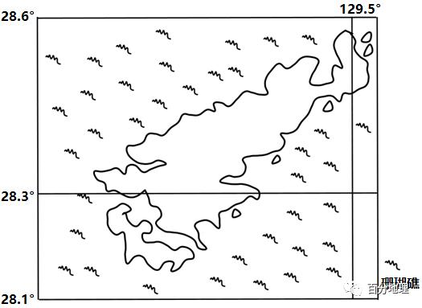
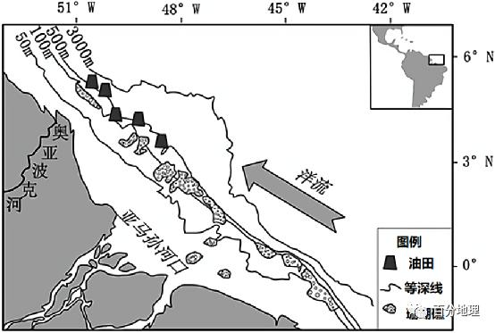

# 微专题之085珊瑚礁说

```
本专题摘自“百分地理”公众号，如有侵权请告之删除，谢谢。联系hhwxyhh@163.com
```

------
（2022·全国·高三专题练习）珊瑚礁是成千上万的由碳酸钙组成的珊瑚虫骨骼在数百年至数千年的生长过程中形成的，为许多动植物提供了生活环境，还是大洋带的鱼类的幼鱼生长地，被称为“海底城市”或“海洋中的热带雨林”。下图为海洋保护区内的珊瑚礁（上）和允许捕鱼的藻类覆盖的珊瑚礁（下），据此完成1-2题。   
   
   
   
1．我国珊瑚礁分布最广泛的海域是（  ）   
A．渤海   
B．黄海   
C．东海   
D．南海   
2．对珊瑚礁威胁最大的是（  ）   
A．气候异常   
B．海水运动   
C．海洋生物   
D．人类活动   
3．下列关于珊瑚礁的开发和保护，做法正确的是（  ）   
A．禁止珊瑚礁地区的人类活动   
B．制定珊瑚礁保护的法律法规   
C．大力发展污染少的旅游活动   
D．加大捕捞减少海洋生物破坏   
<span style="color: rgb(255, 0, 0);">1.D由材料可知，珊瑚礁被称为“海洋中的热带雨林”，结合所学知识，珊瑚是生长在热带和亚热带浅海的生物，死亡后骨骼堆积形成了珊瑚礁。我国南海纬度低，较其他三处海域水温高，适宜珊瑚生长，珊瑚礁分布最为广泛，故选D。</span>   
<span style="color: rgb(255, 0, 0);">2.D对于珊瑚礁来说，人类是唯一的巨大威胁。尤其陆地上的污染和过渡捕捞对这些生态系统造成了严重威胁。另外人们对珊瑚资源的过度开采也导致数量减少，D对。气候异常会威胁珊瑚礁，但不是主要原因，A错。海水运动和海洋生物是其生存环境的重要组成部分，不会给珊瑚礁带来威胁，BC错。故选D。</span>   
<span style="color: rgb(255, 0, 0);">3.B禁止珊瑚礁地区的人类活动不符合客观现实，A错。海洋保护区内的珊瑚礁明显好于允许捕鱼的藻类覆盖的珊瑚礁，说明制定瑚礁保护的法律法规，可以有效的保护珊瑚礁，B对。大力发展旅游活动，会对珊瑚礁带来破坏，应将开发与保护结合，适当开发，C错。加大捕捞会导致生物资源减少，D错。故选B。</span>   
（2021·全国·高三专题练习）石珊瑚是一种与虫黄藻共生的造礁生物，生长在热带浅海礁石海床上，对水温和水质要求高，出露水面易死亡。涠洲岛是我国北部湾的一个火山岛，目前已成为全球珊瑚研究的重要实验地和旅游胜地。下图示意涠洲岛石珊瑚分布。据此完成4-6题。   
   
   
   
4．石珊瑚生长区距该岛岸较远的原因是（  ）   
A．涠洲岛海域潮差大   
B．近岛岸缺少礁石   
C．近岛岸缺少虫黄藻   
D．距岛岸较远水温适宜   
5．南部海湾石珊瑚稀少的主要原因是（  ）   
A．泥沙较多   
B．水质较差   
C．盐度较高   
D．海床较深   
6．为实现该岛珊瑚礁生态系统的良性发展，最有效的措施是（  ）   
A．保护海域环境   
B．引进珊瑚新种   
C．人工培育珊瑚   
D．修建防护大堤   
<span style="color: rgb(255, 0, 0);">4．A石珊瑚对水温和水质要求高，出露水面易死亡，因为珊瑚不能长时间暴露在水面之上，涠洲岛的潮差大，所以珊瑚生长的地方距离岸线比较远，A正确。涠洲岛是我国北部湾的一个火山岛，近岛岸礁石较多，B错误。石珊瑚是一种与虫黄藻共生的造礁生物，近岛岸缺少虫黄藻不是主要原因，C错误。距岛岸较远、较近处水温差异不大，D错误。故选A。</span>   
<span style="color: rgb(255, 0, 0);">5．B石珊瑚生长在热带浅海礁石海床上，对水温和水质要求高。据图可知，南部海湾没有明显径流注入，泥沙较多的可能性不大，排除A；南部海湾沿岸居民点及旅游设施多，排放的污染物较多，水质较差，因此不适宜石珊瑚生长，B符合题意；岛屿面积不大，岛屿周边盐度差别不大，排除C；南部海湾水深大多在0~10米之间，与其它石珊瑚分布区水深相似，排除D。故选B。</span>   
<span style="color: rgb(255, 0, 0);">6．A为实现该岛珊瑚礁生态系统的良性发展，最有效的措施是保护海域环境，减少污染，不影响、破坏其生存的水质、水温环境，A正确。引进的珊瑚不一定适应当地环境，且可能破坏当地生态平衡，B错误。人工培育珊瑚可以增加珊瑚数量，但不是珊瑚礁生态系统的良性发展的最好措施，C错误。修建防护大堤工程量大，对珊瑚生态系统影响不大，还可能对周边海洋生态造成破坏，D错误。故选A。</span>   
（2021年云南玉溪高三期末）我国南海的永乐环礁属于典型的珊瑚岛礁群，环礁内部分布有大量的珊瑚礁。全富岛和甘泉岛无居民常驻，但海滩上微塑料污染严重。下图示意永乐环礁及全富岛、甘泉岛海滩微塑料污染分布（圆圈越大，微塑料越多）。据此完成7-9题。   
   
   
   
7．甘泉岛、全富岛微塑料污染较重的海滩位于（  ）   
A．环礁外侧   
B．环礁内侧   
C．东侧   
D．南侧   
8．与两岛海滩微塑料污染分布密切相关的条件是（  ）   
A．岛礁塑料排放多   
B．海上船舶停靠多   
C．海水自西向东流   
D．环礁内部风浪小   
9．两岛海滩微塑料污染直接威胁（  ）   
A．海上航行   
B．人体健康   
C．珊瑚生长   
D．石油开采   
<span style="color: rgb(255, 0, 0);">7．B从图中可以看出，甘泉岛、全富岛微塑料污染较重的海滩位于靠近环礁内侧的地方，B正确，ACD错误，故选B。</span>   
<span style="color: rgb(255, 0, 0);">8．D与两岛海滩微塑料污染分布密切相关的条件是环礁内部风浪小，海浪小，微塑料可以堆积，污染严重。D正确。全富岛和甘泉岛无居民常驻，岛礁塑料排放少，A错误。海上船舶停靠少，B错误。当地夏季盛行偏南风，冬季盛行偏北风，海水并非自西向东流，C错误。D正确，ABC错误，故选D。</span>   
<span style="color: rgb(255, 0, 0);">27．C两岛海滩微塑料污染严重，水体变差，直接威胁珊瑚生长，C正确。对海上航行没有影响，A错误。附近没有常住居民，对人体健康影响小，B错误。对石油开采没有影响，D错误。C正确，ABD错误，故选C。</span>   
（2022年东莞市东华高级中学高三期中））苏丹港位于海边上，是苏丹重要的货物集散地，港区前是成片的珊瑚礁，珊瑚礁把深海区和浅海区分隔开。其港池和航道大部分为人工疏浚形成。我国某公司在苏丹港建设了很多大型深水泊位，使这座百年老港焕发出新的生机。下图示意苏丹港码头及港池分布，据此完成10题。   
   
   
   
10．苏丹港港区前的珊瑚礁起到的作用主要是（  ）   
A．减缓海盐对海岸的侵蚀   
B．减轻地震对港区的破坏   
C．削弱海浪对海岸的侵蚀   
D．削弱东北信风对海岸的吹蚀   
<span style="color: rgb(255, 0, 0);">10．C红海为高盐度海区，珊瑚礁并不能减缓海盐对海岸的侵蚀，A项错；红海地处板块交界地带，是地震多发区，地震灾害受灾程度受地震震级、震源深度和距震中的距离影响，与珊瑚礁无关，B项错；珊瑚礁地处浅海区，能削弱海浪对海岸的侵蚀，C项对；苏丹港附近海岸确实受东北信风的影响，但珊瑚礁海拔较低，对风力的削弱作用不大，D项错，所以该题选C。</span>   
（2022·全国·模拟预测）珊瑚主要生活在光照充足的18°C-20°C的浅海环境，珊瑚礁为许多动植物提供了生活环境，被誉为海底热带雨林，读图完成11-12题。   
   
   
   
11．非洲大陆西部几乎无珊瑚礁分布的原因可能是西岸（  ）   
①多飓风   
②寒流影响   
③多雾   
④降水多   
A．①②   
B．②③   
C．③④   
D．①③   
12．近年来，非洲东岸珊瑚大面积死亡的原因可能是（  ）   
A．全球变暖   
B．海洋污染   
C．人为破坏   
D．生物入侵   
<span style="color: rgb(255, 0, 0);">11．B非洲大陆西部海域有加那利寒流和本格拉寒流流经，多海雾（寒流流经较低纬度海区，多海雾），光照条件差，不利于珊瑚生长。飓风多发生在北大西洋、加勒比海和北太平洋东部等区域，该地基本不受飓风影响。大陆西岸回归线附近降水少，只有在赤道附近的大陆西岸以及几内亚湾北部沿海地区降水较多。②③正确，①④错。故选B。</span>   
<span style="color: rgb(255, 0, 0);">12．A人为破坏和污染影响的范围往往较小，不会造成珊瑚大面积死亡，排除BC。珊瑚礁为许多动植物提供了生活环境，被誉为海底热带雨林，受生物入侵导致其大面积死亡的可能性不大，排除D。由材料可知，珊瑚主要生活在18°C-20°C的浅海环境，全球变暖造成海水温度升高，海平面上升，这是非洲东岸珊瑚大面积死亡最可能的原因，A正确。故选A。</span>   
（2022·全国·高三专题练习）在我国南海分布着许多宛若翡翠的环礁，环礁由珊瑚虫营造而成，造礁珊瑚一般只生活在水温较高、光线克足、水质清洁、饵料和氧气充足的水域。近年来，南海环礁区域开发活动日盛。下图为我国南海某环礁礁顶结构示意图，读图，据此完成13-14题。   
   
   
   
13．礁前斜坡珊瑚的生长速度最快，其主要原因不可能是（  ）   
A．基底坚实   
B．风浪拍抚   
C．海水较深   
D．水体清澈   
14．人们在珊瑚礁区的开发活动，所选择的位置合理的是（  ）   
A．海水养殖—礁前斜坡   
B．水上旅游—潟湖坡   
C．潜水运动—礁坪区   
D．工程建设—潟湖区   
<span style="color: rgb(255, 0, 0);">13．C从材料中看造礁珊瑚一般只生活在水温较高、光线充足、水质清洁、饵料和氧气充足的水域。基底坚实利于造礁珊瑚稳定，A错误；风浪拍抚，氧气充足，B错误；海水较深，水温较低，光线不足，不利于造礁珊瑚生长，C正确；水体清澈，水质清洁，利于造礁珊瑚生长，D错误；故选C。</span>   
<span style="color: rgb(255, 0, 0);">14．B礁前斜坡进行海水养殖影响水质，不利于造礁珊瑚生长，A错误；潟湖坡水上旅游对珊瑚生长影响小，还能增加收入，B正确；潜水运动适合选择在水深区，礁坪区距离海水较远，C错误；潟湖区水深，可以进行潜水运动，不适合工程建设，D错误；故选B。</span>   
（2022·云南师大附中高三阶段练习）珊瑚主要生长在水流稳定、风浪较小、光照充足、水质洁净的热带海域，其遗骸和其他生物的碳酸钙骨骼一起堆积形成珊瑚礁。一般认为，河流入海口附近地区极难有珊瑚礁存在。2016年，海洋学家在亚马孙河入海口发现了面积达9500平方公里的珊瑚礁群（下图），其属于新型的珊瑚礁系统，内部生物多样性差异较大，且面临较多威胁。据此完成15-17题。   
   
   
   
15．图示海区珊瑚礁（  ）   
①大致与海岸线平行②分布在水深50～100米处③呈条带状分布④远离河流入海口   
A．①②   
B．②③   
C．③④   
D．①③   
16．亚马孙河入海口附近利于珊瑚生长的条件是（  ）   
A．受季风环流的影响，风浪较大   
B．河流径流量季节变化较小，水流稳定   
C．受寒流的影响，水温较低   
D．河流径流量大，降低了海水盐度   
17．与南部相比，亚马孙河口北部珊瑚礁群落多样性较低的自然原因不包括（  ）   
A．水质较差   
B．光照不足   
C．石油开采   
D．盐度较高   
<span style="color: rgb(255, 0, 0);">15．D通过读图可知海区珊瑚礁大致与海岸线平行，①正确；图示海区的珊瑚礁分布在亚马孙河入海口附近水深50～500米的海区，②错误；海区珊瑚礁沿着等深线呈条带状分布，③正确；海区珊瑚礁在亚马孙河口处分布较多，靠近河流入海口，④错误，所以选择D，ABC错误。</span>   
<span style="color: rgb(255, 0, 0);">16．B亚马孙河入海口大气环流主要为赤道低气压带，未表现出季风特征，A错误；全年降水丰沛，河流径流量季节变化较小，水流稳定，B正确；亚马孙河入海口受到南赤道暖流的影响，C错误；河流径流量大，降低了海水盐度，但珊瑚生长不受海水盐度影响，D错误，所以选择B。</span>   
<span style="color: rgb(255, 0, 0);">17．D与南部相比，亚马孙河口北部，河流携带泥沙入海，洋流将河水和泥沙向北推移，北部海区浑浊度提高（水质较差），光照不足（较弱），盐度降低（较低），AB不符合题意，D符合题意，石油开采不属于自然原因，排除C，所以选择D。</span>   
（2022·重庆南开中学高三阶段练习）珊瑚由无数微小的珊瑚虫聚集形成，最适宜的生存温度是22-28℃，对水质极其敏感。珊瑚礁的主要成为为碳酸钙，它是由珊瑚虫骨骼堆积而成。造礁珊瑚依赖于体内共生藻的光合作用为其提供能量，主要生活在50米深度以内的海域中，被认为是海平面变化的理想见证者。我国的南海诸岛多为珊瑚岛，这里的珊瑚礁延伸方向与风向一致。据此完成18-20题。   
18．珊瑚礁具有重要的生态功能，主要体现在（  ）   
①抵御沿海的赤潮现象   
②减弱沿岸的海浪侵蚀   
③提供海洋生物栖息地   
④平衡大气中的二氧化碳   
⑤减轻海洋的石油污染   
A．①②③   
B．①②⑤   
C．③④⑤   
D．②③④   
19．珊瑚礁可以反映环境变化，下列说法正确的是（  ）   
A．水深50米以内的珊瑚礁说明该地海平面不断下降   
B．高山地区发现有珊瑚礁分布说明该地海平面上升   
C．厚度远大于50米的珊瑚礁说明该地地壳缓慢下沉   
D．厚度小且水平范围广的珊瑚礁说明地壳运动频繁   
20．迎风岸的珊瑚礁生长更迅速，主要是因为该岸（  ）   
①有适宜的水温②营养物质丰富③水中溶解氧多④侵蚀作用较弱   
A．①②   
B．②③   
C．①④   
D．③④   
<span style="color: rgb(255, 0, 0);">18．D赤潮现象与进入海洋中的大量氮、磷等营养元素有关，与珊瑚礁无关，①错误，排除AB。分布在岸边的珊瑚礁具有削减海浪能量的作用，②正确；珊瑚礁为许多动植物提供了生活环境，其中包括蠕虫、软体动物、海绵、棘皮动物和甲壳动物，此外珊瑚礁还是大洋带的鱼类的幼鱼生长地。③正确。珊瑚礁体内的藻类可以通过光合作用吸收大气和海水中的二氧化碳，只在珊瑚的作用下，大气中的二氧化碳和海水中的溶解钙加速形成碳酸钙沉淀，可以平衡大气中的二氧化碳，④正确，D正确。珊瑚礁不具有分解海洋石油的功能，且水质恶化，珊瑚无法再生长，⑤错误，C错误。故选D。</span>   
<span style="color: rgb(255, 0, 0);">19．C由于多数的造礁珊瑚生活在50米深度以内的海水中，故发现水深50米以内的珊瑚礁是正常现象，说明当地海平面无较大变化，A错误。高山区域的珊瑚礁证明当地地壳抬升，海平面下降，因此B错误。海平面缓慢上升或地壳缓慢下沉时，一代代的珊瑚礁遗体逐渐向上堆积，可形成厚度远大于50米的礁石，C正确。海平面稳定时，珊瑚礁在50米深度内平铺发展，D错误。故选C。</span>   
<span style="color: rgb(255, 0, 0);">20．B珊瑚虫是造就珊瑚礁的主力军。珊瑚虫的生长需要进食海水中的浮游生物，还需要水中有足够的溶解氧，迎风岸风浪较大，海水易扰动，能够输送大量营养物质和增加水中溶解氧，②③正确，故B正确。迎风岸与背风岸水温差异不大，①错误，AC排除；迎风岸风浪侵蚀较强，④错误，D排除。故选B。</span>   
（2021·全国·高三专题练习）珊瑚礁一般指在热带和亚热带浅海，由造礁珊瑚骨架和生物碎屑组成的具抗浪性能的海底隆起。造礁珊瑚具有分泌碳酸钙形成外骨骼的功能，它们世代交替增长，最终生长到低潮线。环礁是海洋中呈环状分布的珊瑚礁，中间有封闭或半封闭的潟湖或礁湖。下图为环礁形成示意图。据此完成21-23题。   
   
   
   
21．四幅图，按形成环礁的顺序排序正确的是（  ）   
A．②③①④   
B．①③②④   
C．③④②①   
D．③②④①   
22．根据钻探，澳洲的大堡礁石灰岩厚度在200米以上，科学家推测，大堡礁至少已经有3000万年的历史了。这说明（  ）   
A．当地珊瑚虫大多数生长缓慢   
B．位于地壳缓慢沉降地带   
C．位于地壳缓慢抬升地带   
D．珊瑚礁较为高大、陡峻   
23．在伦敦举行的一次学术会议上，科学家发出如下警告：“随着珊瑚生存环境的恶化，珊瑚礁将极有可能在21世纪末完全灭绝。”下列措施有利于保护珊瑚礁的是（  ）   
①推广绿色清洁能源   
②营建沿海防护大堤   
③加强台风监测预报   
④推行海洋生态旅游   
A．②③   
B．①②   
C．③④   
D．①④   
<span style="color: rgb(255, 0, 0);">21．D环礁的形成顺序是，在海底火山喷发后所形成的火山岛周围③；因环境适合珊瑚生长，于是大批珊瑚附着生长，逐渐形成群礁②；其后因故导致岛屿下沉或海平面上升，珊瑚礁仍持续堆积增长，由于岛屿的外水流交换较多，珊瑚生长状况较内侧佳，于是逐渐形成堡礁④；当火山岛完全沉没水中，仅剩下环状的珊瑚礁岛屿持续增长，便成为环礁①。故选D。</span>   
<span style="color: rgb(255, 0, 0);">22．B珊瑚礁在温暖浅海不断生长，而珊瑚礁构成的石灰岩不断加厚，达200米以上，说明当地地壳缓慢沉降，珊瑚不断生长，珊瑚骨架和生物碎屑不断沉积。故选B。</span>   
<span style="color: rgb(255, 0, 0);">23．D推广绿色清洁能源利于减少二氧化碳和酸性气体，减少海水酸化对珊瑚礁的侵蚀，①正确；推广海洋生态游也利于减少对珊瑚礁的破坏，④正确。故选D。</span>   
（2021·全国·高三专题练习）珊瑚礁是由珊瑚虫遗骸经过漫长地质年代的堆积作用形成的。珊瑚礁初始一般依托在海平面以下几十米的海底山体上生长，珊瑚虫遗体不断堆积导致珊瑚礁逐渐升高，甚至可以露出海面。永兴岛是我国最大的珊瑚岛，地形平坦，平均海拔不足5米，周围分布着由环状珊瑚礁包围的潟湖（下图）。据此完成24-25题。   
   
   
   
24．永兴岛周边海底地形最平缓的是（  ）   
A．东北部   
B．西南部   
C．西北部   
D．东南部   
25．永兴岛表层沉积着大量的珊瑚石碎屑和贝壳沙等，其主要来源可能是（  ）   
A．海流带来的潟湖内堆积物   
B．台风带来的东沙群岛砂石   
C．海流带来的环礁珊瑚碎屑   
D．台风带来的环礁珊瑚碎屑   
<span style="color: rgb(255, 0, 0);">24．A由图可得，永兴岛附近东北方向珊瑚礁分布范围最广，边界线距离岛屿最远，因此该方向海底地形最平缓，选择A选项。</span>   
<span style="color: rgb(255, 0, 0);">25．D永兴岛附近台风多发，表层沉积着大量的珊瑚石碎屑和贝壳沙等，最有可能事强劲的台风携带环珊瑚礁的碎屑来此堆积。如果是海流带来的，则只能堆积在永兴岛的边缘近海地带。D正确，ABC错，故选D。</span>   
（2021年全国甲卷）珊瑚礁是由造礁珊瑚和其他生物骨骼共同形成的生物质石灰岩，主要分布在热带浅水海域。造礁珊瑚一般生活在距海面25米以内海域。下图示意珊瑚礁发育的一种模式的不同阶段。据此完成26-28题。   
   
   
   
26．判断图示珊瑚礁的发育阶段依次是（  ）   
A．②①④③   
B．③①④②   
C．②④①③   
D．③④①②   
27．图中所示④阶段珊瑚礁的形成过程中,海平面可能（  ）   
A．先升后降   
B．先降后升   
C．持续上升   
D．持续下降   
28．西太平洋35°N附近海域也分布有珊瑚礁,主要原因是这里（  ）   
A．岛屿众多   
B．受副热带高压控制   
C．受暖流影响   
D．受东亚季风影响   
<span style="color: rgb(255, 0, 0);">26．C珊瑚环礁的形成过程：首先，在岛屿（尤其是火山岛屿）沿岸形成环绕海岸并与岛屿相连的岸礁；第二阶段，岛屿略微下沉，珊瑚则与沉降速率保持同步向上生长，由于外缘海况条件好，珊瑚礁增长快于内侧，结果珊瑚礁与海岸分开，中间隔以澙湖，形成堡礁；第三阶段,岛屿全部沉降入海，珊瑚仍向上生长，形成环绕澙湖的环礁。读图观察可看出②是海底火山喷发出露海面，形成火山岛；④是造礁珊瑚和其他生物骨骼在浅海岸边沉积形成岸礁；①是海平面下降，继续接受沉积，形成堡礁；③继续接受沉积，珊瑚礁变厚。ABD错误，C正确。故选C。</span>   
<span style="color: rgb(255, 0, 0);">27．A珊瑚礁与地壳运动有关，正常情况下，珊瑚礁形成于距海面25m以内的海域，高出海面者是地壳上升或海平面下降的反应，反之，标志着海平面上升。图④首先是海平面上升，岛屿（地壳）下降，造礁珊瑚和其他生物骨骼在海面以下25m以内的浅海岸边沉积；之后海平面下降，珊瑚礁出露海面。BCD错误，A正确。故选A。</span>   
<span style="color: rgb(255, 0, 0);">28．C据材料可知，珊瑚主要分布在热带海域，西太平洋北纬35°海域地处中纬度，沿岸有暖流经过，提高了该海域的水温，能满足珊瑚生长的条件，所以分布有珊瑚礁，C正确；岛屿众多不是珊瑚礁形成的唯一条件，A错误；副热带高压主要影响降水，不是珊瑚礁的形成条件，B错误；北纬35°以南海域也受东亚季风影响，D错误。故选C。</span>   
29．（2023·全国·高三专题练习）阅读图文材料，完成下列要求。   
西沙群岛，是中国南海陆地面积最大的群岛，由40多个岛、洲，组、沙、准组成，陆地总面积约10km2，其中永兴岛最大，面积为3.210km2，是三沙市的驻地。西沙群岛大部分是以珊瑚、贝屑为主的珊瑚岛礁，珊瑚礁盘大。海滩又成又松，以前种植蔬菜难以存活，驻岛驻礁官兵吃青菜难，如今只要向沙土中添加一种植物性纤维黏合剂，蔬菜就可以生长。2020年5月，在永兴岛白沙滩的一片“沙变土”试验田7种蔬菜喜获丰收。这标志着西沙海滩种植蔬菜首获成功，可陆续大面积推广。左图为三沙市位置图，右图为岛礁蔬菜种植景观图。   
   
   
   
   
   
（1）分析西沙群岛驻岛驻礁官兵吃青菜难的原因。   
（2）指出西沙群岛岛礁海滩实现“沙变土”的必要物质条件，并说明岛难海滩“沙变土”对保障我国南海海洋环境的积极影响。   
<span style="color: rgb(255, 0, 0);">【答案】（1）距离大陆较远，主要供应方式为海运，耗时长；土壤发育条件差，以沙土为主，土壤含盐度高，无法种植青菜；岛礁面积小，地表储水条件差，淡水资源不足，灌溉条件差；地处低纬度海域，多气象灾害（台风、暴雨、强烈光照），岛礁农业抗灾减灾能力低。</span>   
<span style="color: rgb(255, 0, 0);">（1）必要物质条件：植物性纤维黏合剂；水；有机肥。积极影响：能解决岛礁官兵种菜难、吃菜难的问题，保障岛礁官兵正常生活和驻守，有利于长期保障我国海洋权益；可以在一定程度上解决岛礁大面积绿化难题，提升生态环境质量，改善局地小气候等。</span>   
<span style="color: rgb(255, 0, 0);">【解析】（1）西沙群岛驻岛驻礁官兵吃青菜难，有可能是当地蔬菜难生产不能自给自足，或者是离蔬菜供应地远难以保证供应。结合材料图中可知，西沙群岛距离大陆较远，主要供应方式为海运，耗时长；西沙群岛大部分是以珊瑚、贝屑为主的珊瑚岛礁，土壤发育条件差，海滩以沙土为主，不利于储水，且土壤含盐度高，无法种植青菜；岛礁面积小，中永兴岛最大，面积才3.210km2，所以地表储水条件差，淡水资源不足，灌溉条件差；结合区域背景可知，当地地处低纬度海域，多气象灾害（台风、暴雨、强烈光照），岛礁农业抗灾减灾能力低。</span>   
<span style="color: rgb(255, 0, 0);">（2）结合材料“向沙土中添加一种植物性纤维黏合剂，蔬菜就可以生长。”所以沙变土的必要物质条件是：植物性纤维黏合剂，除此之外还有水、有机肥。沙变土首先可以解决岛礁官兵种菜难、吃菜难的问题，保障岛礁官兵正常生活和驻守，有利于长期保障我国海洋权益，此外，沙变土使得植被更容易生长，可以在一定程度上解决岛礁大面积绿化难题，提升生态环境质量，改善局地小气候等。</span>   
30．（2022·四川·宜宾市叙州区第一中学校高三阶段练习）阅读图文材料,完成下列要求。   
大堡礁是总面积达20.7万km2的条带状珊瑚礁石密布的浅水区，多数隐于水下成为暗礁,少量出露水面成为岛礁。珊瑚礁群是由微小的珊瑚虫分泌的石灰质骨骼胶结贝壳等海洋生物形成,珊瑚虫生长对水质要求很高,水域水质必须洁净、透明度高、热量充足。下图示意大堡礁分布区及范围。   
   
   
   
（1）简述形成大堡礁的珊瑚虫大量在此生长的有利条件。   
（2）分析近年来大堡礁面积不断萎缩的原因。   
<span style="color: rgb(255, 0, 0);">【答案】（1）澳大利亚东北部浅海大陆架面积广阔,水域较浅;东北部海水污染小，海水洁净，透明度高;历史上沿海地区人口稀少,珊瑚虫受人为的破坏较小;纬度较低.加之沿岸暖流作用，海水温度较高。</span>   
<span style="color: rgb(255, 0, 0);">（1）随着沿海地区人口的增加，工农业生产排放的污水污染了海域的水质;大堡礁区旅游业发展造成海水污染和珊瑚资源的破坏，陆地植被破坏，水土流失加剧导致海水浑浊，透明度下降。</span>   
<span style="color: rgb(255, 0, 0);">【解析】（1）依据材料“珊瑚虫生长对水质要求很高，水域水质必须洁净、透明度高、热量充足”。可知澳大利亚东北部浅海大陆架面积广阔，大陆架海域水域较浅；东北部地区人口密度小，海水污染小，海水洁净，透明度高；历史上沿海地区人口稀少，珊瑚虫受人为的破坏较小；纬度较低，加之沿岸暖流作用，海水温度较高，热量充足，非常适合珊瑚虫的生长。</span>   
<span style="color: rgb(255, 0, 0);">（2）由于珊瑚虫生长对水质要求很高，随着沿海地区人口的增加，工农业生产排放的污水增加，污染了海域的水质；大堡礁区旅游业发达，旅游业的发展造成海水污染和珊瑚资源的破坏；同时陆地植被遭到破坏，水土流失加剧，导致海水浑浊，透明度下降。</span>   
<span style="color: rgb(255, 0, 0);">(3) 大堡礁沿岸陆地的自然植被类型为热带雨林。其形成原因是纬度较低，气温较高；位于东南信风的迎风坡，多地形雨，降水丰富；沿岸流经的东澳大利亚暖流，起到增温增湿的作用。</span>   
31．（2020·江苏泰州·二模）阅读材料，回答下列问题。   
材料一　近期，某研究团队从空中对大堡礁区域的1   
000多个珊瑚礁进行了观察，结果发现了大面积的珊瑚白化现象。多数珊瑚体本身是透明的，含有色素的共生藻(虫黄藻)进入珊瑚后，珊瑚组织便会呈现出五颜六色的珊瑚群聚。珊瑚与藻的共生和光合作用是珊瑚礁生存的必要条件，而由于共生藻的生长对水质、水温有特殊要求。当海水质量下降和温度上升会让共生藻从珊瑚中释放出来，导致珊瑚白化。   
材料二　下图澳大利亚大堡礁分布图。   
   
   
   
（1）简述大堡礁对地理环境的积极意义。   
（2）分析大堡礁珊瑚白化的人为原因。   
（3）简述缓解珊瑚礁白化现象的措施。   
<span style="color: rgb(255, 0, 0);">【答案】（1）为海洋生物提供栖息地，保护生物多样性；是海洋生态系统的重要组成部分；保护海岸和沿海居民安全；发展珊瑚礁旅游业。</span>   
<span style="color: rgb(255, 0, 0);">（2）沿海陆地污水排放，水体富营养化，水质恶化；全球气候变暖，海水水温升高。</span>   
<span style="color: rgb(255, 0, 0);">（3）大幅降低碳排放，减缓全球变暖；实施清洁生产，减少工业废水排放；加强监测，建立预警系统；建立保护区；加大宣传力度，增强环保意识；加强国际合作。</span>   
<span style="color: rgb(255, 0, 0);">【解析】（1）大堡礁对地理环境的积极意义主要体现在大堡礁可以为海洋生物提供栖息地，保护生物多样性；珊瑚是生态环境的产物，是海洋生态系统的重要组成部分；大堡礁有护堤作用，也可保护沿海居民安全；大堡礁的珊瑚礁姿态优美，颜值高，可以发展珊瑚礁旅游业。</span>   
<span style="color: rgb(255, 0, 0);">（2）根据材料所述可知，由于共生藻的生长对水质、水温有特殊要求。当海水质量下降和温度上升会让共生藻从珊瑚中释放出来，浅水珊瑚会发生白化甚至死亡。人为原因如沿海陆地污水排放，会导致水体富营养化，进而水质恶化；不合理的人类活动如毁林、大量使用化石燃料等会加速全球气候变暖，海水水温升高，水质变化，这些都会导致共生藻生长受到影响，从珊瑚中释放导致珊瑚白化。</span>   
<span style="color: rgb(255, 0, 0);">（3）缓解珊瑚礁白化现象也就是对珊瑚礁生态系统的保护，具体措施主要结合前面所述珊瑚白化的原因分析，可以加大宣传力度，增强环保意识，让民众意识到珊瑚礁的经济及生态价值；建立珊瑚礁保护区，加强对珊瑚礁的修复；建立监测机制，建立预警系统，加强实时保护；节能减排，减缓全球变暖；实施清洁生产，减少工业废水排放，生活污水达标排放，保护珊瑚礁海域的水质；加强立法，从法律层面保护珊瑚礁；扩大国际合作等。</span>   
32．（2021·甘肃·张掖市第二中学高三阶段练习）阅读材料，回答问题。   
珊瑚喜高温微盐、光照充足、水面平静、水质洁净的海域，生存条件要求严苛。巴拿马运河开凿于1903～1914年，1914年正式通航。自运河开通至今，两端海域的珊瑚礁呈退化趋势。巴拿马运河属于水闸式运河，通过水闸不断的蓄水、放水来调整船只航行水位。图1示意巴拿马运河位置，图2示意巴拿马运河开通前后加勒比入口处珊瑚数量及其相关因素的变化。   
   
   
   
分析巴拿马运河的运营导致附近海域珊瑚礁退化的原因，并提出合理的治理措施。   
<span style="color: rgb(255, 0, 0);">【答案】原因：船闸运行期间频繁蓄水、泄水、清淤，导致附近海域水流不稳定大规模排水携带陆源沉积物，导致附近海域透明度降低，光照减弱；大量船舶的通行加剧海水污染运河水体深度较小，流速慢，水温变化大，水体排放过程中导致两端海水温度异常变化，影响珊瑚礁生长。</span>   
<span style="color: rgb(255, 0, 0);">措施：提高轮船和运河沿岸的污水达标处理率与排放标准；运河口人工疏浚淤泥搬运至远海集中排放；人工栽培、繁育珊瑚礁。</span>   
<span style="color: rgb(255, 0, 0);">【解析析】珊瑚礁退化的原因从珊瑚生存环境破坏、水质变差的角度分析，珊瑚喜高温微盐、光照充足、水面平静、水质洁净的海域，生存条件要求严苛，结合工程建设引起水污染、水温变化、光照条件改变、水流速度变化、盐度变化等影响，导致珊瑚生存环境变差进行分析；船闸运行期间频繁蓄水、泄水、清淤，导致附近海域水流不稳定，大规模排水携带陆源沉积物，导致附近海域透明度降低，光照减弱，影响珊瑚生存环境；大量船舶的通行加剧海水污染，水质恶化，珊瑚死亡；运河水体深度较小，流速慢，水温变化大，破坏珊瑚生存环境；水体排放过程中，导致两端海水温度异常变化，影响珊瑚礁生长。</span>   
<span style="color: rgb(255, 0, 0);">治理措施从提高水质、人工养殖等方面入手，提高珊瑚生存环境质量；提高轮船和运河沿岸的污水达标处理率与排放标准，以提高水质，减少水污染；运河口人工疏浚淤泥，搬运至远海集中排放，以提高水的清洁度，改善光照、水位条件；人工栽培、繁育珊瑚礁。</span>   
33．（2020·江苏连云港·高三阶段练习）阅读图文资料，完成下列要求。   
造礁珊瑚生活在浅海区，总的生长趋势是不断向上靠近海面生长。珊瑚礁是造礁珊瑚的石灰质遗骸等堆积而成的一种礁石，根据珊瑚礁与陆地的位置关系可分为岸礁、堡礁和环礁。我国南海以环礁为主，其珊瑚礁沉积为二元地质结构，即表层为珊瑚碎屑沉积，下层为已成岩的礁灰岩。下图示意岸礁→堡礁→环礁演变过程。   
   
   
   
（1）从地质运动和造礁珊瑚生长习性角度，解释岸礁→堡礁→环礁的演变过程。   
（2）说明环礁礁灰岩上珊瑚碎屑沉积的成因。   
<span style="color: rgb(255, 0, 0);">33．【答案】（1）岩浆喷出海面形成锥形火山岛，造礁珊瑚在火山岛周围浅海生长，紧贴火山岛形成岸礁；（板块运动导致）火山岛逐渐下沉，造礁珊瑚持续向上靠近海面生长，期间形成的珊瑚礁与锥形火山岛有水域相隔，形成堡礁；火山岛完全沉降入海，造礁珊瑚仍向上生长，形成礁内全为水域的环礁。</span>   
<span style="color: rgb(255, 0, 0);">（2）灰岩在风化、侵蚀作用下产生珊瑚碎屑；经海浪搬运作用至礁灰岩顶部沉积；（高、低潮海面间的）部分珊瑚碎屑经风力搬运至高潮海面之上沉积。</span>   
<span style="color: rgb(255, 0, 0);">【解析】（1）通过材料及图文可知，首先是通过岩浆喷出海面形成锥形火山岛，造礁珊瑚在火山岛周围浅海生长，紧贴火山岛形成岸礁；其次是地壳运动导致火山岛逐渐下沉，而造礁珊瑚持续向上靠近海面生长，逐渐珊瑚礁与锥形火山岛有水域相隔，形成堡礁；最后随着地壳运动，火山岛继续下沉，直至完全沉降入海，而造礁珊瑚仍向上生长，形成礁内全为水域的环礁，这就是岸礁→堡礁→环礁的演变过程。</span>   
<span style="color: rgb(255, 0, 0);">（2）环礁礁灰岩上珊瑚碎屑沉积会经过风化、侵蚀、搬运、沉积的过程。首先灰岩受外力作用风化、侵蚀等作用产生珊瑚碎屑；然后珊瑚碎屑受海浪搬运作用至礁灰岩顶部沉积；同时，也有部分珊瑚碎屑经风力搬运至高潮海面之上沉积。</span>   
（2021·辽宁抚顺·一模）阅读图文材料，完成下列问题。   
材料一   
砗磲是生活在热带海洋的大型底栖贝类，最大体长超过1米。凭借和虫黄藻珠联璧合的共生机制，砗磲主要通过“晒太阳”产生的糖类和氨基酸获得营养，是一种“光合动物”，也是珊瑚礁生态系统中重要的组成生物。我国南海一度是砗磲资源极为丰富的海域，然而由于过度捕捞，如今在该海域已很难见到砗磲。   
   
   
   
材料二   
某研究小组对海南岛沿岸有珊瑚礁分布的海域进行砗磲取样调查，结果如下表所示。   
各取样点的砗磲数量、覆盖度表：   
<table cellspacing="0" cellpadding="0" width="577"><tbody><tr><td width="161" valign="middle" style="padding: 3.75pt 6pt;border-width: 1pt;border-color: rgb(0, 0, 0);"><section style="margin-top: 0pt;margin-bottom: 0pt;margin-left: 0pt;text-indent: 0pt;font-size: 10.5pt;font-family: &quot;Times New Roman&quot;;text-align: center;line-height: 2em;"><span style="font-family: 楷体;">取样点位置及数量（个）</span><span style="font-family: 楷体;"></span></section></td><td width="109" valign="middle" style="padding: 3.75pt 6pt;border-width: 1pt;border-color: rgb(0, 0, 0);"><section style="margin-top: 0pt;margin-bottom: 0pt;margin-left: 0pt;text-indent: 0pt;font-size: 10.5pt;font-family: &quot;Times New Roman&quot;;text-align: center;line-height: 2em;"><span style="font-family: 楷体;">平均深度（米）</span><span style="font-family: 楷体;"></span></section></td><td width="109" valign="middle" style="padding: 3.75pt 6pt;border-width: 1pt;border-color: rgb(0, 0, 0);"><section style="margin-top: 0pt;margin-bottom: 0pt;margin-left: 0pt;text-indent: 0pt;font-size: 10.5pt;font-family: &quot;Times New Roman&quot;;text-align: center;line-height: 2em;"><span style="font-family: 楷体;">砗磲数量</span><span style="font-family: 楷体;">（个）</span><span style="font-family: 楷体;"></span></section></td><td width="164" valign="middle" style="padding: 3.75pt 6pt;border-width: 1pt;border-color: rgb(0, 0, 0);"><section style="margin-top: 0pt;margin-bottom: 0pt;margin-left: 0pt;text-indent: 0pt;font-size: 10.5pt;font-family: &quot;Times New Roman&quot;;text-align: center;line-height: 2em;"><span style="font-family: 楷体;">砗磲覆盖度（个</span>/<span style="font-family: 楷体;">平方米）</span><span style="font-family: 楷体;"></span></section></td></tr><tr><td width="161" valign="middle" style="padding: 3.75pt 6pt;border-width: 1pt;border-color: rgb(0, 0, 0);"><section style="margin-top: 0pt;margin-bottom: 0pt;margin-left: 0pt;text-indent: 0pt;font-size: 10.5pt;font-family: &quot;Times New Roman&quot;;text-align: center;line-height: 2em;"><span style="font-family: 楷体;">昌江黎族自治县</span>/1</section></td><td width="109" valign="middle" style="padding: 3.75pt 6pt;border-width: 1pt;border-color: rgb(0, 0, 0);"><section style="margin-top: 0pt;margin-bottom: 0pt;margin-left: 0pt;text-indent: 0pt;font-size: 10.5pt;font-family: &quot;Times New Roman&quot;;text-align: center;line-height: 2em;">2.6</section></td><td width="109" valign="middle" style="padding: 3.75pt 6pt;border-width: 1pt;border-color: rgb(0, 0, 0);"><section style="margin-top: 0pt;margin-bottom: 0pt;margin-left: 0pt;text-indent: 0pt;font-size: 10.5pt;font-family: &quot;Times New Roman&quot;;text-align: center;line-height: 2em;">0</section></td><td width="164" valign="middle" style="padding: 3.75pt 6pt;border-width: 1pt;border-color: rgb(0, 0, 0);"><section style="margin-top: 0pt;margin-bottom: 0pt;margin-left: 0pt;text-indent: 0pt;font-size: 10.5pt;font-family: &quot;Times New Roman&quot;;text-align: center;line-height: 2em;">0</section></td></tr><tr><td width="161" valign="middle" style="padding: 3.75pt 6pt;border-width: 1pt;border-color: rgb(0, 0, 0);"><section style="margin-top: 0pt;margin-bottom: 0pt;margin-left: 0pt;text-indent: 0pt;font-size: 10.5pt;font-family: &quot;Times New Roman&quot;;text-align: center;line-height: 2em;"><span style="font-family: 楷体;">临高县</span>/1</section></td><td width="109" valign="middle" style="padding: 3.75pt 6pt;border-width: 1pt;border-color: rgb(0, 0, 0);"><section style="margin-top: 0pt;margin-bottom: 0pt;margin-left: 0pt;text-indent: 0pt;font-size: 10.5pt;font-family: &quot;Times New Roman&quot;;text-align: center;line-height: 2em;">2.5</section></td><td width="109" valign="middle" style="padding: 3.75pt 6pt;border-width: 1pt;border-color: rgb(0, 0, 0);"><section style="margin-top: 0pt;margin-bottom: 0pt;margin-left: 0pt;text-indent: 0pt;font-size: 10.5pt;font-family: &quot;Times New Roman&quot;;text-align: center;line-height: 2em;">0</section></td><td width="164" valign="middle" style="padding: 3.75pt 6pt;border-width: 1pt;border-color: rgb(0, 0, 0);"><section style="margin-top: 0pt;margin-bottom: 0pt;margin-left: 0pt;text-indent: 0pt;font-size: 10.5pt;font-family: &quot;Times New Roman&quot;;text-align: center;line-height: 2em;">0</section></td></tr><tr><td width="161" valign="middle" style="padding: 3.75pt 6pt;border-width: 1pt;border-color: rgb(0, 0, 0);"><section style="margin-top: 0pt;margin-bottom: 0pt;margin-left: 0pt;text-indent: 0pt;font-size: 10.5pt;font-family: &quot;Times New Roman&quot;;text-align: center;line-height: 2em;"><span style="font-family: 楷体;">文昌市</span>/3</section></td><td width="109" valign="middle" style="padding: 3.75pt 6pt;border-width: 1pt;border-color: rgb(0, 0, 0);"><section style="margin-top: 0pt;margin-bottom: 0pt;margin-left: 0pt;text-indent: 0pt;font-size: 10.5pt;font-family: &quot;Times New Roman&quot;;text-align: center;line-height: 2em;">3.1</section></td><td width="109" valign="middle" style="padding: 3.75pt 6pt;border-width: 1pt;border-color: rgb(0, 0, 0);"><section style="margin-top: 0pt;margin-bottom: 0pt;margin-left: 0pt;text-indent: 0pt;font-size: 10.5pt;font-family: &quot;Times New Roman&quot;;text-align: center;line-height: 2em;">0</section></td><td width="164" valign="middle" style="padding: 3.75pt 6pt;border-width: 1pt;border-color: rgb(0, 0, 0);"><section style="margin-top: 0pt;margin-bottom: 0pt;margin-left: 0pt;text-indent: 0pt;font-size: 10.5pt;font-family: &quot;Times New Roman&quot;;text-align: center;line-height: 2em;">0</section></td></tr><tr><td width="161" valign="middle" style="padding: 3.75pt 6pt;border-width: 1pt;border-color: rgb(0, 0, 0);"><section style="margin-top: 0pt;margin-bottom: 0pt;margin-left: 0pt;text-indent: 0pt;font-size: 10.5pt;font-family: &quot;Times New Roman&quot;;text-align: center;line-height: 2em;"><span style="font-family: 楷体;">万宁市</span>/3</section></td><td width="109" valign="middle" style="padding: 3.75pt 6pt;border-width: 1pt;border-color: rgb(0, 0, 0);"><section style="margin-top: 0pt;margin-bottom: 0pt;margin-left: 0pt;text-indent: 0pt;font-size: 10.5pt;font-family: &quot;Times New Roman&quot;;text-align: center;line-height: 2em;">4.2</section></td><td width="109" valign="middle" style="padding: 3.75pt 6pt;border-width: 1pt;border-color: rgb(0, 0, 0);"><section style="margin-top: 0pt;margin-bottom: 0pt;margin-left: 0pt;text-indent: 0pt;font-size: 10.5pt;font-family: &quot;Times New Roman&quot;;text-align: center;line-height: 2em;">18</section></td><td width="164" valign="middle" style="padding: 3.75pt 6pt;border-width: 1pt;border-color: rgb(0, 0, 0);"><section style="margin-top: 0pt;margin-bottom: 0pt;margin-left: 0pt;text-indent: 0pt;font-size: 10.5pt;font-family: &quot;Times New Roman&quot;;text-align: center;line-height: 2em;">0.155</section></td></tr><tr><td width="161" valign="middle" style="padding: 3.75pt 6pt;border-width: 1pt;border-color: rgb(0, 0, 0);"><section style="margin-top: 0pt;margin-bottom: 0pt;margin-left: 0pt;text-indent: 0pt;font-size: 10.5pt;font-family: &quot;Times New Roman&quot;;text-align: center;line-height: 2em;"><span style="font-family: 楷体;">三亚市</span>/17</section></td><td width="109" valign="middle" style="padding: 3.75pt 6pt;border-width: 1pt;border-color: rgb(0, 0, 0);"><section style="margin-top: 0pt;margin-bottom: 0pt;margin-left: 0pt;text-indent: 0pt;font-size: 10.5pt;font-family: &quot;Times New Roman&quot;;text-align: center;line-height: 2em;">3.1</section></td><td width="109" valign="middle" style="padding: 3.75pt 6pt;border-width: 1pt;border-color: rgb(0, 0, 0);"><section style="margin-top: 0pt;margin-bottom: 0pt;margin-left: 0pt;text-indent: 0pt;font-size: 10.5pt;font-family: &quot;Times New Roman&quot;;text-align: center;line-height: 2em;">19</section></td><td width="164" valign="middle" style="padding: 3.75pt 6pt;border-width: 1pt;border-color: rgb(0, 0, 0);"><section style="margin-top: 0pt;margin-bottom: 0pt;margin-left: 0pt;text-indent: 0pt;font-size: 10.5pt;font-family: &quot;Times New Roman&quot;;text-align: center;line-height: 2em;">0.083</section></td></tr></tbody></table>


   
注：砗磲覆盖度指单位面积内砗磲总数与单位面积的比值。   
（1）据图表分析海南岛沿岸砗磲数量及覆盖度的分布规律。   
（2）海南岛砗磲为何会出现此种分布规律。   
（3）砗磲是珊瑚礁生态系统中重要的组成生物，但由于食客的追捧和砗磲贝雕工艺品收藏热的兴起，野生砗磲日益稀少，请为砗磲种群数量的恢复提供一些建议。   
<span style="color: rgb(255, 0, 0);">【答案】（1）砗磲数量由南向北逐渐递减；砗磲覆盖度西北沿岸低于东南沿岸；南部海域低于东岸中部海域。</span>   
<span style="color: rgb(255, 0, 0);">（2）砗磲喜欢温暖海域，海南岛南部温度高于北部；西、北部离陆地较近，海域较为封闭，易受污染；西、北部取样点附近有河流入海，水体浑浊，影响虫黄藻光合作用；南部三亚海域旅游活动集中，影响砗磲栖息环境。</span>   
<span style="color: rgb(255, 0, 0);">（3）通过立法对砗磲进行保护，禁止采捞野生砗磲；对我国砗磲资源进行调查，建立砗磲保护区；发展砗磲人工育苗技术，后期可出售养殖砗磲；整顿砗磲贝雕行业，引导企业对砗磲进行精加工，提高产品附加值；大力宣传砗磲保护政策及生态效益，提高当地居民的环保意识。</span>   
<span style="color: rgb(255, 0, 0);">【解析】（1）据图表中各取样点的砗磲数量、覆盖度可知，砗磲数量南多北少，由南向北逐渐递减；砗磲覆盖度东南的万宁市、三亚市较大，西北沿岸低于东南沿岸，东岸万宁市比南部三亚市覆盖度更大。</span>   
<span style="color: rgb(255, 0, 0);">（2）由于砗磲是生活在热带海洋的大型底栖贝类，砗磲喜欢温暖海域，海南岛南部水温高于北部；西部和北部靠近大陆，海域较为封闭，受陆地的污染物影响大；西、北部取样点设置在河流入海口附近，河流携带的泥沙使水体浑浊，使虫黄藻光合作用较差；南部三亚海域旅游活动集中，大量的人类活动影响砗磲栖息环境。</span>   
<span style="color: rgb(255, 0, 0);">（3）可以制定相关的法律法规，用法律的手段禁止采捞野生砗磲，对砗磲进行保护；对我国现有的砗磲资源进行摸底调查，建立砗磲自然保护区；加大技术投入，发展砗磲人工育苗养殖技术；规范砗磲贝雕行业，引导企业对砗磲进行精加工，提高产品附加值，尽量减少对砗磲消耗和浪费；对当地居民进行大力宣传砗磲保护的政策，普及生态保护知识，提高当地居民的环保意识。</span>   
35．（2021·福建·模拟预测）阅读图文材料，完成下列要求。   
海南省三沙市南沙区永暑岛是建在永暑礁上的人天岛，面积居南海岛屿中的前三位。永暑礁为具有上土下岩的二元地质结构珊瑚礁，“下岩”是形成于末次冰期及以前的礁灰岩（保留了原生生物的骨架孔隙），渗透性强；“上土”是末次冰期后由珊瑚碎屑和砂土沉积形成的礁砂砾土层，渗透性较弱，海水不易渗入，地表淡水却容易下渗留存。建岛2年后，在该岛发现了地下淡水资源，其形成和更新都比大陆快。   
   
   
   
（1）形成珊瑚礁上土下岩渗透性差异与海平面升降有关，分析这种渗透性差异形成的原因。   
（2）从水循环角度说明永暑岛地下淡水形成和更新都较快的原因。   
（3）有人认为永暑岛应大力发展旅游业，你是否赞同?并说明理由。   
<span style="color: rgb(255, 0, 0);">【答案】（1）末次冰期时气温较低，海平面下降，礁灰岩暴露在海平面以上；（礁灰岩）受流水、风力、海浪等的侵蚀，溶蚀孔洞发育，（保留了原生生物的骨架孔隙，）孔隙较多较大，渗透性强；末次冰期后，气候变暖，海平面上升，水下沉积的珊瑚碎屑和砂土，颗粒较细，形成的礁砂砾土层孔隙较小，渗透性较弱。</span>   
<span style="color: rgb(255, 0, 0);">（2）永暑岛属于热带雨林气候、降水丰富；面积较大（有足够的宽度）,可以积累足够的地表水；土层（主要为珊瑚碎屑沉积物）渗透性较低，海水不易渗入，地表淡水却容易下渗留存；地势平坦，地表水易下渗；地下淡水水量较少（体积较小）,埋藏较浅，所以更新时间较短。</span>   
<span style="color: rgb(255, 0, 0);">（3）赞同：永暑岛地处热带，有独特的热带海岛风光，且海洋生物资源丰富，旅游资源丰富；永暑岛位于南海航线，且有机场，能够满足游客的进出；中国经济发展迅速，居民收入增长快，客源市场广阔；南沙区政府所在地，有地下淡水资源，有一定公共设施和旅游配套设施。不赞同：距离中国大陆较远，客源市场距离较远；属于海岛，交通不便；岛屿面积较小，接待能力有限；人工岛生态环境较脆弱，大量游客易造成生态环境破坏；当地淡水资源不足，无法满足游容和当地居民的生活需要；建岛时间不长，公共设施和旅游配套设施建设不够完善。</span>   
<span style="color: rgb(255, 0, 0);">【解析】（1）渗透性差异取决于其形成时期所处的环境条件，在空气中形成的岩石较为松散，在水环境中形成的岩石较为致密。结合材料信息“下岩”形成于末次冰期，此地质时期气温较低，海平面下降，礁灰岩随着海平面的下降出露水面，受外力作用，如流水、风力及海浪等影响，溶蚀孔洞发育，孔隙较多较大，渗透性强；“上土”是末次冰期后由珊瑚碎屑和砂土沉积形成的礁砂砾土层，此时处于间冰期，气候回暖，气温升高，海平面升高，形成的礁砂砾土层渗透性较弱，海水不易渗入。</span>   
<span style="color: rgb(255, 0, 0);">（2）从永暑岛所处的海陆环境及纬度地带可知，永暑岛位于热带雨林气候区，降水充分，热量丰富；并且从其独特的岩层结构，即土层主要为由珊瑚碎屑和砂土沉积形成的礁砂砾土层，渗透性较弱，海水不易渗入，地表淡水却容易下渗留存；岛屿面积较大且地形平坦，易储存充足的淡水资源；地下水埋藏浅且水量较少，永暑岛地下淡水形成和更新都较快。</span>   
<span style="color: rgb(255, 0, 0);">（3）赞成或者不赞成皆可，只要把相对应的理由描述清楚即可。旅游业的发展要考虑旅游资源、客源地及市场距离、基础设施、交通、居民收入等相关方面。赞成，可以从旅游资源独特，如热带海洋生物、海岛风光；交通，建设有机场，方便游客进出；客源地广阔，居民收入增加；有一定的基础设施等。不赞成，可从生态环境脆弱，游客易造成生态环境的破坏；基础设施有待完善，接待能力有限，交通方式单一，交通不便利；淡水资源紧缺，无法满足游容和当地居民的生活需要等</span>   
36．（2022·全国·高三专题练习）阅读图文材料，完成下列要求。   
塞舌尔，是位于印度洋西南部的群岛国家，16世纪初，该群岛被葡萄牙人发现，岛上荒无人烟，葡萄牙人登陆不久随即离去。其中最大岛屿为马埃岛，距离最近的陆地1000公里，岛屿周围有大量的珊瑚礁分布，而造礁珊瑚生长适宜的水温为20-30℃，生长的水深范围是0-50米，一般迎风浪一侧珊瑚礁发育较好。近年来当地出现大规模珊瑚礁退化现象。下图为塞舌尔群岛和马埃岛位置示意图。   
   
   
   
（1）描述马埃岛周边海域珊瑚礁的分布特点并分析成因。   
（2）指出珊瑚礁大规模退化对当地的不利影响   
<span style="color: rgb(255, 0, 0);">【答案】（1）特点：珊瑚礁分布范围广；空间分布不均；东多西少；集中分布在马埃岛东北部海域。成因：该海域地处热带浅海大陆架，满足珊瑚礁生长的水温和水深条件；受东南信风的影响，岛屿东部海域位于迎风一侧，风浪较大，利于珊瑚礁形成。</span>   
<span style="color: rgb(255, 0, 0);">（2）生物多样性减少；海岸线受海浪侵蚀加剧；影响旅游业发展；影响渔业发展。</span>   
<span style="color: rgb(255, 0, 0);">【解析】（1）分布特点的描述先整体再局部。由右图可知，整体看：珊瑚礁分布范围广；空间分布不均；东多西少。局部极值：集中分布在马埃岛东北部海域。依据区域认知和材料分析珊瑚礁的分布成因。区域认知：该海域地处热带浅海大陆架，满足珊瑚礁生长的水温和水深条件；材料中“一般迎风浪一侧珊瑚礁发育较好”，可联系教材，该地受东南信风的影响，岛屿东部海域位于迎风一侧，风浪较大，利于珊瑚礁形成。</span>   
<span style="color: rgb(255, 0, 0);">（2）由材料可知，“迎风浪一侧珊瑚礁发育较好”，故珊瑚礁退化后，海岸线受海浪侵蚀加剧；珊瑚礁生态系统复杂，珊瑚礁退化后造成生物多样性减少，同时影响渔业发展；珊瑚礁是主要的旅游资源，其退化会影响旅游业发展。</span>   
37．（2022·全国·高三专题练习）阅读图文材料，完成下列要求。   
小明在查阅海岸地貌资料的过程中了解到，珊瑚礁海岸是一种特殊的海岸地貌，从全球来看，珊瑚主要分布在热带浅水海域，但是西太平洋35°N附近海域也有珊瑚礁分布。针对珊瑚礁的形成，小明进一步查阅资料了解到，珊瑚礁是由造礁珊瑚和其他生物骨骼共同形成的生物质石灰岩，造礁珊瑚一般生活在距海面25米以内海域且在较硬的基底上生长较好，图示意珊瑚礁发育的一种模式的四个阶段。   
   
   
   
（1）简述图示火山体对珊瑚礁形成的促进作用。   
（2）推测Ⅲ阶段所示珊瑚礁形成期间的海平面变化过程，并说明依据。   
（3）针对西太平洋35°N附近海域有图示发育模式的珊瑚礁分布这一现象，小明准备从下列两个方向着手探究其成因。请你选择其中一个方向帮助小明完成该探究，如果多选，则按方向①计分。   
方向①：海水运动方向②：海底地貌   
<span style="color: rgb(255, 0, 0);">【答案】（1）火山体一方面提供了造礁珊瑚生长所需的坚实基底；另一方面提供了距海面25米以内的海域，从而促进了珊瑚礁的形成。</span>   
<span style="color: rgb(255, 0, 0);">（2）海平面先升后降。该阶段初始海平面不断上升，珊瑚礁随之向上生长；后来海平面下降，部分珊瑚礁因出露海平面而停止向上生长。</span>   
<span style="color: rgb(255, 0, 0);">（3）方向①：该海域有暖流流经，海水温度较高，能够满足造礁珊瑚的正常生长。方向②：该海域位于板块边界附近，海底火山活动频繁，形成的火山体有一部分可为珊瑚礁的形成提供基底。</span>   
<span style="color: rgb(255, 0, 0);">【解析】（1）由材料可知，造礁珊瑚一般生活在距海面25米以内海域且在较硬的基底上生长较好。火山由岩浆冷却凝固形成，岩浆岩较硬，为造礁珊瑚生长提供了所需的坚实基底，同时，火山的隆起，为造礁珊瑚提供了距海面25米以内的海域，从而促进了珊瑚礁的形成。</span>   
<span style="color: rgb(255, 0, 0);">（2）由材料“造礁珊瑚一般生活在距海面25米以内海域”可知，造礁珊瑚需要生存在海平面以下的水中，由图Ⅲ可知，珊瑚礁部分礁体暴露于海平面以上，且礁体出露部分变化不大，因此，可推断该海域的海平面需要先升高，使火山岩上部形成珊瑚礁，然后下降将形成的珊瑚礁出露海平面。</span>   
<span style="color: rgb(255, 0, 0);">（3）方向①：据材料可知，珊瑚主要分布在热带海域，西太平洋北纬35°海域地处中纬度，沿岸有暖流经过，提高了该海域的水温，能满足珊瑚生长的条件，所以分布有珊瑚礁。方向②：由材料可知，造礁珊瑚一般在较硬的基底上生长较好。结合所学知识可知，西太平洋35°N附近海域位于板块边界附近，地壳活跃，海底火山活动频繁，形成的火山体有一部分可为珊瑚礁的形成提供坚实基底。</span>   
38．（2021·云南·曲靖一中高三阶段练习）阅读图文材料，完成下列问题。   
珊瑚栖息于微盐、水面平静、水质清澈、光照充足、水温为25~27C的浅海岩礁。造礁珊瑚一般生活在距海面25米以内海域。珊瑚礁是由造礁珊瑚和其他生物骨骼共同形成的生物质石灰岩。下图为涠洲岛示意图及珊瑚礁发育的一种模式图   
   
   
   
   
   
（1）与①②海域对比，试说明涠洲岛③海域珊瑚分布较多的原因。   
（2）据珊瑚礁发育模式图简述珊瑚礁的发育过程。   
（3）推测②阶段珊瑚礁形成过程中海平面的变化并说明依据。   
<span style="color: rgb(255, 0, 0);">【答案】（1）（1）①海域为海湾，有港区分布，人类活动密集，水体污染较严重，不利珊瑚生长；③海域开阔，水质清澈，人类活动干预小。②海域夏季海流势力强，风浪大，等深线密集，水较深，坡度陡，不利于生长；③海域坡度平缓，夏季风背风坡，且冬季海流势力弱，风浪小，适合生长。</span>   
<span style="color: rgb(255, 0, 0);">（2）海底火山喷发出露海面，形成火山岛；造礁珊瑚和其他生物骨骼在火山岛沿岸形成环绕海岸并与岛屿相连的岸礁；岛屿略微下沉，海平面上升，珊瑚与沉降速率保持同步向上生长，形成堡礁；岛屿继续下沉，继续接受沉积，珊瑚礁变厚。</span>   
<span style="color: rgb(255, 0, 0);">（3）海平面先升后降。</span>   
<span style="color: rgb(255, 0, 0);">依据：珊瑚礁与地壳运动有关，正常情况下，珊瑚礁形成于距海面25m以内的海域，高出海面者是地壳上升或海平面下降的反应，反之，标志着海平面上升。图②首先是海平面上升，岛屿（地壳）下降，造礁珊瑚和其他生物骨骼在海面以下25m以内的浅海岸边沉积；之后海平面下降，珊瑚礁出露海面。</span>   
<span style="color: rgb(255, 0, 0);">【解析】（1）根据材料，珊瑚栖息于微盐、水面平静、水质清澈、光照充足、水温为25~27℃的浅海岩礁。①海域分布有港区，人类活动频繁，水体污染严重，不利于珊瑚生长；②海域附近等深线密集，岸陡，不利于珊瑚的生长，夏季海流较大，风浪大，不利于珊瑚的生长；③海域等深线稀疏，坡度缓，受人类活动影响小，水质清澈，位于夏季风的背风坡，冬季海流较弱，风浪小，适合珊瑚的生长。</span>   
<span style="color: rgb(255, 0, 0);">（2）读图该珊瑚礁在火山岛上沉积而形成，首先海底火山喷发，形成露出海平面的火山岛，后火山岛逐渐下沉，使造礁珊瑚和其他生物骨骼围绕火山岛形成岸礁；火山岛下沉，海平面上升，珊瑚沉积作用增强，珊瑚礁逐渐变厚。</span>   
<span style="color: rgb(255, 0, 0);">（3）根据材料珊瑚礁形成于距海面25m以内的海域，图示珊瑚礁露出水面，表明海平面有下降的过程；珊瑚沉积之前，海平面上升（岛屿下降），使造礁珊瑚和其他生物骨骼在海面以下25m以内的浅海岸边沉积，故②阶段海平面先上升后下降。</span>   
39．（2021·广东·高三阶段练习）   
全球珊瑚礁的分布主要集中在南北回归线之间年均水温超过20℃的浅海地区，珊瑚礁是海洋中生物多样性最高的生态系统，被称为“海洋中的热带雨林”。图5为世界某岛附近海域珊瑚礁分布图，该岛周边海水清澈透明，能看到色彩亮丽的珊瑚礁及热带鱼，是绝好的潜水场所，颇有名气，近年来珊瑚礁数量减少明显。   
   
   
   
推断该岛虽然纬度位置较高但依然有广泛珊瑚礁分布的主要原因，并指出其近年来数量明显减少的原因。   
<span style="color: rgb(255, 0, 0);">【答案】存在的主要原因：该岛屿地处低纬度大陆东岸，周围海域有暖流经过，年均海水温度较高，适宜珊瑚生长。遭受破坏原因：全球气候变暖，海洋生态环境恶化；海水污染加剧；过度的旅游（潜水）开发；过度的珊瑚礁开采；不合理的海洋捕捞方式等。</span>   
<span style="color: rgb(255, 0, 0);">【解析】“全球珊瑚礁的分布主要集中在南北回归线之间年均水温超过20℃的浅海地区”，说明珊瑚对生长区海水的温度要求较高。该岛虽然纬度位置较高但依然有广泛珊瑚礁分布说明该岛周围水温高于周边地区。同一纬度，海水温度高应是受暖流影响。由图中经纬度等信息可知，该岛屿属于琉球群岛，位于亚欧大陆东部。低纬度大陆东岸域有暖流经过，海水温度较高，适宜珊瑚生长。近年来珊瑚礁数量明显减少应与珊瑚礁的破坏和造礁珊瑚生长环境的变化有关。珊瑚礁的形成是造礁珊瑚及其它造礁生物对生成礁的钙物质长期积累沉积的结果，由造礁珊瑚的石灰质遗骸和石灰质藻类堆积而成的一种礁石。附近居民为煅烧石灰，大量开采珊瑚礁，对珊瑚礁破坏严重；珊瑚礁蕴藏着丰富的矿产资源，礁灰岩是多孔隙岩类，渗透性好，有机质丰度高，是油气良好的生储层，岩油开采会破坏珊瑚礁；海滨开发、过度浅水活动、贩卖珊瑚等也会对珊瑚礁造成严重破坏。从珊瑚的生长环境看：全球气候变暖造成海洋生态环境恶化，不利于珊瑚的生长；海上石油开采、轮船航行及近岸地区的生产和生活排污加剧海水污染，正在破坏着珊瑚礁的生态系统，使珊瑚礁接近崩溃的边缘。因为以上原因，近年来数量明显减少。</span>   
40．（2022·全国·高三专题练习）阅读图文资料，完成下列要求。   
马克·吐温在1896年去过毛里求斯后，曾引用当地岛民的话写道：“上帝先创造了毛里求斯，而后创造了天堂，天堂就是按照毛里求斯的样子创造的。”毛里求斯岛为非洲东部一岛国，岛上玄武岩遍布，中部是高原山地，沿海是狭窄平原，最高峰海拔826米。16世纪末期欧洲殖民者来毛里求斯定居之前，这里是体态臃肿、羽翼退化、步履蹒跚、略显笨拙的渡渡鸟的天堂。近年来，我国很多企业到毛里求斯投资，这里成为中国企业投资非洲的前沿和桥梁。下图为毛里求斯位置和区域略图。   
   
   
   
指出毛里求斯珊瑚礁的分布特点并说明其形成过程。   
<span style="color: rgb(255, 0, 0);">【答案】分布特点：位于主要岛屿四周。形成过程：主岛位于地壳断裂发育处，岩浆活动频繁，多次喷发后露出海面，形成火山岛，岛屿四周海水相对较浅；地处热带海洋，水质干净清澈，珊瑚沿岛屿外围浅海生长，死后遗体堆积，日积月累形成珊瑚礁。</span>   
<span style="color: rgb(255, 0, 0);">【解析】从图中可看出珊瑚礁主要分布在岛屿周围。珊瑚礁是珊瑚虫死亡后骨骼堆积形成，而珊瑚虫主要分布在水质好的温暖浅海。结合毛里求斯的位置可知其位于非洲板块与印度洋板块张裂边界，地壳断裂发育，岩浆活动频繁，形成火山岛。岛屿四周海水相对较浅且地处热带，水质清澈，水温较高，适宜珊瑚虫生长。珊瑚虫沿岛屿外围浅海生长，死后遗体堆积，日积月累形成珊瑚礁。</span>   
41．（2022·山东省莱西市第一中学模拟预测）阅读图文资料，完成下列问题。   
珊瑚主要生长在水流稳定、风浪较小、光照充足、水质洁净的热带海域，其遗骸和其它生物的碳酸钙骨骼一起堆积形成珊瑚礁。一般认为，河流入海口附近地区极难有珊瑚礁存在。2016年，海洋学家在亚马孙河入海口发现了面积达9500平方公里的珊瑚礁群（下图），其属于新型的珊瑚礁系统，内部生物多样性差异较大，且面临较多威胁。   
   
   
   
（1）指出图示海区珊瑚礁的分布特点。   
（2）从水体稳定性的角度，说明亚马孙河入海口附近利于珊瑚生长的特殊环境。   
（3）与南部相比，分析亚马孙河口北部珊瑚礁群落多样性较低的自然原因。   
（4）推测油田开采对该海域珊瑚生长可能造成的威胁。   
<span style="color: rgb(255, 0, 0);">【答案】（1）大致与海岸线平行，呈条带状（或斑块状）分布，主要分布在浅海（水深50～500米）地区。</span>   
<span style="color: rgb(255, 0, 0);">（2）地处热带雨林气候区，入海河流径流量季节变化较小，水流稳定；受赤道无风带影响，风浪较小；河口附近受洋流顶托，盐度（密度）大的海水位于底部（表层为淡水），垂直交换小，海水环境稳定。</span>   
<span style="color: rgb(255, 0, 0);">（3）与南部相比，亚马孙河口北部：河流携带泥沙入海，洋流将河水向北推移，浑浊度提高（水质较差），光照不足（较弱）；河流淡水使北部海域盐度降低（较低），不利于海洋生物生长；河口北部受河流与洋流两者影响，水流扰动较频繁（较强），不利于珊瑚生长。</span>   
<span style="color: rgb(255, 0, 0);">（4）破坏海底地貌，压缩珊瑚生存空间；导致海水扰动频繁，破坏珊瑚生长环境；开采及油轮运输频繁，导致海水污染。</span>   
<span style="color: rgb(255, 0, 0);">【解析】（1）读图及图例可知，该海区珊瑚礁主要分布在水深50～500米的浅海区，大体呈条带状分布，分布区域大致与海岸线平行。</span>   
<span style="color: rgb(255, 0, 0);">（2）由材料可知，珊瑚主要生长的环境水流稳定、风浪较小。亚马孙河入海口附近地处热带雨林气候区，终年受赤道低气压带控制，全年高温多雨，降水季节变化小，受其影响入海河流径流量季节变化较小，水流稳定；该地区属于受赤道无风带影响，风浪较小；河口附近受洋流顶托作用，水流速度慢，表层为大量淡水，底部为盐度、密度较大的海水，海水不易进行垂直交换，海水环境稳定，利于珊瑚生长。</span>   
<span style="color: rgb(255, 0, 0);">（3）由材料可知，珊瑚主要生长在水流稳定、风浪较小、光照充足、水质洁净的热带海域。读图可知，该处洋流大体向偏北方向流动。与南部相比，亚马孙河口北部：河流携带泥沙进入海洋，受向北的洋流的影响，河水被向北推移，所携带的泥沙随之向北推移，洋流导致水体浑浊，水质较差，光照不足，影响珊瑚生长；大量河流淡水的注入使北部海域盐度降低，营养盐类较少，不利于海洋生物生长；河口北部受河流与洋流的影响，水流扰动较频繁，水流不稳定，不利于珊瑚生长。</span>   
<span style="color: rgb(255, 0, 0);">（4）由材料可知，珊瑚主要生长在水流稳定、风浪较小、光照充足、水质洁净的热带海域。由图可知，油田位于珊瑚分布地区。海底油田的开采，会破坏海底地貌，使珊瑚生存空间减少；石油开采的过程中会导致海水扰动频繁，造成水流不稳定，破坏珊瑚生长环境；石油开采及油轮运输过程中，可能导致石油泄漏，导致海水污染。从而威胁珊瑚生长。</span>   
   
   
   
   