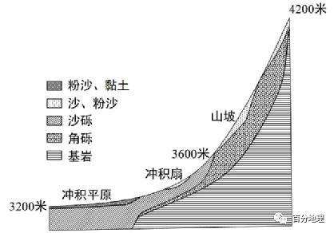
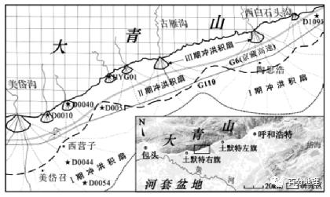

# 微专题之086冲（洪）积扇

```
本专题摘自“百分地理”公众号，如有侵权请告之删除，谢谢。联系hhwxyhh@163.com
```

------
（2022·湖南·宁乡市教育研究中心模拟预测）干旱半干旱的山区，受气候变化和构造活动等影响，在流水作用下，砂砾石在山前堆积往往形成冲洪积扇。大青山属阴山山脉的中部，南侧分布有山前断裂带，在大青山山体间歇性抬升过程中，大青山南部山前存在着由早到晚的三期冲积扇（图左）一期冲洪积扇形成时期气候暖干，构造活动较强，二期冲洪积扇形成于距今0.8万—0.55万年的时期，图右示意图为某采样点的地层剖面。据此完成下面小题。   

   

   

1．砂砾石在山前堆积往往形成冲洪积扇，反映图右地层剖面特征的采样点为图左中的（  ）   
A．甲   
B．乙   
C．丙   
D．丁   
2．与Ⅱ期冲洪积扇相北，Ⅲ期冲洪积扇形成时期（  ）   
A．气温较暖湿   
B．气候较干冷   
C．河流径流量大   
D．植被覆盖率低   
3．Ⅰ期冲洪积扇形成的主导因素是（  ）   
A．气候   
B．植被   
C．风化物   
D．构造活动   
<span style="color: rgb(255, 0, 0);">1．C本题考查图文信息获取解读与沉积规律。剖面图中有两个砂砾石层，反映出该地经历了两期冲洪积扇的形成过程，其中地下3米左右处砂砾石层形成于距今0.8万年之后，为Ⅱ期冲洪积扇，则表层砂砾石层为Ⅲ期冲洪积扇，故采样点应同时具有Ⅱ期和Ⅲ期冲洪积扇。读图可知甲、乙、丁三处均无ⅢI期冲洪积扇存在，只有丙符合条件，C正确，ABD错误。故选C。</span>   
<span style="color: rgb(255, 0, 0);">2．B本题考查流水堆积地貌的形成。由图可知，与Ⅱ期冲洪积扇相比，Ⅲ期冲洪积扇面积更小,距山体更近，说明Ⅲ期冲洪积扇形成时期河流的流量更小，流速更慢，搬运沉积的泥沙更少。若气候较暖湿，山地降水更多，河流流量应更大，冲洪积扇面积更大，B正确，A、C错误；如果植被覆盖率较低，则水土流失更严重，入河泥沙、砾石更多，冲洪积扇面积更大，这与题意不符，D错误。故选B。</span>   
<span style="color: rgb(255, 0, 0);">3．D本题考查内外力作用与地貌形态。由材料可知，Ⅱ期冲洪积扇形成时期，气候暖干，降水相对较少，较小的水流量不利于冲洪积扇的形成发育，但该时期构造活动较强，山体抬升速率较快，水流落差增大，带来较强的水动力条件，弥补了降水较少的不利因素，即强烈的构造活动在冲洪积扇的形成中占据了主导地位，导致了Ⅰ期冲洪积扇形成的规模大，D正确。ABC错误。故选D。</span>   
（2021·浙江·海亮高级中学模拟预测）根据所在环境不同，冲积扇可以细分为“旱扇”和“湿扇”，下图是旱扇和湿扇示意图，完成下面小题。   

   

4．比较旱扇和湿扇所在地的自然地理特征，描述正确的是（  ）   
A．旱扇上河流流量季节变化较小   
B．湿扇上的河流的搬运能力更强   
C．旱扇上的河流主要补给是雨水   
D．湿扇上的河流的流速更大   
<span style="color: rgb(255, 0, 0);">4．B旱扇主要分布在干旱区，河流流量小，河流搬运能力弱，多时令河，应以冰雪融水补给为主，故季节变化较大，年际变化小，A、C选项错误。湿扇主要分布在湿润区，河流流量大，搬运能力强，B选项正确。流速由地形落差决定，湿扇上的河流流速不一定更大，D选项错误。故选B。</span>   
（2022·江苏淮安·模拟预测）下图为“某冲积扇纵剖面图”。据此完成下面小题。   

   

5．虚线处沉积物自下向上分布正确的有（  ）   
A．砾石、砂、黏土   
B．角砾、细砂、粗砂   
C．黏土、中沙、砾石   
D．砂、黏土、砾石   
6．推测图中新的冲积扇向源头处移动的成因是（  ）   
A．沉积物来源区地壳沉降   
B．沉积物堆积区地壳上升   
C．沉积物堆积区地壳沉降   
D．沉积物来源区地壳稳定   
<span style="color: rgb(255, 0, 0);">5．A根据河流沉积物的分选性原则，受流水搬运作用的影响，大颗粒的物质先沉积，小颗粒的物质后沉积，故比较靠下的物质，应属于颗粒较大的物质，靠上的物质应属于颗粒较小的物质。砾石、砂、黏土的颗粒大小关系为，砾石&gt;砂&gt;黏土，符合题意，A选项正确；粗砂比细砂更大，其沉积的位置应该更靠下，B选项错误；砾石比黏土和中沙颗粒更大，其沉积位置应该更靠下C、D选项错误。故选A。</span>   
<span style="color: rgb(255, 0, 0);">6．C沉积物来源区为上游地区，地壳下降会使得上游地势变低，整体流域地势变缓，冲积扇位置的沉积作用会更为显著，在沉积物稳定前提下，冲积扇会向下游发展，A选项错误；沉积物堆积区为冲积扇地带，该地带地壳上升会使得上游与下游地势落差变小，使得流速进一步减慢，侵蚀作用减弱沉积作用增强，冲积扇会向下游发展，B选项错误；沉积物堆积区地壳沉降会使得下游地势变低，上下游之间落差进一步增大，会使得此处流水侵蚀作用加强，会形成近似于溯源侵蚀的一种形式，冲积扇向源头方向移动，C选项正确；沉积物来源区地壳稳定，在流水作用基本不变的前提下，冲积扇面积大小较为稳定，排除D选项。故选C。</span>   
（2022·四川泸州·三模）冲积扇是内外力综合作用下形成的，其大小与地壳运动物质基础、河流等有关。大青山位于阴山山脉中部，大青山山前断裂带是该地区的主要断裂带。该地区冲积扇形成于最年轻的地质年代全新世，且不同时期形成的冲积扇在垂向上存在相互叠覆的现象，即新的扇体叠覆在老的扇体之上。下表为不同时期冲积扇特征、区域气候特征和地壳运动强弱，下图为不同时期的冲积扇分布位置示意图。据此完成下面小题。   
<table cellspacing="0" cellpadding="0" width="577"><tbody><tr><td width="114" valign="middle" style="padding: 3.75pt 6pt;border-width: 1pt;border-color: rgb(0, 0, 0);"><section style="margin-top: 0pt;margin-bottom: 0pt;margin-left: 0pt;text-indent: 0pt;font-size: 10.5pt;font-family: &quot;Times New Roman&quot;;line-height: 2em;"><span style="font-family: 宋体;">冲积扇形成时期</span><span style="font-family: 宋体;"></span></section></td><td width="86" valign="middle" style="padding: 3.75pt 6pt;border-width: 1pt;border-color: rgb(0, 0, 0);"><section style="margin-top: 0pt;margin-bottom: 0pt;margin-left: 0pt;text-indent: 0pt;font-size: 10.5pt;font-family: &quot;Times New Roman&quot;;line-height: 2em;"><span style="font-family: 宋体;">冲积扇规模</span><span style="font-family: 宋体;"></span></section></td><td width="100" valign="middle" style="padding: 3.75pt 6pt;border-width: 1pt;border-color: rgb(0, 0, 0);"><section style="margin-top: 0pt;margin-bottom: 0pt;margin-left: 0pt;text-indent: 0pt;font-size: 10.5pt;font-family: &quot;Times New Roman&quot;;line-height: 2em;"><span style="font-family: 宋体;">区域气候特征</span><span style="font-family: 宋体;"></span></section></td><td width="100" valign="middle" style="padding: 3.75pt 6pt;border-width: 1pt;border-color: rgb(0, 0, 0);"><section style="margin-top: 0pt;margin-bottom: 0pt;margin-left: 0pt;text-indent: 0pt;font-size: 10.5pt;font-family: &quot;Times New Roman&quot;;line-height: 2em;"><span style="font-family: 宋体;">地壳运动强弱</span><span style="font-family: 宋体;"></span></section></td></tr><tr><td width="114" valign="middle" style="padding: 3.75pt 6pt;border-width: 1pt;border-color: rgb(0, 0, 0);"><section style="margin-top: 0pt;margin-bottom: 0pt;margin-left: 0pt;text-indent: 0pt;font-size: 10.5pt;font-family: &quot;Times New Roman&quot;;line-height: 2em;"><span style="font-family: 宋体;">甲</span><span style="font-family: 宋体;"></span></section></td><td width="86" valign="middle" style="padding: 3.75pt 6pt;border-width: 1pt;border-color: rgb(0, 0, 0);"><section style="margin-top: 0pt;margin-bottom: 0pt;margin-left: 0pt;text-indent: 0pt;font-size: 10.5pt;font-family: &quot;Times New Roman&quot;;line-height: 2em;"><span style="font-family: 宋体;">较小</span><span style="font-family: 宋体;"></span></section></td><td width="100" valign="middle" style="padding: 3.75pt 6pt;border-width: 1pt;border-color: rgb(0, 0, 0);"><section style="margin-top: 0pt;margin-bottom: 0pt;margin-left: 0pt;text-indent: 0pt;font-size: 10.5pt;font-family: &quot;Times New Roman&quot;;line-height: 2em;"><span style="font-family: 宋体;">冷、干</span><span style="font-family: 宋体;"></span></section></td><td width="100" valign="middle" style="padding: 3.75pt 6pt;border-width: 1pt;border-color: rgb(0, 0, 0);"><section style="margin-top: 0pt;margin-bottom: 0pt;margin-left: 0pt;text-indent: 0pt;font-size: 10.5pt;font-family: &quot;Times New Roman&quot;;line-height: 2em;"><span style="font-family: 宋体;">较弱</span><span style="font-family: 宋体;"></span></section></td></tr><tr><td width="114" valign="middle" style="padding: 3.75pt 6pt;border-width: 1pt;border-color: rgb(0, 0, 0);"><section style="margin-top: 0pt;margin-bottom: 0pt;margin-left: 0pt;text-indent: 0pt;font-size: 10.5pt;font-family: &quot;Times New Roman&quot;;line-height: 2em;"><span style="font-family: 宋体;">乙</span><span style="font-family: 宋体;"></span></section></td><td width="86" valign="middle" style="padding: 3.75pt 6pt;border-width: 1pt;border-color: rgb(0, 0, 0);"><section style="margin-top: 0pt;margin-bottom: 0pt;margin-left: 0pt;text-indent: 0pt;font-size: 10.5pt;font-family: &quot;Times New Roman&quot;;line-height: 2em;"><span style="font-family: 宋体;">较大</span><span style="font-family: 宋体;"></span></section></td><td width="100" valign="middle" style="padding: 3.75pt 6pt;border-width: 1pt;border-color: rgb(0, 0, 0);"><section style="margin-top: 0pt;margin-bottom: 0pt;margin-left: 0pt;text-indent: 0pt;font-size: 10.5pt;font-family: &quot;Times New Roman&quot;;line-height: 2em;"><span style="font-family: 宋体;">暖、湿</span><span style="font-family: 宋体;"></span></section></td><td width="100" valign="middle" style="padding: 3.75pt 6pt;border-width: 1pt;border-color: rgb(0, 0, 0);"><section style="margin-top: 0pt;margin-bottom: 0pt;margin-left: 0pt;text-indent: 0pt;font-size: 10.5pt;font-family: &quot;Times New Roman&quot;;line-height: 2em;"><span style="font-family: 宋体;">弱</span><span style="font-family: 宋体;"></span></section></td></tr><tr><td width="114" valign="middle" style="padding: 3.75pt 6pt;border-width: 1pt;border-color: rgb(0, 0, 0);"><section style="margin-top: 0pt;margin-bottom: 0pt;margin-left: 0pt;text-indent: 0pt;font-size: 10.5pt;font-family: &quot;Times New Roman&quot;;line-height: 2em;"><span style="font-family: 宋体;">丙</span><span style="font-family: 宋体;"></span></section></td><td width="86" valign="middle" style="padding: 3.75pt 6pt;border-width: 1pt;border-color: rgb(0, 0, 0);"><section style="margin-top: 0pt;margin-bottom: 0pt;margin-left: 0pt;text-indent: 0pt;font-size: 10.5pt;font-family: &quot;Times New Roman&quot;;line-height: 2em;"><span style="font-family: 宋体;">大</span><span style="font-family: 宋体;"></span></section></td><td width="100" valign="middle" style="padding: 3.75pt 6pt;border-width: 1pt;border-color: rgb(0, 0, 0);"><section style="margin-top: 0pt;margin-bottom: 0pt;margin-left: 0pt;text-indent: 0pt;font-size: 10.5pt;font-family: &quot;Times New Roman&quot;;line-height: 2em;"><span style="font-family: 宋体;">暖、较干</span><span style="font-family: 宋体;"></span></section></td><td width="100" valign="middle" style="padding: 3.75pt 6pt;border-width: 1pt;border-color: rgb(0, 0, 0);"><section style="margin-top: 0pt;margin-bottom: 0pt;margin-left: 0pt;text-indent: 0pt;font-size: 10.5pt;font-family: &quot;Times New Roman&quot;;line-height: 2em;"><span style="font-family: 宋体;">强</span><span style="font-family: 宋体;"></span></section></td></tr></tbody></table>


   

7该地区冲积扇形成的先后顺序是（  ）   
A．甲→乙→丙   
B．乙→甲→丙   
C．丙→甲→乙   
D．丙→乙→甲   
8．导致乙和丙时期冲积扇面积差异的主要因素是（  ）   
A．地壳运动   
B．降水差异   
C．河水流量   
D．物质基础   
9．大青山山体在三个冲积扇形成期间的地壳运动中处于（  ）   
A．先抬升后下降   
B．不断抬升   
C．先下降后抬升   
D．不断下降   
<span style="color: rgb(255, 0, 0);">7．D由材料“不同时期形成的冲积扇在垂向上存在相互叠覆的现象，即新的扇体叠覆在老的扇体之上”并结合图示可知，甲时期冲积扇在最上面，叠覆在乙时期冲积扇之上，乙时期冲积扇叠覆在丙时期冲积扇之上，可得该地区冲积扇形成的先后顺序是丙→乙→甲，D正确，排除A、B、C选项。故选D。</span>   
<span style="color: rgb(255, 0, 0);">8．A根据表格可知，乙时期冲积扇规模较丙较小，主要原因是地壳运动弱，导致疏松物质少，尽管气候较湿润，被带到冲积扇处堆积的物质仍然较少，冲积扇规模偏小；丙时期地壳运动强，疏松物质多，在暖干条件下被带到冲积扇处堆积的物质依旧较多，冲积扇规模偏大，A正确。乙时期气候湿润，河水流量大，应形成冲积扇规模大，但图示乙时期冲积扇规模小；丙时期气候较干，河水流量小，应形成的冲积扇较小，但图示丙时期冲积扇规模大，故降水差异、河水流量不是主要因素，B、D错误。冲积扇的形成需要泥沙等物质条件，但乙和丙物质条件的差异，主要取决于地壳运动形成的疏松物质的多少，而不是物质基础，D错误。故选A。</span>   
<span style="color: rgb(255, 0, 0);">9．B由表格可知，丙、乙、甲时期的冲积扇规模不断减小，地壳运动减弱。若地壳抬升，当地壳运动减弱时，山体抬升变慢，疏松物质产生的较少，且山体与冲积扇的相对高度变化缓慢，流水的侵蚀搬运能力减弱，则形成的冲积扇面积变小，B正确。山体下降通常不会在新的位置形成冲积扇，A、C、D选项。故选B。</span>   
（2022·安徽合肥·三模）下图所示我国祁连山西段某山间盆地边缘，山坡、冲积扇和冲积平原的植被均为草原，其中冲积平原草原茂盛。山坡表面多覆盖有沙和粉沙物质。附近气象站（海拔3367米）监测的年平均气温为-2.6℃，年降水量约291毫米，集中在夏季，冬春季多风。据此完成下面小题。   

   

10．冲积扇和山坡堆积物中砾石的差异（  ）   
A．冲积扇堆积物中砾石以沙砾为主，分选性差，磨圆度较差   
B．坡面堆积物中砾石以角砾为主，分选性差，磨圆度较差   
C．冲积扇堆积物中砾石以角砾为主，分选性好，有一定磨圆度   
D．坡面堆积物中砾石以沙砾为主，分选性好，有一定磨圆度   
11．分布在山坡表面的沙和粉沙的主要来源及成因（  ）   
A．冲积扇春季风力强劲，地表沙粒易启动   
B．冲积扇夏季地表干燥，地表沙源丰富   
C．冲积平原秋季草原枯萎，地表沙源丰富   
D．冲积平原冬季风力强劲，地表沙粒易启动   
12．冲积平原水分条件比山坡和冲积扇好的主要原因（  ）   
A．地势较低，蒸发弱   
B．地表物质颗粒较细，保水性能力弱   
C．深层土壤冰冻时间较长，利于蓄水   
D．地表水下渗能力增强   
<span style="color: rgb(255, 0, 0);">10．B由图可知，冲积扇以沙砾为主，C选项错误。河流流出山口，流速减慢，河流搬运的物质逐渐沉积，沉积作用具有分选性，故在此沉积的砾石分选较好，流水在搬运过程中对水中的砾石有磨蚀作用，故沉积在此的砾石有一定的磨圆度，A选项错误。由图可知，山坡以角砾为主，D选项错误。表层有沙、粉沙，该处位于较陡的山坡，砾石主要由重力作用及高海拔处的冰川作用（气象站海拔3 367米，监测的年平均气温为-2.6℃，该山为祁连山西段，海拔高达4200米，应当有山地冰川发育）在此堆积，故砾石分选较差，未经流水的磨蚀，故磨圆度较差，B选项正确。故选B。</span>   
<span style="color: rgb(255, 0, 0);">11．A依据材料信息可知，图中冲积扇和冲积平原表层都有粉沙、黏土物质，但冲积平原草原茂盛，固沙作用显著，故山坡的沙和粉沙物质主要来源于冲积扇，C、D选项错误。该地区春季多大风，冲积扇地表干燥，地表沙粒被风吹起，风沙流沿山坡爬升，到达一定位置后风速减慢，挟沙能力减弱，沙和粉沙沉积在山坡上，A选项正确。夏季山地降水及高山冰雪融水较多，冲积扇上草类等植被覆盖率较高，不易出现风沙，B选项错误。故选A。</span>   
<span style="color: rgb(255, 0, 0);">12．C地势较低，气温较高，蒸发较强，A选项错误。由图可知，冲积平原地表主要由粉沙、黏土组成，颗粒较细，利于保水，B选项错误。该区域年平均气温为-2.6℃，冬季寒冷，深层土壤冰冻时间较长，土壤水分不易被蒸发，利于蓄水，C选项正确。由图可知，冲积平原地势较低，来自山坡和冲积扇的地表径流和地下径流均在此汇集，地下水容易出露，为冲积平原提供水源，地表水下渗能力强则易导致地表水分条件差，D选项错误。故选C。</span>   
（2022·辽宁·模拟预测）区域的地质地貌证据可以通过河流地貌来判断。涪江自第四纪以来发育了早更新世（Q1）、中更新世（Q2）和全新世（Q3）等三期冲（洪）积扇。下图为涪江冲（洪）积扇地区构造地貌和河流演化示意图。完成下面小题。   

   

13．Q1冲（洪）积扇堆积物的颗粒（  ）   
A．自西南向东北逐渐变细   
B．自西北向东南逐渐变细   
C．自西南向东北逐渐变粗   
D．自西北向东南逐渐变粗   
14．该区域经历过的地质过程最可能是（  ）   
A．F1-F2之间地层间歇性隆升   
B．F1西北侧地层持续隆升   
C．F1-F2之间地层间歇性下陷   
D．F2西南侧地层持续下陷   
<span style="color: rgb(255, 0, 0);">13．B结合涪江冲（洪）积扇地区构造地貌和河流演化示意图可知，Q1冲积扇西北侧为高山东南侧为盆地，从西北向东南地势逐渐降低，河流流速逐渐减慢搬运能力减弱，堆积颗粒物变细，ACD错误，B正确。</span>   
<span style="color: rgb(255, 0, 0);">14．C结合冲积扇的分布形态，高山分布在西北侧，盆地，丘陵分布在东南侧，可以判断出F1-F2地层是下陷的。从F1-F2，高山先过渡到台地经历了一次下降，然后地壳稳定，当地壳再一次下陷，再形成盆地，海拔进一步降低。所以F1-F2之间地层间歇性下陷，故选C。</span>   
（2022·广东·开平市忠源纪念中学模拟预测）暂时性河流和季节性河流在干旱、半干旱地区广泛发育。典型的暂时性河流在一年里基本都是干的，偶尔形成突发性洪水。新疆准噶尔盆地西部白杨河冲积扇表面发育有暂时性河流和季节性河流，暂时性河道占据着冲积扇表面的大部分区域。下图为白杨河冲积扇上两种类型河道的分布及其沉积过程模式图，1~6代表不同时期的季节性河流沉积物。据此完成下面小题。   

   

15．暂时性河流的主要补给水源是（  ）   
A．地下水   
B．冰川融水   
C．积雪融水   
D．短时暴雨   
16．不同时期的1~6沉积物形成的位置不同，说明了（  ）   
A．该区域地壳不断下降   
B．季节性河道频繁摆动   
C．该区域气候冷暖交替   
D．暂时性河道逐渐增加   
17．在白杨河冲积扇顶部，与季节性河道相比，暂时性河道沉积物（  ）   
A．平均颗粒大   
B．颗粒棱角多   
C．源地距离远   
D．分选性明显   
<span style="color: rgb(255, 0, 0);">15．D题中说到暂时性河流一年基本为干的，偶尔形成突发性洪水。新疆地下水位低，不会补给河流，A错误；冰川融水和积雪融水不是偶尔形成的，是每年温度回升，冰川积雪融化，补给河流，BC错误；暂时性河道水流极少，且水流持续时间短，应该是夏季偶发性强降水，如短时暴雨作为补给水源，D正确；故选D。</span>   
<span style="color: rgb(255, 0, 0);">16．B由图示可知，各阶段沉积物，位置分布不均，1阶段在中心，2阶段在西，3阶段又在东，可知季节性河道频繁摆动，B正确；地壳不断下降和气候冷暖交替与沉积物位置变化关系不大，AC错误；沉积物主要是季节性河流冲积形成，D错误；故选B。</span>   
<span style="color: rgb(255, 0, 0);">17．B从材料可知，暂时性河道水流小，持续时间短，使得流水的搬运能力和侵蚀能力弱，沉积物距离源地近，因此，沉积物颗粒更细，导致以泥质为主，分选性不明显，河道中的砾石受到流水的打磨作用较弱，大多呈现扁平状、棱角状，B正确，ACD错误；故选B。</span>   
18．（2021·全国·高考真题）阅读图文材料,完成下列要求。   
下图所示的我国祁连山西段某山间盆地边缘，山坡、冲积扇和冲积平原的植被均为草原，其中冲积平原草原茂盛。山坡表面多覆盖有沙和粉沙物质。附近气象站(海拔3367米)监测的年平均气温为-2.6℃，年降水量约291毫米，集中在夏季，冬春季多风。   

   

（1）说明冲积扇和山坡堆积物中砾石的差异及其原因。   
（2）分析分布在山坡表面的沙和粉沙的空间迁移过程。   
（3）说明冲积平原水分条件比山坡和冲积扇好的原因。   
<span style="color: rgb(255, 0, 0);">【答案】（1）冲积扇：以沙砾为主，砾石分选较好，有一定的磨圆度；由流水搬运、沉积而成。山坡：以角砾为主，砾石分选较差（大小混杂)，磨圆度较差（棱角分明)；主要由重力作用形成（海拔较高处可能有冰川作用）。</span>   
<span style="color: rgb(255, 0, 0);">（2）沙和粉沙物质主要来源于冲积扇。春季、风力强劲。冲积扇地表干燥，地表沙粒易启动。风沙流着山坡爬升，到达一定位置后携沙能力减弱，沙和粉沙沉积在山坡上。</span>   
<span style="color: rgb(255, 0, 0);">（3）地势较低，山坡和冲积扇流水在此汇集，（冲积扇前沿）地下水出露；地表物质颗粒较细，利于保水；深层土壤冰冻时间较长，利于蓄水。</span>   
<span style="color: rgb(255, 0, 0);">【解析】（1）由图可知，冲积扇以沙砾为主，河流流出山口，流速减慢，河流搬运的物质逐渐沉积，沉积作用具有分选性，故在此沉积的砾石分选较好，流水在搬运过程中对水中的砾石有磨蚀作用，故沉积在此的砾石有一定的磨圆度。由图可知，山坡以角砾为主，表层有沙、粉沙，该处位于较陡的山坡，砾石主要由重力作用在此堆积，故砾石分选较差，未经流水的磨蚀，故磨圆度较差。</span>   
<span style="color: rgb(255, 0, 0);">（2）由图可知，除山坡外，粉沙还分布在冲积平原和冲积扇，沙、粉沙粒径小，流速减慢时在冲积扇和冲积平原沉积。冲积平原草原茂盛，故山坡的沙和粉沙物质主要来源于冲积扇。该地区春季多大风，冲积扇地表干燥，地表沙粒被风吹起，风沙流沿山坡爬升，到达一定位置后风速减慢，携沙能力减弱，沙和粉沙沉积在山坡上。</span>   
<span style="color: rgb(255, 0, 0);">（3）由图可知，冲积平原地势较低，来自山坡和冲积扇的地表径流和地下径流均在此汇集，地下水容易出露，为冲积平原提供水源；由图可知，冲积平原地表主要由粉沙、黏土组成，颗粒较细，利于保水；该区域冬季寒冷，深层土壤冰冻时间较长，土壤水分不易被蒸发，利于蓄水。</span>   
19．（2022·湖南·新田县第一中学一模）阅读图文材料，完成下列要求。   
冲积扇（图）是流水携带泥沙在出山口形成的扇形堆积地貌。依据冲积扇所在的环境条件差异，将冲积扇分为“旱扇”和“湿扇”两类。“旱扇”是短暂洪水带来的暂时性河流造就，分布于干旱半干旱地区；“湿扇”分布于湿润区，扇上河流常年存在，搬运能力稳定长久。我国天山北麓洪积扇较多，在天山持续抬升过程中，洪积扇面积不断变化。   

   

(1)与“旱扇”相比，指出“湿扇”沉积物的突出特点并说明原因。   
(2)说明天山北麓先后形成的旱扇扇端距离山麓的远近关系。   
<span style="color: rgb(255, 0, 0);">【答案】(1)“湿扇”沉积物多、面积广，砾石磨圆度较好，自扇顶至扇缘颗粒物逐渐变细。</span>   
<span style="color: rgb(255, 0, 0);">(2)先形成的扇端距离天山山麓近，后形成的扇端距离天山山麓更远。</span>   
<span style="color: rgb(255, 0, 0);">【解析】（1）据材料可知，“湿扇”分布于湿润区，扇上河流常年存在，搬运能力稳定长久，常年受河流的作用，面积一般较大，而“旱扇”多为时令河，堆积作用小，发育面积通常较小；“湿扇”的河流常年存在，砾石受到的磨蚀作用更强，磨圆度更好；河流出山口后，随着流速逐渐降低，携带的碎石泥沙逐渐沉积，颗粒大的先沉积，颗粒小的后沉积，所以“旱扇”自扇顶至扇缘颗粒物质逐渐变细。</span>   
<span style="color: rgb(255, 0, 0);">（2）依据冲积扇所在的环境条件，冲积扇一般发育在山口坡度由陡变缓的山麓地带，随着天山持续抬升，先形成的冲积扇也相应抬升，使扇缘地带坡度增加，后形成的冲积扇继续在老冲积扇的外缘发育，所以先形成的扇端距离天山山麓近，后形成的扇端距离天山山麓更远。</span>   
20．（2022·广东佛山·一模）阅读图文材料，回答下列要求。   
佛山西樵山形成于早第三纪，由于火山形成后的构造运动和外力作用，形成了如今山上有72山峰（最高峰344米），232处泉眼，28处瀑布的地表形态。西樵山周边分布着大片三角洲平原，海拔3-4米。西樵山曾经作为采石场植被破坏严重，禁止采石后植被迅速恢复。山中有一巨石----冬菇石，又名仙笠石，横列涧中，高约8尺，是从山上崩塌下来的巨大角砾凝灰岩块，长久受外力作用，上广下锐，四檐垂下，形似冬菇，下可蔽风雨。下图为西樵山及附近地貌类型图。   

   

(1)简述西樵山多泉水出露的原因。   
(2)从外力作用的角度，推测冬菇石顶部硕大较圆滑、根部较小的原因。   
(3)据图描述西樵山附近冲积扇的分布规律，并分析其形成过程。   
<span style="color: rgb(255, 0, 0);">【答案】(1)位于亚热带季风气候区，降水丰富；山上植被多，下渗水量大，地下水补给充足；西樵山属于古火山，地质构造活跃，多断层裂隙；地下水沿裂隙涌出成众多泉水。</span>   
<span style="color: rgb(255, 0, 0);">(2)冬菇石顶部暴露，长时间受球形风化作用而成；底部流水侵蚀、冲刷作用明显，最终岩体变小。</span>   
<span style="color: rgb(255, 0, 0);">(3)规律：新、老冲积扇均分布在山麓地带，成环状；新冲积扇数量较少，叠置于老冲积扇上。</span>   
<span style="color: rgb(255, 0, 0);">过程：早期大量采石时，植被破坏，水土流失明显，形成较大范围的老冲积扇；禁止采石后，植被恢复，在沟谷出山口处流速减慢泥沙堆积形成叠置在上的新冲积扇。</span>   
<span style="color: rgb(255, 0, 0);">【解析】（1）解答本题应从泉水的形成和“多”两个方面考虑。泉是地下水的天然集中地表出露，是地下含水层或含水通道呈点状出露地表的地下水涌出现象，为地下水集中排泄形式。它是在一定的地形、地质和水文地质条件的结合下产生的。结合图中经纬度位置和海陆位置可知，西樵山位于亚热带季风气候区，降水丰富；绿色植物具有涵养水源的作用，山上植被多，下渗水量大，因而地下水补给充足。“佛山西樵山形成于早第三纪，由于火山形成后的构造运动和外力作用，形成了如今山上有72山峰（最高峰344米），232处泉眼，28处瀑布的地表形态”，说明西樵山属于古火山，地质构造活跃，有众多的断层裂隙发育；地下水沿裂隙涌出，形成泉水众多的景象。</span>   
<span style="color: rgb(255, 0, 0);">（2）外力作用包括风化、侵蚀、搬运、沉积和固结成岩作用五个方面。冬菇石顶部硕大较圆滑、根部较小应是风化、侵蚀作用的结果。冬菇石顶部暴露，长时间在风吹、日晒、雨淋等外力作用下发生风化，岩石破碎，突出的棱角逐渐缩减，最终趋向球形。结合图中经纬度位置和海陆位置可知，西樵山位于亚热带季风气候区，降水丰富，多地表径流；冬菇石底部被流水侵蚀，根部变小。</span>   
<span style="color: rgb(255, 0, 0);">（3）结合图例、读图可知，西樵山附近冲积扇包括老冲积扇和性冲积扇两种。新、老冲积扇呈环状分布在山麓地带，新冲积扇叠置于老冲积扇上，数量较老冲积扇少。冲积扇是河流出山口处的扇形堆积体。当河流流出谷口时，摆脱了侧向约束，其携带物质便铺散沉积下来，因此形成冲积扇需具备丰富的沉积物、水流速度变缓等条件。由材料可知，西樵山曾经作为采石场植被破坏严重，禁止采石后植被迅速恢复。早期因为大量采石导致植被破坏，水土流失加剧，河流含沙量增加，在出山口出形成较大范围的老冲积扇；禁止采石后植被迅速恢复，水土流失得到控制，冲积扇发育减缓，在某些沟谷出山口处泥沙因水流速度减慢，堆积形成叠置在上的新冲积扇。</span>   
21．（2022·安徽·天长市第二中学模拟预测）阅读图文材料，完成下列要求。   
开都河流域位于天山主脉与支脉之间，发源于天山山系海拔4000米以上的阿尔明山，东南流注博斯腾湖，全长530千米。开都河流域由三个盆地组成，开都河上游的小尤路都斯盆地、中游的大尤路都斯盆地、下游的焉耆盆地。开都河流域地貌类型复杂，主要有山地、丘陵、风成地貌、河流地貌等，表现出盆地内部地貌类型环状分布的规律。下图示意开都河流域地形分布。   

   

(2)推测由盆地边缘到盆地中心地貌类型的分布。   
(3)开都河流域典型的风成地貌主要分布在低山丘陵区，就此作出合理解释。   
(4)博斯腾湖所在的焉耆盆地平原面积最大，分析其形成原因。   
<span style="color: rgb(255, 0, 0);">【答案】(2)开都河流域由三个盆地组成，盆地地貌的封闭性环状分布成为开都河流域地貌分布的典型；由盆地边缘到盆地中心依次分布高山、低山、丘陵、山前洪（冲）积扇、冲积平原等。</span>   
<span style="color: rgb(255, 0, 0);">(3)低山丘陵区是降水稀少地带，气候极为干燥，风力作用显著；低山丘陵区非河流水系汇聚区，缺少河流地貌的发育，风成地貌发育空间较大。</span>   
<span style="color: rgb(255, 0, 0);">(4)焉耆盆地位于开都河下游，河流流速缓慢，利于泥沙沉积；焉耆盆地面积大，山前洪（冲）积扇和冲积平原的发育空间大。</span>   
<span style="color: rgb(255, 0, 0);">【解析】（2）由盆地边缘到盆地中心地貌类型的分布主要从盆地地貌的封闭性角度来分析，由于开都河流域有三个盆地共同组成，盆地地貌具有封闭性，盆地环形分布成为开都河流域地貌分布的典型特点，根据图中信息，结合内力作用盆地四周抬升，中部断裂下陷，外力作用流水形成冲积扇和冲积平原，故可以分析判断出，从盆地边缘到盆地中心依次分布，有高山，低山，丘陵，山前冲积扇以及冲积平原等地貌。</span>   
<span style="color: rgb(255, 0, 0);">（3）开都河流域典型的风成地貌主要分布在低山丘陵区的原因主要从降水和风力的角度来分析。开都河流域低山丘陵地区降水相对稀少，气候较为干旱，因此风力作用显著，由于开都河流域低山丘陵地区不是河流水系的汇聚区，因此缺少河流地貌的发育，所以导致风成地貌的发育空间较大，所以开都河流域典型的风成地貌主要分布在低山丘陵区。</span>   
<span style="color: rgb(255, 0, 0);">（4）博斯腾湖所在的焉耆盆地平原面积最大的原因主要从河流流速与盆地面积的角度来分析。从河流流速的角度来说，焉耆盆地位于开都河下游地区，所以河流流速较慢，有利于泥沙沉积。从盆地面积的角度来说，焉耆盆地面积较大，山前冲积扇和冲积平原的发育空间较大，因此博斯腾湖所在的焉耆盆地平原面积最大。</span>   
22．（2022·湖北·襄阳五中模拟预测）阅读图文材料，完成下列要求。   
雅鲁藏布江位于青藏高原南部，两岸支流峡谷，多古冰川地貌。研究发观，流域内干支流交汇处的宽谷河段广泛发育坡前黄土沉积地貌，且黄土的粒径明显小于砂粒。其形成时间多是末次冰期以后，且不同基岩性质的山坡前均有分布。有学者研究提出该地沉积地貌发育概念模型（下图）：冰期，山坡主要被冰川和冰川沉积物覆盖。冰期末期，冰川沉积物受冰雪融水的搬运作用形成洪（冲）积扇。间冰期，该地谷风（即近地面从谷地吹向山坡的风）作用显著。   

   

(1)说明冰期末期该地区洪（冲）积扇的形成过程。   
(2)与沙丘相比，该地区黄土沉积地貌分布更靠近坡前，试分析原因。   
<span style="color: rgb(255, 0, 0);">【答案】(1)冰期末期，大量冰川融化；大量冰雪融水在支流峡谷中流速快，搬运作用显著，大量冰川沉积物被搬运至山谷出口；出山后，地势变缓，且干流河谷宽阔，水流变宽流速减缓，沉积物堆积形成洪（冲）积扇。</span>   
<span style="color: rgb(255, 0, 0);">(2)间冰期，雅鲁藏布江河谷沉积物出露于水面，其搬运、沉积主要受风力作用影响；风力搬运、沉积具有分选性；该地盛行谷风，（河谷沉积物中的）黄土粒径小于砂粒，体积小，质量轻，因此能被风力搬运至更远的距离，更高的地方（至山坡前）。</span>   
<span style="color: rgb(255, 0, 0);">【解析】（1）根据“学者研究提出该地沉积地貌发育概念模型：冰期，山坡主要被冰川和冰川沉积物覆盖。冰期末期，冰川沉积物受冰雪融水的搬运作用形成洪（冲）积扇”进行分析：冰期，山坡主要被冰川和冰川沉积物覆盖，松散物质多，为洪积扇的形成提供物质来源。冰期末期，气温升高，大量冰川融化形成冰雪融水，冰川沉积物出露地表；大量冰雪融水在支流峡谷中流速快，搬运作用显著,大量冰川沉积物被搬运至山谷出口；出山后，由于地势变缓，且河流的河道变宽，水流变宽流速减缓，搬运能力减弱，大量的堆积物在出山口堆积，沉积物堆积形成洪（冲）积扇。</span>   
<span style="color: rgb(255, 0, 0);">（2）由材料“间冰期，该地谷风(即近地面从谷地吹向山坡的风)作用显著”可知，间冰期,雅鲁藏布江河谷沉积物出露,河谷地带是砂砾与黄土沉积物的来源，其搬运、沉积主要受风力作用影响，风力搬运、沉积具有分选性；该地盛行谷风，风从河谷吹向山麓，风力逐渐降低，因此颗粒较大的砂砾先沉积、颗粒较小的黄土后沉积。河谷沉积物中的黄土粒径小于砂粒，体积小，质量轻，因此能被风力搬运至更远的距离，更高的地方至山坡前。</span>   
23．（2022·山东淄博·三模）阅读图文资料，完成下列要求。   
青海湖是我国最大的咸水湖，四周高山环抱，常年盛行北风。湖北岸发育许多冲积扇，尤以沙柳河（落差1500米、长度105.8千米、流域面积1442平方千米）和泉吉河（落差1108米、长度65千米、流域面积567平方千米）形成的冲积扇最典型，两冲积扇与湖水接触的扇缘处均发育完整扇形。下图示意青海湖北岸冲积扇分布。   

   

(1)在下图中绘制出由A到B沉积物平均粒径变化趋势并说明原因。   

   

(2)说明沙柳河冲积扇比泉吉河冲积扇面积大的原因。   
(3)对两冲积扇与湖水接触的扇缘处均发育完整扇形的现象，做出合理解释。   

   
【答案<span style="color: rgb(255, 0, 0);">】(1)原因：由A到B，随着流速减慢，颗粒大的先沉积，颗粒小的后沉积。</span>   
<span style="color: rgb(255, 0, 0);">(2)沙柳河比泉吉河落差大（径流量大），对地表的整体侵蚀能力强，携带沉积物多；长度长，流域面积大，冲积扇的物质来源区广。</span>   
<span style="color: rgb(255, 0, 0);">(3)处于北风背风一侧，风速小；湖水波浪作用弱，对扇缘侵蚀作用小。</span>   
<span style="color: rgb(255, 0, 0);">【解析】（1）根据所学知识可知，冲积扇是流水沉积作用形成的，沉积物随着流水来到河流的出山口处，随着地势变缓、水流流速减慢，颗粒大的先沉积，颗粒小的后沉积。由图可知A地势高、B地势低，由A到B沉积物平均粒径由大变小。如图：</span>   
<span style="color: rgb(255, 0, 0);">（2）根据材料“沙柳河（落差1500米、长度105.8千米、流域面积1442平方千米）和泉吉河（落差1108米、长度65千米、流域面积567平方千米）”可知：沙柳河比泉吉河长度长，流域面积大，冲积扇的物质来源区广；沙柳河比泉吉河落差大、径流量大，水流速度快，对地表的侵蚀能力强，携带的沉积物多，所以导致沙柳河冲积扇比泉吉河冲积扇面积大。</span>   
<span style="color: rgb(255, 0, 0);">（3）根据材料可知：青海湖常年盛行北风，湖北岸处于北风背风坡一侧，风速小，湖水不易起波，所以湖水波浪作用弱，对扇缘侵蚀作用小，因此两冲积扇与湖水接触的扇缘处均发育完整扇形。</span>   
24．（2022·山东·肥城市教学研究中心模拟预测）阅读图文材料，完成下列要求。   
冲积扇的形成和发展受自然地理环境（如气候条件和地壳升降运动等因素）的制约。根据冲积扇所在环境条件不同，可以分为“旱扇”和“湿扇”。“旱扇”是由暂时性河流造就的，在干旱半干旱地区，山间的河流径流主要来源于洪水，因此也叫洪积扇。“湿扇”位于湿润区，扇上的河流基本是常年性的，河流的搬运能力稳定长久。冲积扇的宏大精美丝毫不亚于山峰、河流、瀑布、湖泊，西北是我国大型冲积扇发育程度最高的地区，也是欣赏冲积旱扇景观的最佳地区。图A为“湿扇”“旱扇”示意图，图B为我国西北贺兰山区地形图。   

   

(1)分析我国西北地区成为航空欣赏冲积扇最佳地区的原因。   
(2)试推断飞机航行至塔里木盆地时拍摄到的冲积扇景观应属于图A中甲和乙中的哪一种类型，并说出依据。   
(3)航空拍摄到图B地区冲积扇呈现出东西山麓分布不均衡的美，请描述分布特征并分析原因。   
<span style="color: rgb(255, 0, 0);">【答案】(1)气候干旱，气温年较差大，物理风化作用强，陆源碎屑物质供应多；山体高大，流水速度快，搬运能力强，形成的冲积扇数量多；冲积扇彼此邻近，形成集群，规模宏大；晴天多，云量少，能见度好；植被覆盖率低，冲积扇地貌裸露，视觉效果好；地广人稀，人类活动影响小。</span>   
<span style="color: rgb(255, 0, 0);">(2)乙图。西部地区山体落差大，水流速度快，加之洪水期水量大，河流下蚀作用明显，河道较平直且呈放射状；西北地区季节性河流居多，以旱扇为主。</span>   
<span style="color: rgb(255, 0, 0);">(3)冲积扇主要分布在山脉的东侧，西侧并没有发育。山脉东侧位于夏季风的迎风坡，降水较多，河流发育较好；中南部地区山脉海拔高，河流落差大，河流侵蚀搬运的物质多，在山麓地区流水堆积作用形成的冲积扇地貌更加丰富。</span>   
<span style="color: rgb(255, 0, 0);">【解析】（1）由所学知识可知，西北地区成为航空欣赏冲枳扇的最佳地区的原因有两个：一是有结构完整且发育度高的冲积扇；二是有便于欣赏的条件。我国西北地区深居内陆，冬冷夏热，气温年较差大；远离海洋，降水少，气候干旱，物理风化作用强，产生的陆地上碎屑物质多；西北地区山体高大，地形起伏大，河流落差大，流速度快，河流搬运携带物质多，沉积形成的冲积扇数量多；冲积扇彼此相连，规模宏大；西北地区降水少，晴天多，云量少，能见度好，便于观察；由于该地，土壤肥力较低，植被稀少，冲积扇地貌裸露，航拍视觉效果好；西北地区土地面积广大，人口稀少，受人类活动干扰小。</span>   
<span style="color: rgb(255, 0, 0);">（2）由材料信息及所学知识可知，塔里木盒地位于干旱半干旱地区，降水稀少，河水大多来自高山冰雪融水为主，主要是以季节性河流为主；山体落差大，水流速度快，加之汛期水量大，河流下切侵蚀作用强，河道较深且由出山品处呈放射状发展，旱扇的条件较好，所以对应图中的乙图。</span>   
<span style="color: rgb(255, 0, 0);">（3）由图中信息及所学知识可知，山脉东西两侧的冲积扇形成条件不同，即冲积扇出现差异；贺兰山是我国季风区与非季风区的分界线，图中冲积扇主要分布在贺兰山的东侧，西侧很少。由于贺兰山的东侧东面位于东南季风的迎风坡，受地形抬升，降水较多，河流径流量大；河流东侧落差大，河流流动速度快，携带碎屑物质的能力更强；在山麓地区，由于流速减缓，泥沙堆积，形成冲积扇。</span>   
25．（2022·河南郑州·三模）阅读图文材料，完成下列问题。   
我国内陆绿洲地区人类活动遗址众多，这些遗址可为气候变化研究提供相关依据。我国某考古团队在西北某山地南坡发掘出古人类生活遗址（如下图）。小明是该考古队的成员，同时也是某大学城市与环境学院的学生。通过研究，小明发现在距今2万~1万年期间，此处沉积了厚达5m的洪积物，形成了老洪积扇；而位于老洪积扇缘端细腻黑褐色湖沼沉积厚度约1m，大致形成于距今1万~9千年期间，且中部夹杂盐碱结晶层；距今3500年前后，古人类选择在此生活，并留下了大量放牧牛羊、谷物种植的遗迹。之后，该遗址被新的洪积物掩盖埋藏。   

   

(1)分析老洪积扇厚度大的主要原因。   
(2)根据古人类生活留下的遗迹，判断距今3500年前后该地带适合人类生活繁衍的主要地理条件。   
(3)描述图中湖沼沉积层的主要形成过程。   
(4)推测距今2万年以来该地区气候的干湿变化。   
<span style="color: rgb(255, 0, 0);">【答案】(1)（物质来源）山区地表多砾石、泥沙，（动力条件）季节性山洪频发，洪水携带大量砾石、泥沙在山麓地带堆积。</span>   
<span style="color: rgb(255, 0, 0);">(2)（气候）地势低，气候较温暖；（水源）地下水埋藏浅（或有泉水出露），水源相对充足；（地形、土壤）地形平坦，沉积物颗粒较细，土壤肥力高；（植被）草木茂盛。</span>   
<span style="color: rgb(255, 0, 0);">(3)（湖沼形成）地势低洼，雨季降水和地下水在此汇集形成湖泊沼泽；（湖沼环境演变为陆地环境）位洪积扇扇缘，地势趋于平坦，水流速度减慢，水流携带的沉积物颗粒小，大量细小颗粒物在湖泊沼泽中沉积；（湖沼物质形成与变化）气候温暖湿润，植被繁茂，大量枯枝落叶在湖沼沉积，并形成黑色腐殖质；气候变干，湖沼逐渐干涸，盐分结晶，形成夹杂盐碱的黑褐色湖沼沉积层。</span>   
<span style="color: rgb(255, 0, 0);">(4)由湿润趋于干燥，再变湿润。</span>   
<span style="color: rgb(255, 0, 0);">【解析】（1）从沉积物的物质来源和动力条件两方面入手分析。该地位于西北某山地南坡，山区地表多砾石、泥沙，为沉积物提供了物质来源；西北地区气候类型包括温带季风气候、温带大陆性气候和高寒气候，整体而言，降水较少且主要集中在夏季，出现季节性山洪，山洪发生时，洪水携带大量砾石、泥沙在山麓地带堆积。</span>   
<span style="color: rgb(255, 0, 0);">（2）主要从自然条件地形、气候、水源、土壤、植被等方面入手分析。从示意图上看，遗址所在处地形相对平坦；从材料“而位于老洪积扇缘端细腻黑褐色湖沼沉积厚度约1m”可知，遗址所在处沉积物颗粒较细，土壤肥力高；位于南坡（阳坡）且地势低，气候较温暖；该处地下水埋藏浅，水源相对充足；在水源附近，植被生长茂盛。</span>   
<span style="color: rgb(255, 0, 0);">（3）湖沼沉积层的主要形成过程可以通过湖沼形成、湖沼环境演变为陆地环境、湖沼物质形成并沉积形成沉积层来描述。该处位于山区地势低洼处，雨季时，降水和地下水易在此处汇集，形成湖泊沼泽；湖沼沉积处位于洪积扇扇形边缘，地势趋于平坦，水流速度变缓，水流携带的沉积物沉积，且颗粒大的先沉积，颗粒小的后沉积，在洪积扇扇形边缘处沉积物颗粒小，同时大量细小颗粒物在湖泊沼泽中沉积；当时由于该地地势低，气候较温暖，再加上地下水埋藏浅，水源相对充足，气候温暖湿润，使得当地植被繁茂，大量枯枝落叶在湖沼沉积，最后形成黑色腐殖质；随着时间的推移，气候变干，蒸发旺盛，湖沼逐渐干涸，盐分结晶，形成夹杂盐碱的黑褐色湖沼沉积层。</span>   
<span style="color: rgb(255, 0, 0);">（4）结合第三问图中湖沼沉积层的主要形成过程可知，距今2万年以来该地区气候由湿润趋于干燥；新洪积扇的出现反映出该地再次湿润，故该地气候由湿润趋于干燥，再变湿润。</span>   
26．（2022·河南商丘·三模）阅读图文材料，完成下列要求。   
携带大量泥沙和石块的特殊洪流在山区沟口堆积形成的扇状地貌称为泥石流扇。怒江云南段河谷谷地狭窄、两岸支流密集且比降较大，山体以花岗岩、片岩、片麻岩、大理岩等为主，泥石流灾害多发，河谷内泥石流扇数量较多,以中、小型（面积小于0.1k㎡）堆积扇为主。下图示意怒江云南段泥石流扇和洪积扇分布。   

   

(2)与洪积扇相比较，说明怒江云南段泥石流扇的分布特征。   
(3)与洪积扇相比、从分选性、磨圆度、颗粒粗细、透水性中任选三项描述泥石流扇堆积物的特点。   
(4)调查发现，近年来怒江云南段的泥石流扇逐渐成为当地人们开发的主要对象。推测形成该现象的主要原因。   
<span style="color: rgb(255, 0, 0);">【答案】(2)分布范围广（或上游分布较多）；数量多，密度大。</span>   
<span style="color: rgb(255, 0, 0);">(3)与洪积扇相比，泥石流扇堆积物分选性差（或基本无分选性）；泥石流扇堆积物的石块具有棱角，磨圆度差；组成颗粒粗；泥石流扇堆积物透水性强。</span>   
<span style="color: rgb(255, 0, 0);">(4)当地山高坡陡，耕地面积少；当地人口持续增长，人多地少，人地矛盾突出；泥石流扇水热条件较好，地形开阔，是当地居民开垦种植的良好场所。</span>   
<span style="color: rgb(255, 0, 0);">【解析】（2）由图可知，与洪积扇相比，怒江云南段泥石流扇的分布面积更广；且位置更加靠近河流上游；泥石流扇是特殊洪流在山区沟口堆积形成的，由材料可知，该河段谷地狭窄、两岸支流密集且比降较大，山体以花岗岩、片岩、片麻岩、大理岩等为主，泥石流灾害多发。因此与洪积扇相比，泥石流扇的数量更多、分布密度更大。</span>   
<span style="color: rgb(255, 0, 0);">（3）比较洪积扇和泥石流扇堆积物的特点，可以结合两者的形成条件去分析。该地区的谷地狭窄、支流短小且比降较大，因此在泥石流灾害发生时，泥沙和石块被水流搬运的距离短，石块受水流的磨蚀作用弱，因此堆积物的磨圆度较差，棱角多；该地山体以花岗岩、片岩、片麻岩、大理岩等为主，岩石岩性坚硬，经过风化作用形成石块较大，因此堆积物颗粒较粗，孔隙度较大，保水能力较差，堆积物的透水性较强；该地区的泥石流扇以中、小型堆积扇为主，面积较小，因此从扇顶到扇缘，堆积物的分选性较差。</span>   
<span style="color: rgb(255, 0, 0);">（4）近年来怒江云南段的泥石流扇逐渐成为当地人们开发的主要对象，分析该现象的原因可以结合当地的自然条件和社会经济条件，以及泥石流扇的特点去分析。该地地处横断山区，山高谷深，地形崎岖，耕地资源较少；并且随着当地人口的不断增加，对粮食和耕地的需求不断上升，人多地少的矛盾日益突出；而泥石流扇地处山区沟口，海拔较低，水热条件较好，且地形较为平坦，利于开垦。</span>   
27．（2022·四川凉山·三模）阅读图文材料，完成下列问题。   
材料一   
泥石流是由岩屑、泥土、砂石、石块等松散固体物质，和水一起组成的粘稠状混合物，在重力作用下，沿着坡面或沟床，向下运动的过程。某些泥石流灾害发生后，也会形成扇状地形，简称泥石流扇。下面是泥石流扇和普通流水堆积作用形成的冲积扇景观示意图。   

   

(1)填下表比较泥石流扇和流水冲积扇堆积体在物质组成上的区别。   
<table cellspacing="0" cellpadding="0" width="577"><tbody><tr><td width="45" valign="middle" style="padding: 3.75pt 6pt;border-width: 1pt;border-color: rgb(0, 0, 0);"></td><td width="78" valign="middle" style="padding: 3.75pt 6pt;border-width: 1pt;border-color: rgb(0, 0, 0);"><section style="margin-top: 0pt;margin-bottom: 0pt;margin-left: 0pt;text-indent: 0pt;font-size: 10.5pt;font-family: &quot;Times New Roman&quot;;line-height: 2em;"><span style="font-family: 宋体;">形成时间</span><span style="font-family: 宋体;"></span></section></td><td width="41" valign="middle" style="padding: 3.75pt 6pt;border-width: 1pt;border-color: rgb(0, 0, 0);"><section style="margin-top: 0pt;margin-bottom: 0pt;margin-left: 0pt;text-indent: 0pt;font-size: 10.5pt;font-family: &quot;Times New Roman&quot;;line-height: 2em;"><span style="font-family: 宋体;">分选性</span><span style="font-family: 宋体;"></span></section></td><td width="156" valign="middle" style="padding: 3.75pt 6pt;border-width: 1pt;border-color: rgb(0, 0, 0);"><section style="margin-top: 0pt;margin-bottom: 0pt;margin-left: 0pt;text-indent: 0pt;font-size: 10.5pt;font-family: &quot;Times New Roman&quot;;line-height: 2em;"><span style="font-family: 宋体;">从扇顶至扇缘物质大小变化</span><span style="font-family: 宋体;"></span></section></td></tr><tr><td width="45" valign="middle" style="padding: 3.75pt 6pt;border-width: 1pt;border-color: rgb(0, 0, 0);"><section style="margin-top: 0pt;margin-bottom: 0pt;margin-left: 0pt;text-indent: 0pt;font-size: 10.5pt;font-family: &quot;Times New Roman&quot;;line-height: 2em;"><span style="font-family: 宋体;">冲积扇</span><span style="font-family: 宋体;"></span></section></td><td width="78" valign="middle" style="padding: 3.75pt 6pt;border-width: 1pt;border-color: rgb(0, 0, 0);"><section style="margin-top: 0pt;margin-bottom: 0pt;margin-left: 0pt;text-indent: 0pt;font-size: 10.5pt;font-family: &quot;Times New Roman&quot;;line-height: 2em;"><span style="font-family: 宋体;">多次流水堆积</span><span style="font-family: 宋体;"></span></section></td><td width="41" valign="middle" style="padding: 3.75pt 6pt;border-width: 1pt;border-color: rgb(0, 0, 0);"></td><td width="156" valign="middle" style="padding: 3.75pt 6pt;border-width: 1pt;border-color: rgb(0, 0, 0);"></td></tr><tr><td width="45" valign="middle" style="padding: 3.75pt 6pt;border-width: 1pt;border-color: rgb(0, 0, 0);"><section style="margin-top: 0pt;margin-bottom: 0pt;margin-left: 0pt;text-indent: 0pt;font-size: 10.5pt;font-family: &quot;Times New Roman&quot;;line-height: 2em;"><span style="font-family: 宋体;">泥石流扇</span><span style="font-family: 宋体;"></span></section></td><td width="78" valign="middle" style="padding: 3.75pt 6pt;border-width: 1pt;border-color: rgb(0, 0, 0);"><section style="margin-top: 0pt;margin-bottom: 0pt;margin-left: 0pt;text-indent: 0pt;font-size: 10.5pt;font-family: &quot;Times New Roman&quot;;line-height: 2em;"><span style="font-family: 宋体;">单次泥石流作用</span><span style="font-family: 宋体;"></span></section></td><td width="41" valign="middle" style="padding: 3.75pt 6pt;border-width: 1pt;border-color: rgb(0, 0, 0);"></td><td width="156" valign="middle" style="padding: 3.75pt 6pt;border-width: 1pt;border-color: rgb(0, 0, 0);"></td></tr></tbody></table>


(2)推测泥石流发生需要的条件。材料二   
下图为柴达木盆地某河流域植被与地形关系图。   

   

(3)分析柴达木盆地“平原地区”比山坡水分条件好的原因。   
(4)从土壤的角度，分析洪积平原与湖积平原植被差异的原因。   
<span style="color: rgb(255, 0, 0);">【答案】 (1)</span>

<table cellspacing="0" cellpadding="0" width="577"><tbody><tr><td width="63" valign="middle" style="padding: 3.75pt 6pt;border-width: 1pt;border-color: rgb(0, 0, 0);"></td><td width="98" valign="middle" style="padding: 3.75pt 6pt;border-top-width: 1pt;border-top-color: rgb(0, 0, 0);border-right-width: 1pt;border-right-color: rgb(0, 0, 0);border-bottom-width: 1pt;border-bottom-color: rgb(0, 0, 0);border-left: none;"><section style="margin-top: 0pt;margin-bottom: 0pt;margin-left: 0pt;text-indent: 0pt;font-size: 10.5pt;font-family: &quot;Times New Roman&quot;;line-height: 2em;"><span style="font-family: 宋体;color: rgb(255, 0, 0);">形成时间</span><span style="font-family: 宋体;color: rgb(255, 0, 0);"></span></section></td><td width="56" valign="middle" style="padding: 3.75pt 6pt;border-top-width: 1pt;border-top-color: rgb(0, 0, 0);border-right-width: 1pt;border-right-color: rgb(0, 0, 0);border-bottom-width: 1pt;border-bottom-color: rgb(0, 0, 0);border-left: none;"><section style="margin-top: 0pt;margin-bottom: 0pt;margin-left: 0pt;text-indent: 0pt;font-size: 10.5pt;font-family: &quot;Times New Roman&quot;;line-height: 2em;"><span style="font-family: 宋体;color: rgb(255, 0, 0);">分选性</span><span style="font-family: 宋体;color: rgb(255, 0, 0);"></span></section></td><td width="147" valign="middle" style="padding: 3.75pt 6pt;border-top-width: 1pt;border-top-color: rgb(0, 0, 0);border-right-width: 1pt;border-right-color: rgb(0, 0, 0);border-bottom-width: 1pt;border-bottom-color: rgb(0, 0, 0);border-left: none;"><section style="margin-top: 0pt;margin-bottom: 0pt;margin-left: 0pt;text-indent: 0pt;font-size: 10.5pt;font-family: &quot;Times New Roman&quot;;line-height: 2em;"><span style="font-family: 宋体;color: rgb(255, 0, 0);">从扇顶至扇缘物质大小变化</span><span style="font-family: 宋体;color: rgb(255, 0, 0);"></span></section></td></tr><tr><td width="63" valign="middle" style="padding: 3.75pt 6pt;border-width: 1pt;border-color: rgb(0, 0, 0);"><section style="margin-top: 0pt;margin-bottom: 0pt;margin-left: 0pt;text-indent: 0pt;font-size: 10.5pt;font-family: &quot;Times New Roman&quot;;line-height: 2em;"><span style="font-family: 宋体;color: rgb(255, 0, 0);">冲积扇</span><span style="font-family: 宋体;color: rgb(255, 0, 0);"></span></section></td><td width="98" valign="middle" style="padding: 3.75pt 6pt;border-top-width: 1pt;border-top-color: rgb(0, 0, 0);border-right-width: 1pt;border-right-color: rgb(0, 0, 0);border-bottom-width: 1pt;border-bottom-color: rgb(0, 0, 0);border-left: none;"><section style="margin-top: 0pt;margin-bottom: 0pt;margin-left: 0pt;text-indent: 0pt;font-size: 10.5pt;font-family: &quot;Times New Roman&quot;;line-height: 2em;"><span style="font-family: 宋体;color: rgb(255, 0, 0);">多次流水堆积</span><span style="font-family: 宋体;color: rgb(255, 0, 0);"></span></section></td><td width="56" valign="middle" style="padding: 3.75pt 6pt;border-top-width: 1pt;border-top-color: rgb(0, 0, 0);border-right-width: 1pt;border-right-color: rgb(0, 0, 0);border-bottom-width: 1pt;border-bottom-color: rgb(0, 0, 0);border-left: none;"><section style="margin-top: 0pt;margin-bottom: 0pt;margin-left: 0pt;text-indent: 0pt;font-size: 10.5pt;font-family: &quot;Times New Roman&quot;;line-height: 2em;"><span style="font-family: 宋体;color: rgb(255, 0, 0);">好</span><span style="font-family: 宋体;color: rgb(255, 0, 0);"></span></section></td><td width="147" valign="middle" style="padding: 3.75pt 6pt;border-top-width: 1pt;border-top-color: rgb(0, 0, 0);border-right-width: 1pt;border-right-color: rgb(0, 0, 0);border-bottom-width: 1pt;border-bottom-color: rgb(0, 0, 0);border-left: none;"><section style="margin-top: 0pt;margin-bottom: 0pt;margin-left: 0pt;text-indent: 0pt;font-size: 10.5pt;font-family: &quot;Times New Roman&quot;;line-height: 2em;"><span style="font-family: 宋体;color: rgb(255, 0, 0);">由大到小依次排列</span><span style="font-family: 宋体;color: rgb(255, 0, 0);"></span></section></td></tr><tr><td width="63" valign="middle" style="padding: 3.75pt 6pt;border-width: 1pt;border-color: rgb(0, 0, 0);"><section style="margin-top: 0pt;margin-bottom: 0pt;margin-left: 0pt;text-indent: 0pt;font-size: 10.5pt;font-family: &quot;Times New Roman&quot;;line-height: 2em;"><span style="font-family: 宋体;color: rgb(255, 0, 0);">泥石流扇</span><span style="font-family: 宋体;color: rgb(255, 0, 0);"></span></section></td><td width="98" valign="middle" style="padding: 3.75pt 6pt;border-top-width: 1pt;border-top-color: rgb(0, 0, 0);border-right-width: 1pt;border-right-color: rgb(0, 0, 0);border-bottom-width: 1pt;border-bottom-color: rgb(0, 0, 0);border-left: none;"><section style="margin-top: 0pt;margin-bottom: 0pt;margin-left: 0pt;text-indent: 0pt;font-size: 10.5pt;font-family: &quot;Times New Roman&quot;;line-height: 2em;"><span style="font-family: 宋体;color: rgb(255, 0, 0);">单次泥石流作用</span><span style="font-family: 宋体;color: rgb(255, 0, 0);"></span></section></td><td width="56" valign="middle" style="padding: 3.75pt 6pt;border-top-width: 1pt;border-top-color: rgb(0, 0, 0);border-right-width: 1pt;border-right-color: rgb(0, 0, 0);border-bottom-width: 1pt;border-bottom-color: rgb(0, 0, 0);border-left: none;"><section style="margin-top: 0pt;margin-bottom: 0pt;margin-left: 0pt;text-indent: 0pt;font-size: 10.5pt;font-family: &quot;Times New Roman&quot;;line-height: 2em;"><span style="font-family: 宋体;color: rgb(255, 0, 0);">差</span><span style="font-family: 宋体;color: rgb(255, 0, 0);"></span></section></td><td width="147" valign="middle" style="padding: 3.75pt 6pt;border-top-width: 1pt;border-top-color: rgb(0, 0, 0);border-right-width: 1pt;border-right-color: rgb(0, 0, 0);border-bottom-width: 1pt;border-bottom-color: rgb(0, 0, 0);border-left: none;"><section style="margin-top: 0pt;margin-bottom: 0pt;margin-left: 0pt;text-indent: 0pt;font-size: 10.5pt;font-family: &quot;Times New Roman&quot;;line-height: 2em;"><span style="font-family: 宋体;color: rgb(255, 0, 0);">顶部小，扇缘较大</span><span style="font-family: 宋体;color: rgb(255, 0, 0);"></span></section></td></tr></tbody></table>

<span style="color: rgb(255, 0, 0);">(2)有大量的松散堆积物（泥和石块）；地势较陡，重力作用显著；大量水源（降水或冰雪融水）。</span>   
<span style="color: rgb(255, 0, 0);">(3)平原地区地势较低，山坡流水在此汇集，地下水较浅或出露；地表物质颗粒较细，利于保水；深层土壤冰冻时间较长，利于蓄水。</span>   
<span style="color: rgb(255, 0, 0);">(4)洪积平原：地形坡度较大，土壤颗粒粗大；大气降水下渗较快，水分条件较差，土壤贫瘠，不适宜植被生长，植被生长差。湖积平原：土壤颗粒较细；土壤水分条件好，适宜植物生长，植被茂盛，覆盖率高。</span>   
<span style="color: rgb(255, 0, 0);">【解析】 (1)冲积扇从扇顶到扇缘地面逐渐降低，坡度逐渐变小，从扇顶至扇缘堆积物由粗到细，分选性好；而泥石流扇与冲积扇相比，泥石流搬运、沉积的距离短，因此沉积物分选性较差，泥石流粘稠度大，运动惯性大，冲击力强，因此较大的堆积物随着泥石流来到扇缘地带，而扇顶堆积物相对更小。</span>

<table cellspacing="0" cellpadding="0" width="577"><tbody><tr><td width="63" valign="middle" style="padding: 3.75pt 6pt;border-width: 1pt;border-color: rgb(0, 0, 0);"></td><td width="99" valign="middle" style="padding: 3.75pt 6pt;border-width: 1pt;border-color: rgb(0, 0, 0);"><section style="margin-top: 0pt;margin-bottom: 0pt;margin-left: 0pt;text-indent: 0pt;font-size: 10.5pt;font-family: &quot;Times New Roman&quot;;line-height: 2em;"><span style="font-family: 宋体;color: rgb(255, 0, 0);">形成时间</span><span style="font-family: 宋体;color: rgb(255, 0, 0);"></span></section></td><td width="106" valign="middle" style="padding: 3.75pt 6pt;border-width: 1pt;border-color: rgb(0, 0, 0);"><section style="margin-top: 0pt;margin-bottom: 0pt;margin-left: 0pt;text-indent: 0pt;font-size: 10.5pt;font-family: &quot;Times New Roman&quot;;line-height: 2em;"><span style="font-family: 宋体;color: rgb(255, 0, 0);">分选性</span><span style="font-family: 宋体;color: rgb(255, 0, 0);"></span></section></td><td width="145" valign="middle" style="padding: 3.75pt 6pt;border-width: 1pt;border-color: rgb(0, 0, 0);"><section style="margin-top: 0pt;margin-bottom: 0pt;margin-left: 0pt;text-indent: 0pt;font-size: 10.5pt;font-family: &quot;Times New Roman&quot;;line-height: 2em;"><span style="font-family: 宋体;color: rgb(255, 0, 0);">从扇顶至扇缘物质大小变化</span><span style="font-family: 宋体;color: rgb(255, 0, 0);"></span></section></td></tr><tr><td width="63" valign="middle" style="padding: 3.75pt 6pt;border-width: 1pt;border-color: rgb(0, 0, 0);"><section style="margin-top: 0pt;margin-bottom: 0pt;margin-left: 0pt;text-indent: 0pt;font-size: 10.5pt;font-family: &quot;Times New Roman&quot;;line-height: 2em;"><span style="font-family: 宋体;color: rgb(255, 0, 0);">冲积扇</span><span style="font-family: 宋体;color: rgb(255, 0, 0);"></span></section></td><td width="99" valign="middle" style="padding: 3.75pt 6pt;border-width: 1pt;border-color: rgb(0, 0, 0);"><section style="margin-top: 0pt;margin-bottom: 0pt;margin-left: 0pt;text-indent: 0pt;font-size: 10.5pt;font-family: &quot;Times New Roman&quot;;line-height: 2em;"><span style="font-family: 宋体;color: rgb(255, 0, 0);">多次流水堆积</span><span style="font-family: 宋体;color: rgb(255, 0, 0);"></span></section></td><td width="106" valign="middle" style="padding: 3.75pt 6pt;border-width: 1pt;border-color: rgb(0, 0, 0);"><section style="margin-top: 0pt;margin-bottom: 0pt;margin-left: 0pt;text-indent: 0pt;font-size: 10.5pt;font-family: &quot;Times New Roman&quot;;line-height: 2em;"><span style="font-family: 宋体;color: rgb(255, 0, 0);">好</span><span style="font-family: 宋体;color: rgb(255, 0, 0);"></span></section></td><td width="145" valign="middle" style="padding: 3.75pt 6pt;border-width: 1pt;border-color: rgb(0, 0, 0);"><section style="margin-top: 0pt;margin-bottom: 0pt;margin-left: 0pt;text-indent: 0pt;font-size: 10.5pt;font-family: &quot;Times New Roman&quot;;line-height: 2em;"><span style="font-family: 宋体;color: rgb(255, 0, 0);">由大到小依次排列</span><span style="font-family: 宋体;color: rgb(255, 0, 0);"></span></section></td></tr><tr><td width="63" valign="middle" style="padding: 3.75pt 6pt;border-width: 1pt;border-color: rgb(0, 0, 0);"><section style="margin-top: 0pt;margin-bottom: 0pt;margin-left: 0pt;text-indent: 0pt;font-size: 10.5pt;font-family: &quot;Times New Roman&quot;;line-height: 2em;"><span style="font-family: 宋体;color: rgb(255, 0, 0);">泥石流扇</span><span style="font-family: 宋体;color: rgb(255, 0, 0);"></span></section></td><td width="99" valign="middle" style="padding: 3.75pt 6pt;border-width: 1pt;border-color: rgb(0, 0, 0);"><section style="margin-top: 0pt;margin-bottom: 0pt;margin-left: 0pt;text-indent: 0pt;font-size: 10.5pt;font-family: &quot;Times New Roman&quot;;line-height: 2em;"><span style="font-family: 宋体;color: rgb(255, 0, 0);">单次泥石流作用</span><span style="font-family: 宋体;color: rgb(255, 0, 0);"></span></section></td><td width="106" valign="middle" style="padding: 3.75pt 6pt;border-width: 1pt;border-color: rgb(0, 0, 0);"><section style="margin-top: 0pt;margin-bottom: 0pt;margin-left: 0pt;text-indent: 0pt;font-size: 10.5pt;font-family: &quot;Times New Roman&quot;;line-height: 2em;"><span style="font-family: 宋体;color: rgb(255, 0, 0);">差</span><span style="font-family: 宋体;color: rgb(255, 0, 0);"></span></section></td><td width="145" valign="middle" style="padding: 3.75pt 6pt;border-width: 1pt;border-color: rgb(0, 0, 0);"><section style="margin-top: 0pt;margin-bottom: 0pt;margin-left: 0pt;text-indent: 0pt;font-size: 10.5pt;font-family: &quot;Times New Roman&quot;;line-height: 2em;"><span style="font-family: 宋体;color: rgb(255, 0, 0);">顶部小，扇缘较大</span><span style="font-family: 宋体;color: rgb(255, 0, 0);"></span></section></td></tr></tbody></table>


<span style="color: rgb(255, 0, 0);">(2)泥石流发生的条件主要包括三个：①山区地形陡峻、山高谷深 ，地势起伏大；②岩体土体松动、破碎 形成大量的松散堆积物；③大量水流。</span>   
<span style="color: rgb(255, 0, 0);">(3)柴达木盆地内以洪积平原、湖积平原和湖底平原为主，相对于山坡，海拔更低，地下水水位更浅，土壤中水分条件更好；平原地区土壤颗粒物更细，利于储水，以沉积作用为主，土层厚，深层土壤多为永久性冻土，利于表层水分的保存。</span>   
<span style="color: rgb(255, 0, 0);">(4)洪积平原更靠近山坡，地势起伏相对更大，坡度更大，因此土壤的颗粒物更粗，不利于蓄水，大量水分容易下渗，因此土壤中水分条件更差，植被生长的土壤环境更差，植被覆盖率较低；而湖底平原更为平坦，土壤颗粒物更细，土壤中的水分条件更好，植被生长的土壤环境更好，植被覆盖率更高。</span>   
28．（2022·河北邯郸·二模）阅读图文材料，完成下列要求。   
冲积扇的形成和发展受自然地理环境的制约。根据冲积扇所在环境条件不同，可以分为“旱扇”和“湿扇”。“旱扇”是由暂时性河流造就的，在干旱半干旱地区，山间的河流径流主要来源于洪水，因此也叫洪积扇。“湿扇”位于湿润区，扇上的河流基本是常年性的，河流的搬运能力稳定长久。西北是我国大型冲积扇发育程度最高的地区，也是欣赏冲积旱扇景观的最佳地区。左图为“湿扇”“旱扇”示意图，右图为我国西北贺兰山区地形图。   

   

   

(1)与“湿扇”相比，推测“旱扇”沉积物磨圆度的特点并说明原因。   
(2)分析我国西北地区成为航空欣赏冲积扇最佳地区的原因。   
(3)航空拍摄到右图地区冲积扇呈现出东西山麓分布不均衡的美，请描述分布特征并分析原因。   
<span style="color: rgb(255, 0, 0);">【答案】(1)特点：磨圆度低。原因：“旱扇”河流多为季节性河流，水量小流程短；搬运距离短，沉积物被侵蚀、磨损时间短。</span>   
<span style="color: rgb(255, 0, 0);">(2)西北地区，风化作用强，碎屑物多，冲积扇数量多（或规模宏大）；晴天多，云量少，能见度好；植被覆盖率低，冲积扇地貌裸露，视觉效果好（或地广人稀，人类活动影响小）。</span>   
<span style="color: rgb(255, 0, 0);">(3)冲积扇主要分布在山脉的东侧，西侧鲜有发育。山脉东侧位于夏季风的迎风坡，降水较多，河流发育较好；中南部地区山脉海拔高，河流落差大，河流侵蚀搬运的物质多，在山麓地区流水堆积作用形成的冲积扇地貌更加丰富。</span>   
<span style="color: rgb(255, 0, 0);">【解析】(1)由材料“旱扇”是由暂时性河流造就的，在干旱半干旱地区，山间的河流径流主要来源于洪水，因此也叫洪积扇可知：旱扇分布地区降水少，形成“旱扇”的河流多靠高山冰雪融水补给和少量的山地降水补给，多为季节性河流，水流量小，河流的侵蚀、搬运能力弱，搬运距离短，在此过程中搬运物被侵蚀、磨损时间短，磨圆度较低。</span>   
<span style="color: rgb(255, 0, 0);">(2)由所学知识可知，西北地区成为航空欣赏冲积扇的最佳地区的原因有两个：一是有结构完整且发育度高的冲积扇，二是有便于欣赏的条件。我国西北地区深居内陆，冬冷夏热，气温年较差大，降水少，气候干旱，风化作用强，产生的陆源碎屑物质多；西北地区山体高大，地势起伏大，沟谷众多，河流落差大，水流速度快，水流搬运能力强，形成的冲积扇数量多；冲积扇彼此相连，规模宏大；西北地区晴天多，云量少，能见度好，便于观察；冲积扇植被稀少，地貌裸露，观察效果好；西北地区土地面积广大，人口稀少，受人类活动干扰小。</span>   
<span style="color: rgb(255, 0, 0);">(3)由图中信息及所学知识可知，山脉东西两侧的冲积扇形成条件不同，使冲积扇出现差异。贺兰山是我国季风区与非季风区的分界线之一，图中冲积扇分布在贺兰山的东侧，西侧没有。由于贺兰山的东侧位于东南季风的迎风坡，受地形抬升影响，降水较多，河流径流量大；山脉中南部落差大，河流流速快，挟带碎屑物质的能力更强；在山麓地区，由于流水速度减缓，泥沙堆积作用形成冲积扇。</span>   
29．（2022·湖北·模拟预测）阅读图文材料，完成下列要求。   
河流扇是发育在山口地带，以河流沉积作用为主，缺少泥石流沉积的扇状沉积体。发育在湖岸附近的河流扇进入水体，则形成河流扇型三角洲。黄羊泉扇位于新疆准噶尔盆地西北缘，由白杨河、达尔布特河和克拉苏河共同流出山地后堆积形成。黄羊泉扇曾为河流扇型三角洲，后逐渐与玛纳斯湖分离，目前仅在东侧有部分分汊河道注入艾里克湖，20世纪90年代艾里克湖曾一度干涸。古玛纳斯湖曾为一个大湖，最北端接近北部山脉。第四纪以来，古玛纳斯湖逐渐萎缩分离成艾里克湖和玛纳斯湖。左图为白杨河流域图，右图为黄羊泉扇示意图。   

   

(1)描述黄羊泉扇型三角洲的形成过程。   
(2)分析黄羊泉扇上缺乏泥石流沉积的原因。   
<span style="color: rgb(255, 0, 0);">【答案】(1)上游河流流经山区，落差大，河流携带了大量泥沙；由于出山口处地势变缓，且与入湖口距离较近，河流直接入湖；古玛纳斯湖水位高，湖面宽广，湖水的顶托作用强，其挟带的泥沙逐渐堆积形成河流扇型三角洲。</span>   
<span style="color: rgb(255, 0, 0);">(2)气候干旱，降水量小；山地多为坚硬的花岗岩，碎屑物质少，不利于泥石流沉积发育；上游谷地较宽阔，水和碎屑物不易快速汇集。</span>   
<span style="color: rgb(255, 0, 0);">【解析】(1)本题主要考查扇型三角洲的形成过程，结合材料中的信息可从物质条件和动力条件两个方面组织答案。由于“黄羊泉扇位于新疆准噶尔盆地西北缘”，落差大，又有“白杨河、达尔布特河和克拉苏河共同流出山地后”携带了大量泥沙，河流在流出山口时因海拔骤降、地势变平缓而导致水流速度骤降，大量泥沙开始沉积，慢慢地变成了黄羊泉冲积扇；由于黄羊泉扇形成的早期，古玛斯湖的湖泊水量以及面积还没有出现萎缩，河流入湖距离短，加上当时玛纳斯湖水位高，湖面宽广，湖水的顶托作用强，其挟带的泥沙又在入湖口逐渐堆积形成三角洲，随着山麓冲积扇和湖口三角洲的不断扩大相连，逐渐形成河流扇型三角洲。(2)泥石流的形成条件可从地形、动力及物质条件展开分析。黄羊泉扇位于我国的新疆地区，新疆地区位于内陆深处，气候的大陆性突出，干旱、降水稀少，缺少暴雨形成的条件，泥石流无法发生；由图中信息可知，黄羊泉扇两侧山地多为坚硬的花岗岩，受地形狭管效应影响，风力强劲，导致岩石被侵蚀、消磨得严重，碎屑物质少，不利于泥石流沉积发育；最后，黄羊泉扇上游地区，谷地较宽阔，地表起伏较小，水和碎屑物不易快速汇集。综上所述，黄羊泉扇缺少泥石流沉积。</span>   
30．（2022·辽宁·模拟预测）阅读图文材料，完成下列要求。   
构造活动影响着河流沉积的厚度及迁移方向，控制着构造地貌的演化，是冲积扇发育的前提。涪江发源于青藏高原东北部的岷山雪宝顶北坡，在穿越龙门山北东段天竹山后，携带的大量碎屑物质在四川盆地西北侧龙门山前地带堆积形成多个大小规模不等的冲积扇。下图示意涪江龙门山前冲积扇地区构造地貌。   

   

(2)龙门山前冲积扇发生多次变迁，试推测主要原因。   
(3)比较龙门山前冲积扇Q1、Q2、Q3形成时间的早晚，并说明原因。   
(4)调查发现，冲积扇Q2的范围和厚度都明显大于Q1和Q3。试推测主要原因。   
<span style="color: rgb(255, 0, 0);">【答案】(2)断层水平移动，河流改道造成的。</span>   
<span style="color: rgb(255, 0, 0);">(3)顺序是：Q3 Q2Q1。原因：涪江从高山出山口流出，流水沉积形成冲积扇Q3；然后北部断层活动使得河流迁移改道，台地及其南部区域发生下沉，形成新的冲积扇Q2；断层使冲积扇Q3Q2所在地区地壳上升，其南部继续下沉，河流出山口后，形成新的冲积扇Q1。</span>   
<span style="color: rgb(255, 0, 0);">(4)冲积扇Q2形成时期可能因降水量较大,河流水位较高，流量较大,流速较快,流出山口后流程较远,从而导致该冲积扇范围大:该时期内可能由于降水量较大,河流流速快侵蚀强烈,且泥沙物质沉积时间较长,从而导致该冲积扇厚度大。</span>   
<span style="color: rgb(255, 0, 0);">【解析】(2)通常，活动断裂或断层对河流流向、河道迁移、河流袭夺、河床剖面以及河流水系布局有明显的控制作用，图中该河流流向发生了几乎90°的转折，转折处河流大致沿着断层线走向，说明该河段在发育过程中受到断层水平移动影响，改变河流流向，河流多次改道形成多个冲积扇。</span>   
<span style="color: rgb(255, 0, 0);">(3)据图推测，最初涪江从北部断层附近从高山区冲出山口，在山前形成巨大的冲积扇Q3，然后北部高山和台地地区抬升，河流在台地前缘形成新的出山口，在出山口附近形成新的冲积扇Q2，后来在Q2的前缘发生断裂活动，形成断层，使得Q3、Q2所在地区上升，南部丘陵地区相对下降，在断层附近形成更新的出山口、在出山口附近形成更新的冲积扇Q1。</span>   
<span style="color: rgb(255, 0, 0);">(4)影响冲积扇面积大小的因素主要从流量、泥沙含量分析。在冲积扇Q2形成时期可能因降水量较大，使得河流补给量增大，河流水位较高，流量较大，流速较快，流出山口后流程较远，从而导致该冲积扇范围大；其次，该时期内可能由于流速快，侵蚀强烈，河流携带泥沙增多，且河流流程长，泥沙物质沉积时间较长，从而导致该冲积扇厚度大。</span>   
31．（2022·天津·耀华中学一模）阅读图文材料，完成下列要求。   
滦河流出燕山山脉后，在山前地带形成冲积扇，在入海口形成三角洲，冲积扇——三角洲在成因上是一个完整的沉积体系。2500年前，滦河发育了以迁安为顶点的老滦河冲积扇——三角洲，之后发育了以滦州市为顶点的新滦河冲积扇——三角洲。某科研团队对新、老滦河冲积扇——三角洲的形成过程、冲积扇与三角洲的界线确定、三角洲发育规模的影响因素等课题进行了研究，并取得了诸多成果（下图）。   

   

(1)说明图示区域滦河冲积扇——三角洲体系的形成与演化过程。   
(3)通过沉积物特点可以研究推测沉积环境，冲积扇与三角洲的沉积物差异显著，科研团队据此对滦河冲积扇与三角洲进行了勘察确界。与滦河冲积扇相比较，从粒径和来源角度说明滦河三角洲沉积物的特点并分析原因。   
<span style="color: rgb(255, 0, 0);">【答案】(1)河流挟带大量碎屑物质,流出燕山后﹐流速减慢，碎屑物不断沉积形成冲积扇﹔人海口处受海水顶托作用,泥沙沉积,形成三角洲;2500年之前,主要向西南（或南偏西）方向发育;之后﹐由于滦河改道,主要向东南（或南偏东）方向发育。</span>   
<span style="color: rgb(255, 0, 0);">(3)特点:三角洲沉积物颗粒粒径小;沉积物来源包括陆地和海洋两类（或有来自海洋的沉积物或有海洋生物化石）。沉积物颗粒粒径小的原因;粒径较大的颗粒物在冲积扇沉积,粒径较小的颗粒物在河口沉积（或海水顶托，水流速度慢,利于小粒径颗粒物的沉积》。沉积物来源包括陆地和海洋两类的原因:受河流和海洋的共同影响。</span>   
<span style="color: rgb(255, 0, 0);">【解析】（1）冲积扇——三角洲的形成和流速、挟带泥沙、海水顶托作用有关。河流流出山口，由于地势变得平缓，水流速度减慢，河流携带泥沙的能力减弱，泥沙在山前沉积形成冲积扇；在入海口处，地势变得平缓，水流速度减慢，河流携带泥沙的能力减弱，再加上海水的顶托作用，使的大量泥沙在入海口处沉积，形成三角洲，最终冲积扇和三角洲的泥沙连接起来，形成冲积扇——三角洲体系。2500年之前，主要向西南（或南偏西）方向发育；2500年之后，由于滦河改道，主要向东南（或南偏东）方向发育。</span>   
<span style="color: rgb(255, 0, 0);">（3）由题意可得出滦河三角洲沉积物颗粒较细；沉积物来源包括陆地和海洋两类；主要原因是一方面流水沉积具有分选作用，一般情况下，颗粒大的先沉积，颗粒小的后沉积，故粒径较大的颗粒物在冲积扇沉积，粒径较小的颗粒物在河口沉积；另一方面，河流下游入海口地区，由于河流搬运物质能力较弱，所携带的泥沙颗粒较细；滦河三角洲的沉积物主要受滦河和海洋的共同影响。</span>   
32．（2022·江西九江·二模）阅读图文材料，完成下列要求。   
大青山属于阴山山脉中部，是气候变化敏感区和构造运动活跃区。区域构造活动强烈，为洪积扇的形成提供了重要的地形与构造基础。全新世时期，大青山地区气候经历了冷干—暖湿—暖干的变化，地壳运动经历了较强—弱—较弱的强度变化。大型季节性洪水在大青山山口流出后形成三期洪积扇。Ⅰ期洪积扇形成于全新世早期,规模最大。Ⅱ期洪积扇形成于全新世中期，规模比Ⅰ期小。Ⅲ期洪积扇形成于全新世晚期，零散地分布在大青山山前，整体规模最小。下图为大青山洪积扇示意图。   

   

(1)根据洪积扇的成因推测大青山洪积扇形成时期降水特点。   
(2)与Ⅱ期洪积扇相比，分析I期洪积扇规模较大的原因。   
(3)Ⅲ期洪积扇规模有大有小，指出其影响因素。   
(4)说明Ⅲ期洪积扇零散分布的原因。   
<span style="color: rgb(255, 0, 0);">【答案】(1)洪积扇的成因主要是有季节性洪水。据此推测该区域降水季节变化大；多暴雨。</span>   
<span style="color: rgb(255, 0, 0);">(2)（Ⅰ期洪积扇形成时）气候冷干，植被覆盖率低，松散堆积物多；构造运动强烈，山体抬升速率加快，河流落差增大，流水的侵蚀和搬运能力强，堆积物数量大，冲积扇规模最大。</span>   
<span style="color: rgb(255, 0, 0);">(3)径流量；地形（流速，落差，地势起伏）；松散堆积物（植被覆盖度）。</span>   
<span style="color: rgb(255, 0, 0);">(4)气候变干导致河流流量变小；加上构造运动较弱，落差变小，河流搬运的沉积物较少。每个冲积扇规模都较小，未能连接成片。</span>   
<span style="color: rgb(255, 0, 0);">【解析】（1）由材料信息可知，大型季节性洪水在大青山山口流出后形成三期洪积扇，则可推知，洪积扇的成因主要是有季节性洪水的存在，在雨季搬运了大量的泥沙等物质，在河流出山口随着地势的变缓、流速的减慢而沉积形成。由季节性洪水可知，大青山洪积扇形成时期该区域降水季节变化大，多暴雨。（2）影响洪积扇面积大小的因素，主要有流水的作用、下垫面物质状态以及地势的高低状况。由材料可知，全新世时期，大青山地区气候经历了冷干—暖湿—暖干的变化，地壳运动经历了较强—弱—较弱的强度变化，Ⅰ期洪积扇形成于全新世早期，则对应的可以推知，Ⅰ期洪积扇形成时期，气候冷干，地球运动较强。气候冷干，则植被发育差，覆盖率低，下垫面的松散堆积物多；地球运动较强，山体抬升速率快，河流落差大，流水的侵蚀和搬运能力强，堆积物数量大，冲积扇规模最大。（3）由材料可知，全新世时期，大青山地区气候经历了冷干—暖湿—暖干的变化，地壳运动经历了较强—弱—较弱的强度变化，Ⅲ期洪积扇形成于全新世晚期，则对应的可以推知，Ⅲ期洪积扇形成时期气候暖干，地壳活动较弱。气候暖干，降水少，径流量少，流水作用弱；地壳活动较弱，山体抬升速率慢，河流的流速慢，流水的侵蚀和搬运作用弱；气候暖干，植被相对发育较好，覆盖率较高，松散堆积物少。综合分析可知，Ⅲ期洪积扇整体规模最小。但是局部区域，径流量、地势高低、植被覆盖度也存在差异，因此形成的洪积扇规模也就有大有小，则其影响因素有径流量、地形（流速，落差，地势起伏）、松散堆积物（植被覆盖度）。（4）由材料可知，全新世时期，大青山地区气候经历了冷干—暖湿—暖干的变化，地壳运动经历了较强—弱—较弱的强度变化，Ⅲ期洪积扇形成于全新世晚期，则对应的可以推知，Ⅲ期洪积扇形成时期气候暖干，地壳活动较弱。气候暖干，降水少，径流量少，流水作用弱；地壳活动较弱，山体抬升速率慢，河流的流速慢，流水的侵蚀和搬运作用弱；气候暖干，植被相对发育较好，覆盖率较高，松散堆积物少。综合分析可知，Ⅲ期洪积扇整体规模最小。此外，每个冲积扇规模都较小，未能连接成片，所以呈现零星分布。</span>   

   

   